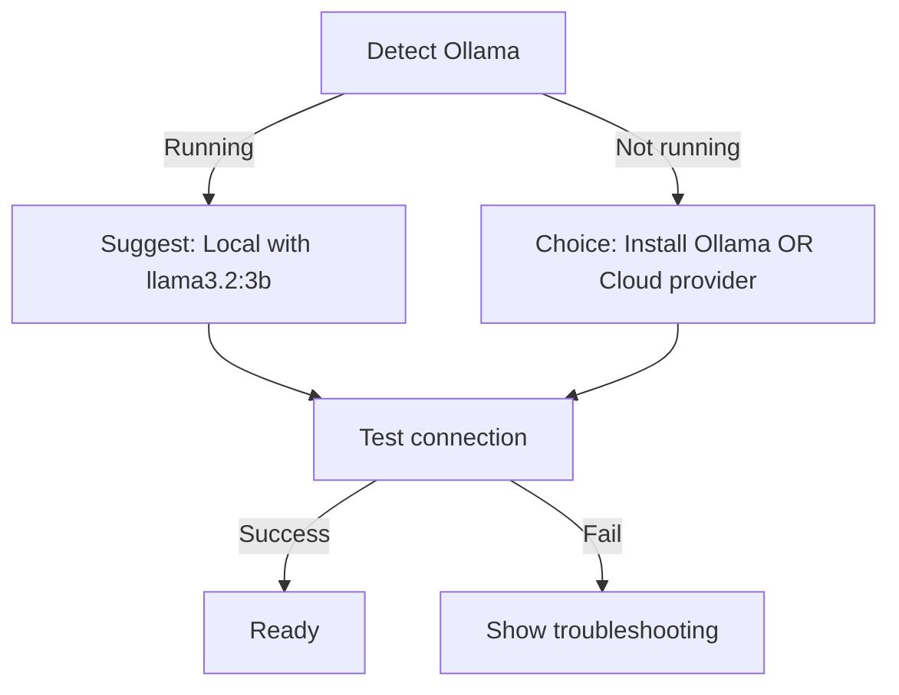

# ADR-0007: Default LLM Strategy

**Status:** Accepted  
**Date:** 2026-07-06  
**Deciders:** Architecture Team

---

## Context

Contexa supports multiple LLM providers but must guide new users to a working configuration during onboarding. The default choice affects first-run experience, privacy posture, and perceived product quality.

## Decision

**No cloud LLM is pre-configured.** Onboarding presents two paths:

1. **Local (Recommended):** Ollama with `llama3.2:3b` or `phi3:mini` — privacy-first, no API key
2. **Cloud:** User selects provider (OpenAI, Anthropic, Gemini) and enters API key

If Ollama is detected running on `localhost:11434` during onboarding, auto-suggest local path.

## Rationale

| Factor | Local Default | Cloud Default |
|--------|--------------|---------------|
| Privacy | ✅ No data leaves device | ❌ Requires trust in provider |
| Setup friction | Medium (install Ollama) | Low (paste API key) |
| Cost | Free | Per-token cost |
| Quality | Good (3B models) | Excellent (GPT-4, Claude) |
| Alignment with "local-first" | ✅ | ❌ |

Recommending local without forcing it respects both privacy-conscious users and users who want best quality.

## Onboarding Flow



## Fallback Chain

```
Primary provider → Secondary provider (if configured) → Error message with context summary (no AI)
```

## Consequences

**Positive:**
- Privacy-first brand alignment
- No Contexa liability for LLM API costs
- Users who install Ollama get instant value

**Negative:**
- Higher onboarding friction for non-technical users
- Local 3B models produce lower-quality responses than GPT-4
- Must maintain Ollama adapter compatibility

## References

- [08_AI_Orchestrator.md](../docs/08_AI_Orchestrator.md)
- [12_UI_UX.md](../docs/12_UI_UX.md)
- [ADR/0001-rust-core-tauri-shell.md](./0001-rust-core-tauri-shell.md)
