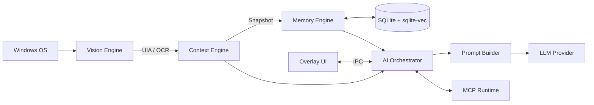

<div align="center">

# Contexa

**The Context Infrastructure for AI**


</div>

**AI Context Platform** — nền tảng ngữ cảnh & bộ nhớ AI, chạy local-first trên Windows (Tauri + Rust), chuẩn MCP-native.

Contexa liên tục xây dựng ngữ cảnh có cấu trúc từ hoạt động desktop (cửa sổ đang mở, nội dung đang xem/soạn...), giúp bất kỳ AI nào cũng hiểu được bạn đang làm gì — không phải chatbot, không phải công cụ OCR, mà là **lớp ngữ cảnh** nằm dưới AI.

> Trạng thái hiện tại: đã qua Phase 0.5 (spike kỹ thuật) và Phase 0 (scaffolding workspace). Đang chuẩn bị vào Phase 1 (Vision/Context/Database Engine) — xem [docs/14_Development_Roadmap.md](docs/14_Development_Roadmap.md).

---

## Kiến trúc pipeline



Chi tiết đầy đủ: [docs/02_System_Architecture.md](docs/02_System_Architecture.md).

---

## Đã validate (Phase 0.5 spikes)

Trước khi viết engine thật, các giả định rủi ro nhất đã được đo bằng benchmark thực tế — xem đầy đủ tại [benchmarks/BASELINE.md](benchmarks/BASELINE.md).

| Chỉ số | Mục tiêu | Đo được | |
|---|---|---|---|
| Semantic search (50K × 384-dim) p95 | < 200 ms | **57 ms** | ✅ |
| Overlay mở (Alt+Space) p95 | < 200 ms | **9 ms** | ✅ |
| CPU capture lúc tương tác (10 fps) | < 5% | **0.14%** | ✅ |
| UIA coverage (app phổ biến) | ≥ 8/10 | 6/7 đo được, 86% | ⚠️ pass có ghi chú |
| COM threading (3 pattern × 1000 cycle) | 0 lỗi | **0 lỗi** | ✅ |

---

## Yêu cầu môi trường

| Công cụ                          | Phiên bản                               | Ghi chú                                                                         |
| ---------------------------------- | ----------------------------------------- | -------------------------------------------------------------------------------- |
| Rust                               | Stable (pin trong`rust-toolchain.toml`) | Cài qua[rustup](https://rustup.rs/); MSRV 1.75.0                                 |
| Node.js                            | 20 LTS                                    |                                                                                  |
| pnpm                               | 9.x+ (pin trong`package.json`)          | `corepack enable` hoặc `npm i -g pnpm`                                      |
| VS 2022 Build Tools (workload C++) | mới nhất                                | Cần cho linker MSVC —`winget install Microsoft.VisualStudio.2022.BuildTools` |
| WebView2                           | Evergreen                                 | Có sẵn trên Windows 11; installer sẽ tự bundle nếu thiếu                  |

Chi tiết đầy đủ: [docs/29_Dev_Environment_Setup.md](docs/29_Dev_Environment_Setup.md).

---

## Chạy dự án

```powershell
# 1. Cài dependency
cargo fetch
pnpm install

# 2. Chạy app desktop (chế độ dev, hot reload)
pnpm -C apps/desktop tauri dev
```

Cửa sổ overlay được **preload ẩn sẵn** lúc khởi động — nhấn **Alt+Space** để bật/tắt (đã đo latency mở p50 5ms / p95 9ms, xem `benchmarks/BASELINE.md`).

---

## Các lệnh kiểm tra (giống hệt CI — `.github/workflows/pr-check.yml`)

```powershell
cargo fmt --check
cargo clippy --workspace -- -D warnings
cargo test --workspace
pnpm -C apps/desktop typecheck
```

---

## Cấu trúc thư mục

```
contexa/
├── apps/desktop/        # Ứng dụng Tauri (Rust + React) — hiện là skeleton, chưa nối engine
├── crates/contexa-*/    # 10 crate engine — stub rỗng, Phase 1 sẽ hiện thực hoá
├── docs/                # Toàn bộ tài liệu kiến trúc/spec (bắt đầu từ docs/README.md)
├── ADR/                 # Architecture Decision Records
├── spikes/               # Kết quả spike kỹ thuật Phase 0.5 (SP-01 → SP-08)
├── benchmarks/           # Baseline hiệu năng đã đo
├── reference-repos/      # Clone repo tham khảo cục bộ — KHÔNG track trong git
└── Cargo.toml            # Workspace root
```

`apps/web` (trang marketing) và pipeline release/ký số CI **chưa scaffold** — để dành Phase 5, xem `docs/14_Development_Roadmap.md`.

---

## Tài liệu

Bắt đầu từ [docs/README.md](docs/README.md) — đây là mục lục toàn bộ spec (kiến trúc, database, các engine, UI, bảo mật, roadmap...).

Quy tắc làm việc với Claude Code / AI agent trong repo này nằm ở [CLAUDE.md](CLAUDE.md) (routing tài liệu, kỷ luật code, quy trình phase-gate) và [AGENTS.md](AGENTS.md) (con trỏ rút gọn cho agent khác).
