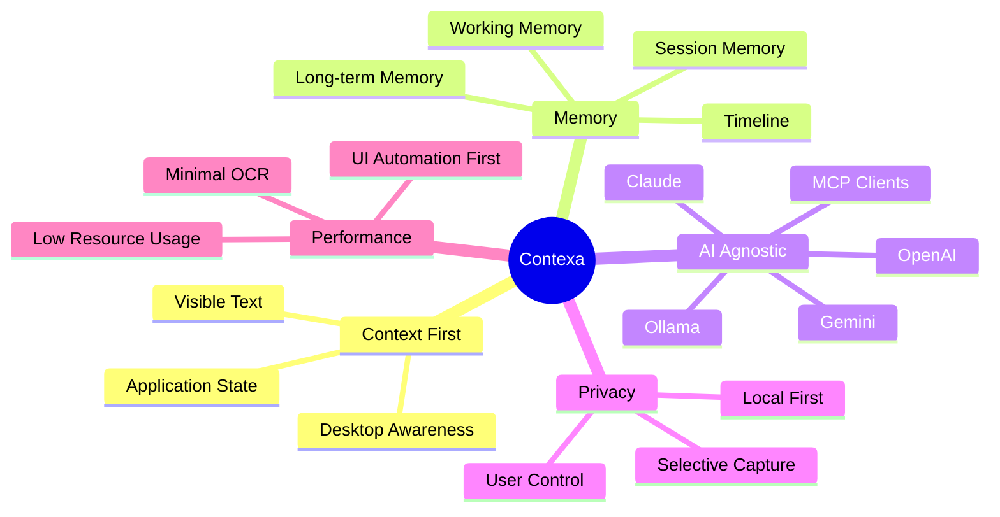

# Contexa — Project Vision

**Version:** 1.1  
**Status:** Reviewed  
**Last Updated:** 2026-07-06

---

## Overview

**Contexa** is an AI Context & Memory Platform — the infrastructure layer that gives every AI system real-time awareness of what a user is doing on their desktop.

While today's AI assistants operate on prompts alone, Contexa continuously builds a rich, structured **Context** from desktop activity: active applications, documents, selections, timelines, and long-term memory. Any connected AI can reason over this Context instead of guessing from a single message.

**Tagline:** AI Context Platform  
**Vision:** Become the Context Infrastructure for AI.  
**Mission:** Provide every AI with real-time desktop context and memory.

---

## Goals

| Goal | Description |
|------|-------------|
| **Context Infrastructure** | Establish Contexa as the standard context layer between desktop activity and AI systems |
| **Invisible Operation** | Run silently in the background with minimal CPU and memory footprint |
| **Instant Intelligence** | Deliver sub-second AI responses via pre-built context on `Alt + Space` |
| **Persistent Memory** | Remember what users worked on across sessions, applications, and days |
| **AI Agnostic** | Support OpenAI, Claude, Gemini, Ollama, LM Studio, and any MCP-compatible client |
| **Privacy by Design** | Local-first processing; user controls what is captured, stored, and shared |
| **Extensibility** | Plugin-friendly architecture for custom context sources and AI integrations |

---

## What Contexa Is — and Is Not

### Contexa Is

- An **AI Context & Memory Platform**
- A **continuous context builder** from desktop activity
- A **timeline and semantic memory** system for work history
- An **MCP-exposed context API** for third-party AI tools
- A **local-first, privacy-respecting** desktop agent

### Contexa Is Not

- A chatbot or conversational AI product
- A standalone OCR tool
- An AI copilot that replaces existing assistants
- A screen recorder or surveillance tool

---

## Core Idea

```
Today's AI:     Prompt → LLM → Response

Contexa's AI:   Prompt
                + Desktop Context
                + Timeline
                + Memory
                + Application State
                + Search Results
                + Metadata
                → LLM → Context-Aware Response
```

AI works on **Context**, not just **Prompt**.

---

## User Experience Vision

1. User works normally across Chrome, VS Code, PDF readers, Excel, Word, and other applications.
2. Contexa runs in the background, continuously building structured Context.
3. User presses **`Alt + Space`** to open the Overlay.
4. User asks natural questions:
   - "Explain this"
   - "Summarize this document"
   - "Translate this selection"
   - "What did I work on today?"
   - "Where is the article about OAuth?"
   - "Explain this code"
5. Contexa assembles Context, optionally searches the internet, and returns an immediate, grounded answer.
6. If context is insufficient, Contexa searches externally, merges results, and responds.

---

## Killer Feature

> **Desktop Context + Timeline + Memory**

Contexa remembers everything you worked on — not as raw screenshots, but as structured, searchable, semantically indexed knowledge tied to your workflow.

---

## Strategic Pillars



---

## Long-Term Vision

Contexa is **not** another AI assistant. It becomes the **Context Layer for all AI**.

Any AI system — chat clients, IDEs, automation tools, enterprise agents — can connect through MCP and access:

- Current desktop context
- Recent activity timeline
- Semantic memory search
- Application and document metadata

Contexa transforms AI from prompt-reactive to **context-aware**.

---

## Success Metrics

| Metric | Target |
|--------|--------|
| Overlay open-to-response latency | < 2 seconds (local LLM), < 5 seconds (cloud LLM) |
| Background CPU usage | < 5% average on modern hardware |
| Background memory | < 300 MB steady state |
| Context accuracy (UI Automation path) | > 95% for supported applications |
| User retention (daily active) | Measured post-launch |
| MCP integration adoption | Third-party clients using Contexa context APIs |

---

## Stakeholders

| Stakeholder | Interest |
|-------------|----------|
| End Users | Productivity, privacy, low friction |
| AI Tool Developers | Reliable context APIs via MCP |
| Engineering Team | Maintainable, modular, testable architecture |
| Security / Compliance | Data minimization, local storage, auditability |

---

## Design Principles

1. **Context First** — Every decision optimizes context quality and availability
2. **Privacy by Design** — Capture only what is needed; store locally by default
3. **Local First** — Core processing on-device; cloud optional
4. **Low Resource Usage** — UI Automation over OCR; frame differencing over full capture
5. **Plugin Friendly** — Extensible context sources and AI providers
6. **AI Agnostic** — No vendor lock-in for LLM providers
7. **Modular** — Independent engines with clear interfaces
8. **Scalable** — Architecture supports future multi-device and team contexts
9. **High Performance** — Concurrent pipelines, thread-safe caches, schedulers

---

## Competitive Moat

| Layer | Moat | Competitor Gap |
|-------|------|----------------|
| Protocol | MCP-native context API | Recall, Rewind, Copilot have no MCP |
| Performance | UIA-first (< 5% CPU) | Screenpipe/OCR approaches use 10–30% CPU |
| Positioning | AI infrastructure, not assistant | Copilots are vendor-locked |
| Privacy | No screenshot storage; local-first | Recall stores screenshots; ChatGPT is cloud |
| Memory | Structured timeline + semantic search | Copilots lack persistent cross-app memory |

See [21_Competitive_Analysis.md](./21_Competitive_Analysis.md) for full landscape analysis.

---

## Future Expansion

- **Multi-monitor and multi-device context** synchronization
- **Team / shared context** for collaborative workflows (opt-in)
- **IDE deep integration** beyond generic UI Automation
- **Mobile companion** for cross-device timeline
- **Enterprise deployment** with policy controls and SSO
- **Context marketplace** for third-party context plugins
- **Federated memory** with user-controlled encryption keys

---

## Best Practices

- Position Contexa as infrastructure, not a competing assistant
- Lead with privacy and local-first messaging in all user-facing materials
- Measure context quality, not just response speed
- Ship MCP support early to drive ecosystem adoption
- Document every architectural decision in ADRs

---

## References

- [01_Software_Requirements_Specification.md](./01_Software_Requirements_Specification.md)
- [02_System_Architecture.md](./02_System_Architecture.md)
- [Model Context Protocol (MCP) Specification](https://modelcontextprotocol.io/)
- [Tauri Documentation](https://tauri.app/)
