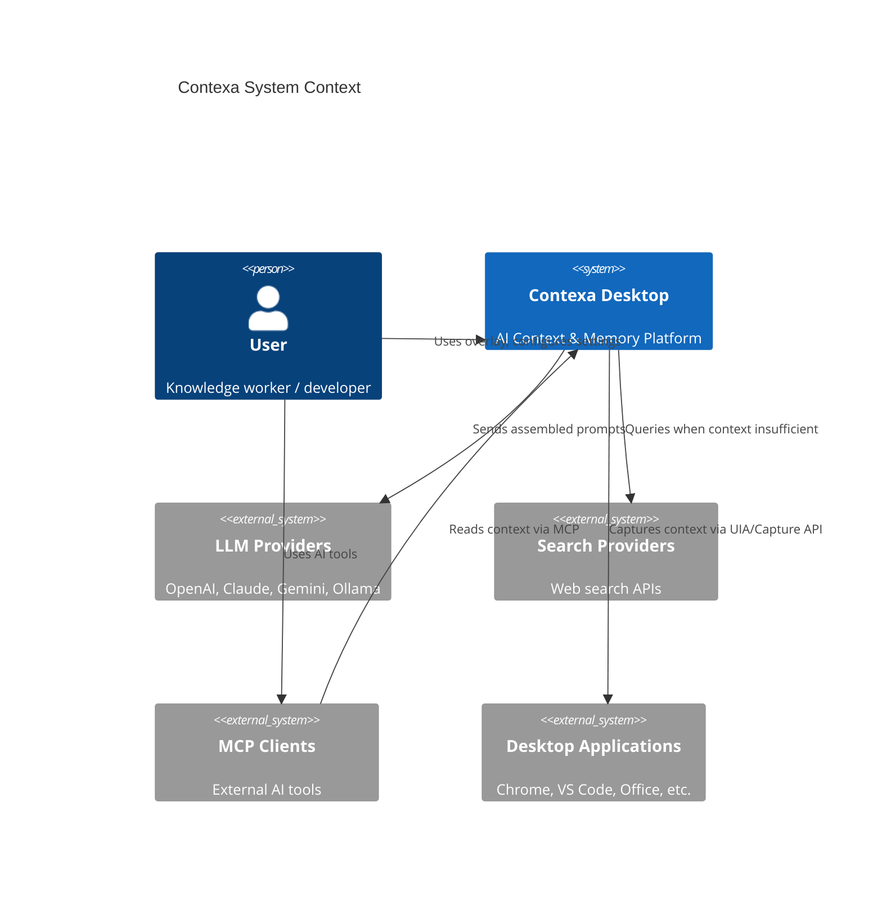
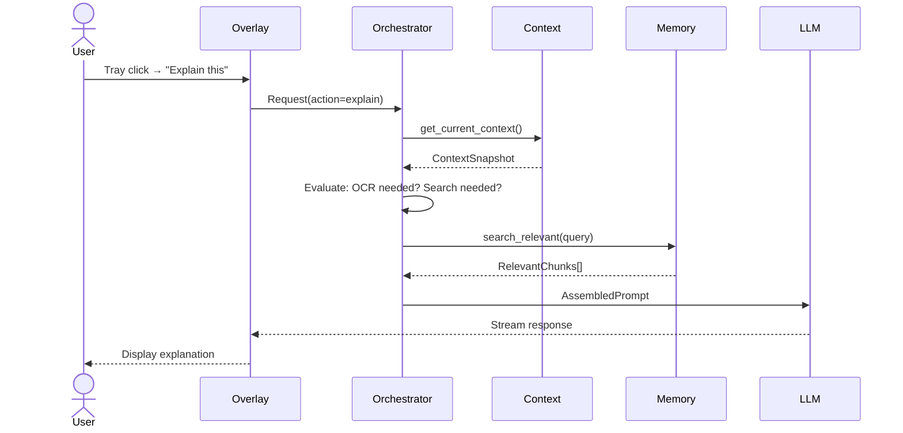
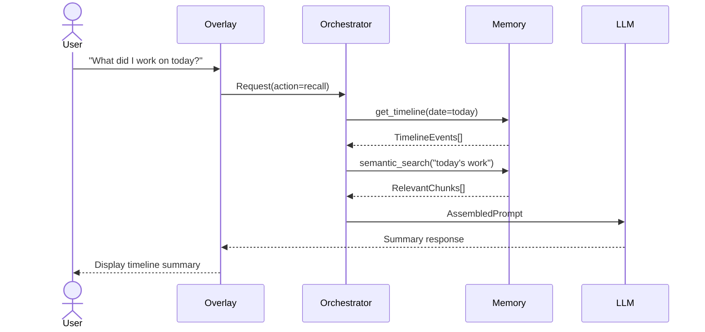

# Software Requirements Specification (SRS)

**Project:** Contexa — AI Context Platform  
**Version:** 1.3  
**Status:** Reviewed  
**Last Updated:** 2026-07-07

---

## 1. Overview

This document defines the functional and non-functional requirements for Contexa, a desktop AI Context & Memory Platform. Contexa captures desktop activity, builds structured context, maintains semantic memory, and exposes context to AI systems via an overlay UI and MCP runtime.

### 1.1 Purpose

Provide a complete, testable requirements baseline for engineering, QA, and product teams prior to implementation.

### 1.2 Scope

| In Scope | Out of Scope |
|----------|--------------|
| Windows desktop agent (Tauri + Rust) | macOS / Linux (Phase 2+) |
| Vision, Context, Memory, AI engines | Building a proprietary LLM |
| Overlay UI with tray activation | Full chatbot replacement |
| MCP client and server runtime | Enterprise SSO (Phase 2+) |
| SQLite + sqlite-vec storage | Cloud-hosted user data (default) |
| Web marketing/docs site (Next.js) | Mobile applications |

### 1.3 Definitions

| Term | Definition |
|------|------------|
| **Context** | Structured snapshot of current desktop state (app, window, text, metadata) |
| **Timeline** | Chronological record of context events across a session or day |
| **Memory** | Persisted, searchable knowledge derived from context over time |
| **Overlay** | Floating UI activated by `Alt + Space` for AI interactions |
| **MCP** | Model Context Protocol — standard for AI tool/context integration |
| **Vision Engine** | Subsystem for screen capture, UI Automation, and selective OCR |
| **Orchestrator** | Decision engine routing requests to OCR, search, memory, and LLM |

### 1.4 References

- [00_Project_Vision.md](./00_Project_Vision.md)
- [02_System_Architecture.md](./02_System_Architecture.md)
- [13_Test_Plan.md](./13_Test_Plan.md) — Requirements traceability matrix
- [22_Technical_Spike_Plan.md](./22_Technical_Spike_Plan.md) — Pre-build validation
- IEEE 830 / ISO/IEC/IEEE 29148 (SRS conventions)

---

## 2. Goals

1. Deliver real-time desktop context to any connected AI within 2 seconds of overlay activation.
2. Maintain continuous background context building with < 5% average CPU usage.
3. Provide semantic search over work history ("What did I work on today?").
4. Expose context APIs via MCP for third-party AI clients.
5. Ensure all data processing is local-first with explicit user consent for external calls.

---

## 3. User Personas

### 3.1 Knowledge Worker

Uses browser, Office suite, and email daily. Needs quick summaries, translations, and recall of recent work.

### 3.2 Software Developer

Uses IDE, terminal, documentation. Needs code explanation, context-aware search, and session recall.

### 3.3 Power User / AI Enthusiast

Connects multiple AI tools via MCP. Needs reliable context APIs and provider flexibility (Ollama, cloud LLMs).

---

## 4. Functional Requirements

### 4.1 Desktop Agent

| ID | Requirement | Priority |
|----|-------------|----------|
| FR-DA-01 | System SHALL run as a background Tauri application with system tray presence | Must |
| FR-DA-02 | System SHALL start automatically on user login (configurable) | Should |
| FR-DA-03 | System SHALL support Windows 10 (build 19041+) and Windows 11 | Must |
| FR-DA-04 | System tray icon SHALL open the overlay on left-click, with an "Open Overlay" menu item as a fallback | Must |
| FR-DA-06 | System SHALL minimize to tray on close; not terminate unless user quits | Must |

### 4.2 Vision Engine

| ID | Requirement | Priority |
|----|-------------|----------|
| FR-VE-01 | System SHALL capture active window using Windows Graphics Capture API | Must |
| FR-VE-02 | System SHALL extract UI elements via UI Automation (UIA) as primary text source | Must |
| FR-VE-03 | System SHALL perform OCR only when UIA yields insufficient text | Must |
| FR-VE-04 | System SHALL NOT continuously OCR the entire screen | Must |
| FR-VE-05 | System SHALL detect frame differences and skip unchanged regions | Must |
| FR-VE-06 | System SHALL hash screen regions to avoid redundant processing | Must |
| FR-VE-07 | System SHALL support region-of-interest detection for focused capture | Should |

### 4.3 Context Engine

| ID | Requirement | Priority |
|----|-------------|----------|
| FR-CE-01 | System SHALL track active window title, process name, and HWND | Must |
| FR-CE-02 | System SHALL extract URL from supported browsers (Chrome, Edge, Firefox) | Must |
| FR-CE-03 | System SHALL capture current text selection when available | Must |
| FR-CE-04 | System SHALL detect document path for supported applications (VS Code, Office) | Should |
| FR-CE-05 | System SHALL maintain a thread-safe context cache with TTL | Must |
| FR-CE-06 | System SHALL detect content language of visible text | Should |
| FR-CE-07 | System SHALL emit context update events on meaningful state changes | Must |
| FR-CE-08 | System SHALL support application-specific context enrichers (plugins) | Should |

### 4.4 Memory Engine

| ID | Requirement | Priority |
|----|-------------|----------|
| FR-ME-01 | System SHALL maintain working memory (last N minutes, in-memory) | Must |
| FR-ME-02 | System SHALL maintain session memory (current login session, SQLite) | Must |
| FR-ME-03 | System SHALL maintain long-term memory (persistent, SQLite) | Must |
| FR-ME-04 | System SHALL build a chronological timeline of context events | Must |
| FR-ME-05 | System SHALL generate embeddings for context chunks using configurable model | Must |
| FR-ME-06 | System SHALL support semantic search via sqlite-vec | Must |
| FR-ME-07 | User SHALL be able to delete memory entries and clear timeline | Must |
| FR-ME-08 | System SHALL support configurable retention policies | Should |
| FR-ME-09 | System SHALL generate daily meta-memory summaries (v1.1) | Should |
| FR-ME-10 | System SHALL generate weekly meta-memory rollups (v1.1) | Should |
| FR-ME-11 | System SHALL extract entities and link related work across sessions (v1.1) | Should |
| FR-ME-12 | User SHALL be able to ignore or merge entities (v1.1) | Should |

### 4.5 AI Orchestrator

| ID | Requirement | Priority |
|----|-------------|----------|
| FR-AO-01 | Orchestrator SHALL decide whether OCR is needed for a given request | Must |
| FR-AO-02 | Orchestrator SHALL decide whether internet search is needed | Must |
| FR-AO-03 | Orchestrator SHALL decide whether to query memory/timeline | Must |
| FR-AO-04 | Orchestrator SHALL decide whether to invoke MCP tools | Should |
| FR-AO-05 | Orchestrator SHALL route to configured LLM provider | Must |
| FR-AO-06 | Orchestrator SHALL support fallback provider on failure | Should |
| FR-AO-07 | Orchestrator SHALL update memory after significant interactions | Must |

### 4.6 Search Engine

| ID | Requirement | Priority |
|----|-------------|----------|
| FR-SE-01 | System SHALL search the internet only when local context is insufficient | Must |
| FR-SE-02 | Search SHALL be triggered by orchestrator decision, not by default | Must |
| FR-SE-03 | Search results SHALL be merged into prompt context before LLM call | Must |
| FR-SE-04 | User SHALL be able to disable internet search globally | Must |
| FR-SE-05 | System SHALL support pluggable search providers | Should |

### 4.7 Prompt Builder

| ID | Requirement | Priority |
|----|-------------|----------|
| FR-PB-01 | System SHALL assemble prompts from context, timeline, memory, and search results | Must |
| FR-PB-02 | System SHALL respect LLM token limits with intelligent truncation | Must |
| FR-PB-03 | System SHALL prioritize current context over historical memory in truncation | Must |
| FR-PB-04 | System SHALL support prompt templates per action type (explain, summarize, translate) | Must |

### 4.8 MCP Runtime

| ID | Requirement | Priority |
|----|-------------|----------|
| FR-MCP-01 | System SHALL act as MCP server exposing context tools | Must |
| FR-MCP-02 | System SHALL act as MCP client connecting to external MCP servers | Should |
| FR-MCP-03 | MCP server SHALL expose `get_current_context` | Must |
| FR-MCP-04 | MCP server SHALL expose `get_visible_text` | Must |
| FR-MCP-05 | MCP server SHALL expose `get_recent_context` | Must |
| FR-MCP-06 | MCP server SHALL expose `get_timeline` | Must |
| FR-MCP-07 | MCP server SHALL expose `search_context` | Must |
| FR-MCP-08 | MCP connections SHALL require explicit user authorization | Must |
| FR-MCP-09 | MCP server SHALL expose Resources (`contexa://context/current`, etc.) | Should (v1.1) |
| FR-MCP-10 | MCP server SHALL expose `get_ide_context` when IDE extension connected | Should (v1.1) |

### 4.9 Overlay UI

| ID | Requirement | Priority |
|----|-------------|----------|
| FR-UI-01 | Overlay SHALL open on `Alt + Space` within 200ms | Must |
| FR-UI-02 | Overlay SHALL provide chat input for free-form queries | Must |
| FR-UI-03 | Overlay SHALL provide quick actions: Explain, Summarize, Translate, Search | Must |
| FR-UI-04 | Overlay SHALL display AI response with streaming support | Must |
| FR-UI-05 | Overlay SHALL provide access to Timeline view | Must |
| FR-UI-06 | Overlay SHALL provide Settings panel | Must |
| FR-UI-07 | Overlay SHALL be dismissible via `Escape` or tray-icon toggle | Must |
| FR-UI-08 | Overlay SHALL not steal focus permanently from active application | Should |

### 4.10 Settings & Configuration

| ID | Requirement | Priority |
|----|-------------|----------|
| FR-ST-01 | User SHALL configure LLM provider and API keys | Must |
| FR-ST-02 | User SHALL configure capture exclusions (apps, URLs, window titles) | Must |
| FR-ST-03 | User SHALL configure memory retention period | Should |
| FR-ST-04 | User SHALL export and delete all local data | Must |
| FR-ST-05 | User SHALL toggle internet search on/off | Must |
| FR-ST-06 | Pro users SHALL enable SQLCipher database encryption (v1.1) | Should |

---

## 5. Non-Functional Requirements

### 5.1 Performance

| ID | Requirement | Target |
|----|-------------|--------|
| NFR-P-01 | Overlay open latency | < 200 ms |
| NFR-P-02 | Context query response (cached) | < 50 ms |
| NFR-P-03 | End-to-end AI response (local LLM) | < 2 s |
| NFR-P-04 | End-to-end AI response (cloud LLM) | < 5 s |
| NFR-P-05 | Background CPU (average) | < 5% |
| NFR-P-06 | Background memory (steady state) | < 300 MB |
| NFR-P-07 | Context update latency after window switch | < 500 ms |
| NFR-P-08 | Semantic search (10K chunks) | < 200 ms |

### 5.2 Reliability

| ID | Requirement |
|----|-------------|
| NFR-R-01 | System SHALL recover from engine crashes without full application restart |
| NFR-R-02 | SQLite WAL mode SHALL be used for crash-safe persistence |
| NFR-R-03 | System SHALL degrade gracefully when LLM provider is unavailable |

### 5.3 Security & Privacy

| ID | Requirement |
|----|-------------|
| NFR-S-01 | All context data SHALL be stored locally by default |
| NFR-S-02 | API keys SHALL be stored in OS credential vault |
| NFR-S-03 | No context data SHALL be sent to cloud without explicit user action |
| NFR-S-04 | MCP connections SHALL require user authorization |
| NFR-S-05 | Capture exclusions SHALL be enforced at engine level |

### 5.4 Usability

| ID | Requirement |
|----|-------------|
| NFR-U-01 | First-run onboarding SHALL complete in < 3 minutes |
| NFR-U-02 | Overlay SHALL be usable without reading documentation |
| NFR-U-03 | Settings SHALL use plain language, not technical jargon |

### 5.5 Maintainability

| ID | Requirement |
|----|-------------|
| NFR-M-01 | Each engine SHALL be independently testable |
| NFR-M-02 | Public interfaces SHALL be defined in Rust traits / TypeScript types |
| NFR-M-03 | All architectural decisions SHALL be recorded in ADRs |

### 5.6 Compatibility

| ID | Requirement |
|----|-------------|
| NFR-C-01 | LLM providers: OpenAI, Anthropic Claude, Google Gemini, Ollama, LM Studio |
| NFR-C-02 | Browsers: Chrome, Edge, Firefox (latest two major versions) |
| NFR-C-03 | MCP protocol version: latest stable at time of implementation |

---

## 6. System Context Diagram

---

## 7. User Flows

### 7.1 Explain This Flow

### 7.2 Timeline Recall Flow

---

## 8. Data Requirements

| Data Entity | Storage | Retention |
|-------------|---------|-----------|
| ContextSnapshot | In-memory cache + SQLite | Cache: 5 min; DB: per policy |
| TimelineEvent | SQLite | Configurable (default 90 days) |
| MemoryChunk | SQLite + sqlite-vec | Configurable (default 90 days) |
| Embedding | sqlite-vec | Tied to MemoryChunk |
| UserSettings | SQLite + OS keychain | Permanent until deleted |
| AuditLog | SQLite | 30 days |

See [04_Database_Design.md](./04_Database_Design.md) for schema details.

---

## 9. Interface Requirements

### 9.1 External Interfaces

- **LLM APIs:** OpenAI-compatible, Anthropic Messages, Google Gemini, Ollama REST
- **MCP:** JSON-RPC over stdio and HTTP/SSE
- **Search APIs:** Pluggable adapter interface
- **OS APIs:** Windows Graphics Capture, UI Automation, Credential Manager

### 9.2 User Interfaces

- System tray icon with status indicator
- Overlay window (React + TailwindCSS)
- Settings window
- Timeline browser view

---

## 10. Constraints

| Constraint | Rationale |
|------------|-----------|
| Windows-first | Primary target platform; UIA and Graphics Capture are Windows-native |
| Rust core | Performance, safety, and direct OS API access |
| SQLite | Local-first, zero-config, embeddable |
| Tauri | Lightweight desktop shell; smaller binary than Electron |
| No continuous full-screen OCR | Performance and battery impact |

---

## 11. Assumptions

1. Users have internet access for cloud LLM and optional search features.
2. Users accept background processing with informed consent during onboarding.
3. UI Automation provides sufficient text for majority of modern applications.
4. Embedding model can run locally or via configured API.

---

## 12. Acceptance Criteria

| Feature | Acceptance Test |
|---------|-----------------|
| Tray overlay | Left-click tray icon; overlay appears < 200ms |
| Context capture | Switch to Chrome; context shows URL within 500ms |
| Explain action | Select code in VS Code; "Explain this" returns relevant explanation |
| Timeline | "What did I work on today?" returns accurate session summary |
| MCP API | External MCP client calls `get_current_context` and receives valid JSON |
| Privacy | With search disabled, no outbound network except LLM provider |
| Exclusion | Add app to exclusion list; no context captured from that app |
| Data deletion | "Delete all data" removes SQLite contents and embeddings |

---

## 13. Future Expansion

- macOS and Linux desktop agents
- Team/shared context with end-to-end encryption
- Browser extension for deeper web context
- Voice input in overlay
- Custom automation rules (if context X, then action Y)
- Enterprise policy management console

---

## 14. Best Practices

- Write acceptance tests for every Must-priority requirement
- Trace requirements to test cases in [13_Test_Plan.md](./13_Test_Plan.md)
- Review NFR targets on real hardware quarterly
- Version this SRS with each milestone

---

## 15. Document History

| Version | Date | Author | Changes |
|---------|------|--------|---------|
| 1.0 | 2026-07-06 | Architecture Team | Initial draft |
