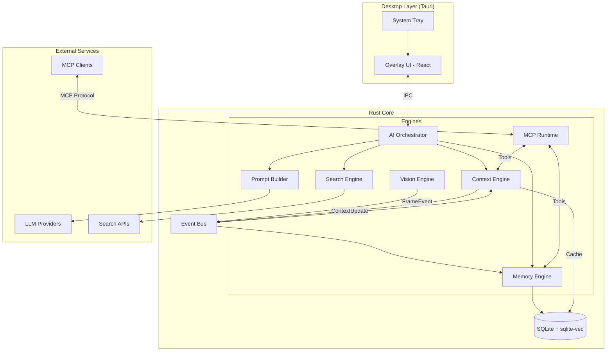
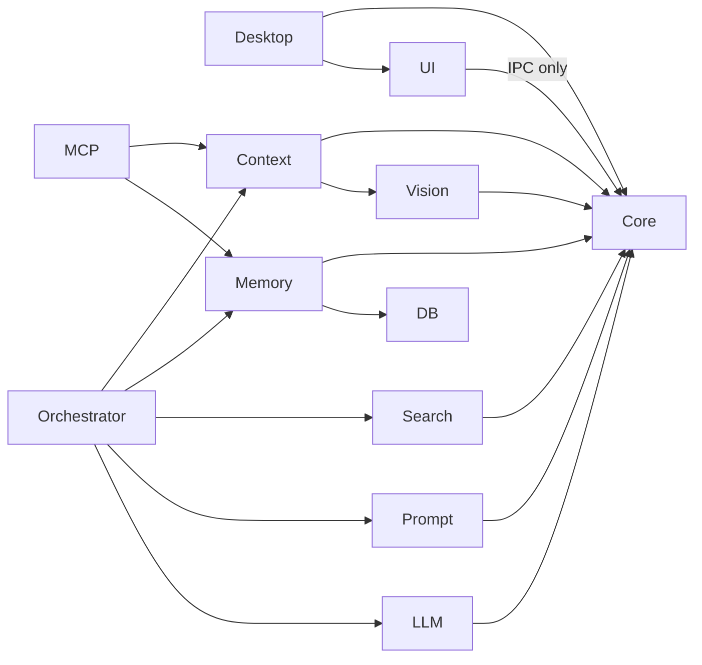
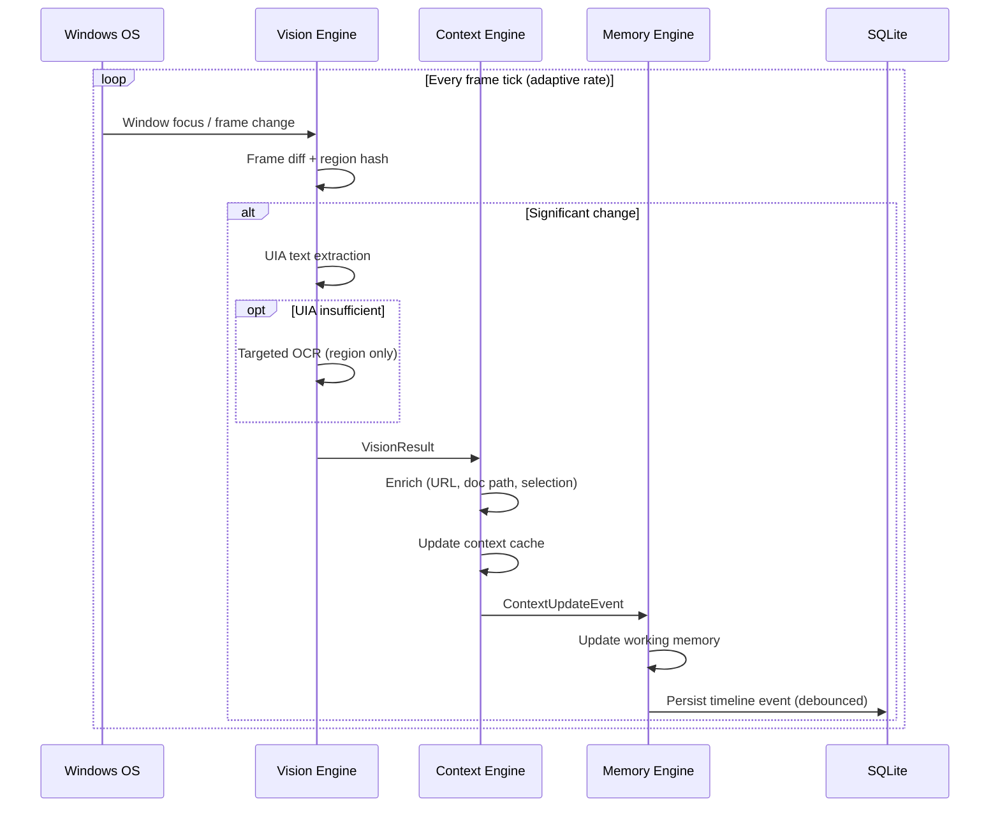
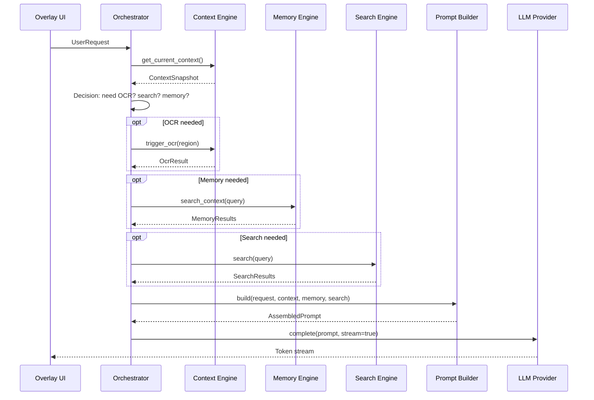
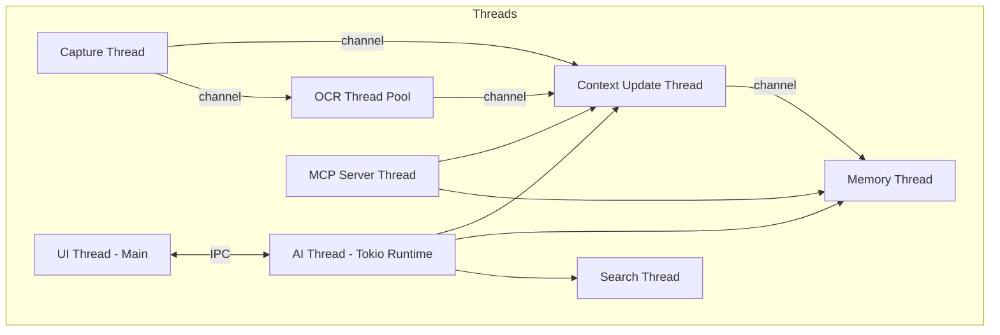
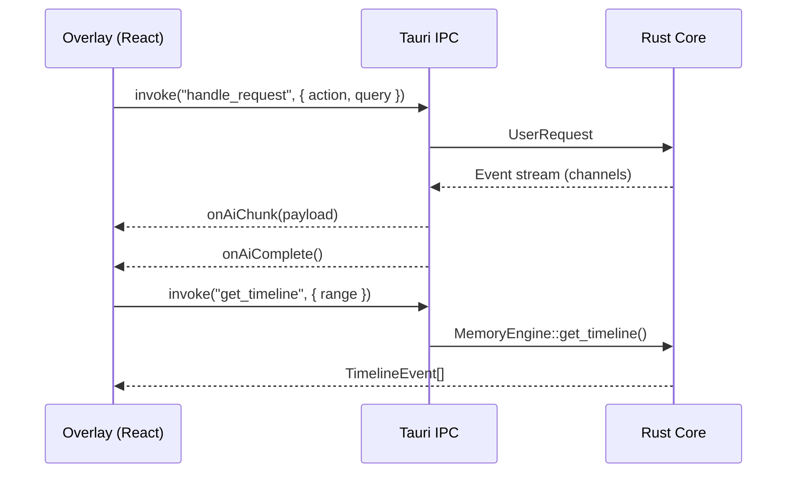
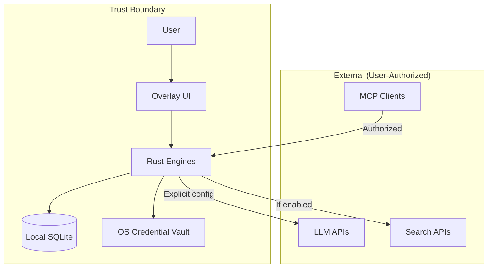

# System Architecture

**Project:** Contexa — AI Context Platform  
**Version:** 1.3  
**Status:** Reviewed  
**Last Updated:** 2026-07-07

---

## 1. Overview

This document describes the high-level and detailed system architecture for Contexa. The system follows a **pipeline architecture** with independent, concurrently executing engines connected via well-defined interfaces and an event bus.

Contexa is structured as a **Tauri desktop application** with a **Rust core** handling all performance-critical engines and a **React/TypeScript frontend** for the overlay and settings UI.

---

## 2. Goals

1. Modular engine design with single-responsibility components
2. Low-latency context pipeline from capture to AI response
3. Thread-safe concurrent processing across capture, context, memory, and AI workloads
4. AI-agnostic integration via provider adapters and MCP
5. Local-first data flow with optional external services

---

## 3. Responsibilities

| Layer | Responsibility |
|-------|----------------|
| **Desktop Shell (Tauri)** | Window management, system tray, IPC bridge |
| **Vision Engine** | Screen capture, UIA, selective OCR, frame differencing |
| **Context Engine** | Context snapshot assembly, caching, enrichment |
| **Memory Engine** | Persistence, timeline, embeddings, semantic search |
| **AI Orchestrator** | Request routing, capability decisions, provider selection |
| **Search Engine** | External search when context is insufficient |
| **Prompt Builder** | Token-aware prompt assembly |
| **MCP Runtime** | MCP server and client for external AI integration |
| **Overlay UI** | User-facing interaction layer |

---

## 4. High-Level Architecture



---

## 5. Component Architecture

### 5.1 Crate Structure

```
contexa/
├── apps/
│   ├── desktop/              # Tauri application entry
│   └── web/                  # Next.js marketing/docs site
├── crates/
│   ├── contexa-core/         # Shared types, event bus, config
│   ├── contexa-vision/       # Vision Engine
│   ├── contexa-context/     # Context Engine
│   ├── contexa-memory/      # Memory Engine
│   ├── contexa-orchestrator/# AI Orchestrator
│   ├── contexa-search/      # Search Engine
│   ├── contexa-prompt/      # Prompt Builder
│   ├── contexa-mcp/         # MCP Runtime
│   ├── contexa-llm/         # LLM provider adapters
│   └── contexa-db/          # Database layer
└── ui/
    └── overlay/              # React overlay components
```

### 5.2 Dependency Rules



**Rule:** Engines MUST NOT depend on each other circularly. The Orchestrator is the only component that coordinates multiple engines. The Event Bus enables decoupled communication.

---

## 6. Data Flow

### 6.1 Continuous Context Pipeline



### 6.2 User Query Pipeline



---

## 7. Interfaces

### 7.1 Event Bus

```rust
pub enum ContexaEvent {
    VisionFrame(VisionResult),
    ContextUpdate(ContextSnapshot),
    MemoryIndexed { chunk_id: String },
    UserRequest(UserRequest),
    AiResponse(AiResponseChunk),
    ConfigChanged(ConfigDelta),
    Shutdown,
}
```

### 7.2 Engine Traits

```rust
pub trait VisionEngine: Send + Sync {
    fn start(&self) -> Result<()>;
    fn stop(&self) -> Result<()>;
    fn capture_region(&self, region: Region) -> Result<VisionResult>;
    fn get_uia_tree(&self, hwnd: HWND) -> Result<UiaTree>;
}

pub trait ContextEngine: Send + Sync {
    fn get_current(&self) -> ContextSnapshot;
    fn get_recent(&self, duration: Duration) -> Vec<ContextSnapshot>;
    fn subscribe(&self) -> broadcast::Receiver<ContextSnapshot>;
}

pub trait MemoryEngine: Send + Sync {
    fn store(&self, snapshot: &ContextSnapshot) -> Result<String>;
    fn search(&self, query: &str, limit: usize) -> Result<Vec<MemoryChunk>>;
    fn get_timeline(&self, range: TimeRange) -> Result<Vec<TimelineEvent>>;
    fn delete(&self, id: &str) -> Result<()>;
}

pub trait AiOrchestrator: Send + Sync {
    async fn handle_request(&self, request: UserRequest) -> Result<ResponseStream>;
}

pub trait LlmProvider: Send + Sync {
    async fn complete(&self, prompt: &AssembledPrompt) -> Result<ResponseStream>;
    fn max_tokens(&self) -> usize;
    fn supports_streaming(&self) -> bool;
}
```

---

## 8. Data Structures

### 8.1 ContextSnapshot

```rust
pub struct ContextSnapshot {
    pub id: Uuid,
    pub timestamp: DateTime<Utc>,
    pub window: WindowInfo,
    pub application: ApplicationInfo,
    pub visible_text: Option<String>,
    pub selected_text: Option<String>,
    pub url: Option<String>,
    pub document_path: Option<String>,
    pub metadata: HashMap<String, String>,
    pub language: Option<String>,
    pub capture_method: CaptureMethod, // UIA | OCR | Hybrid
}
```

### 8.2 UserRequest

```rust
pub struct UserRequest {
    pub id: Uuid,
    pub action: RequestAction,
    pub query: Option<String>,
    pub context_override: Option<ContextSnapshot>,
    pub preferences: RequestPreferences,
}

pub enum RequestAction {
    Chat,
    Explain,
    Summarize,
    Translate { target_lang: String },
    Search,
    Recall,
}
```

See [04_Database_Design.md](./04_Database_Design.md) for persistence schemas.

---

## 9. Threading Model



| Thread | Priority | Description |
|--------|----------|-------------|
| Capture | High | Polls focus changes and frame diffs at adaptive rate |
| OCR Pool | Normal | 1-2 workers; only activated on demand |
| Context Update | High | Assembles snapshots; updates cache |
| Memory | Normal | Debounced persistence and embedding |
| Search | Low | External HTTP; never blocks capture |
| AI (Tokio) | Normal | Async LLM calls, orchestration |
| UI (Main) | High | Tauri main thread; IPC only |
| MCP Server | Normal | Handles external MCP client requests |

**Synchronization:**
- `Arc<RwLock<ContextCache>>` for current context (read-heavy)
- `crossbeam-channel` for engine-to-engine messages
- `tokio::sync` primitives for async AI pipeline
- SQLite WAL mode with connection-per-thread for writes

---

## 10. IPC Architecture (Tauri)



**Commands (Tauri):**

| Command | Direction | Description |
|---------|-----------|-------------|
| `get_current_context` | UI → Core | Returns latest ContextSnapshot |
| `handle_request` | UI → Core | Initiates AI request |
| `get_timeline` | UI → Core | Returns timeline events |
| `get_settings` | UI → Core | Returns user configuration |
| `update_settings` | UI → Core | Persists configuration changes |
| `on_context_update` | Core → UI | Event: context changed |
| `on_ai_chunk` | Core → UI | Event: streaming token |
| `on_ai_complete` | Core → UI | Event: response finished |

---

## 11. Performance Architecture

| Strategy | Implementation |
|----------|----------------|
| UI Automation first | UIA tree walk before any OCR |
| Frame differencing | Compare perceptual hashes; skip identical frames |
| Region hashing | Hash UI regions; skip unchanged regions |
| Adaptive capture rate | 1 fps idle, 5 fps active, 10 fps on interaction |
| Frame dropping | Drop queued frames if context thread is behind |
| Debounced persistence | Batch timeline writes every 5 seconds |
| Embedding batching | Queue chunks; embed in batches of 10 |
| Context cache | In-memory LRU; sub-millisecond reads |
| OCR on demand | Only triggered by orchestrator or UIA failure |

---

## 12. Security Architecture



- API keys never stored in SQLite; OS credential vault only
- Exclusion list enforced in Vision Engine before capture
- MCP server requires token-based authorization
- All external calls logged in audit table

---

## 13. Deployment Architecture

| Component | Target | Distribution |
|-----------|--------|--------------|
| Desktop App | Windows 10/11 x64 | MSI / NSIS installer via Tauri |
| Web Site | Vercel / static host | Next.js SSR/SSG |
| Database | Embedded SQLite | Shipped with desktop app |
| Updates | Tauri updater | Signed auto-update |

See [20_Deployment.md](./20_Deployment.md) for details.

---

## 14. Technology Stack

| Layer | Technology |
|-------|------------|
| Desktop Shell | Tauri 2.x |
| UI | React 18, TypeScript, TailwindCSS |
| Core | Rust (edition 2021) |
| Async Runtime | Tokio |
| Database | SQLite 3 + sqlite-vec via rusqlite |
| Web | Next.js 14, TypeScript, TailwindCSS |
| IPC | Tauri commands + events |
| Build | Cargo workspace, pnpm, Turborepo |

### 14.1 Key Rust Dependencies

| Crate | Version | Purpose |
|-------|---------|---------|
| `tauri` | 2.x | Desktop shell, IPC, system tray |
| `windows` | 0.62+ (pin at impl) | Win32/WinRT APIs (UIA, WGC, OCR) |
| `uiautomation` | 0.25+ | High-level UIA tree traversal |
| `tokio` | 1.x | Async runtime for AI/search/MCP |
| `rusqlite` | 0.32+ | SQLite + extension loading + SQLCipher |
| `refinery` | 0.8+ | Schema migrations |
| `sqlite-vec` | 0.1+ | Vector similarity search (alpha — SP-04 gate) |
| `rmcp` | 1.x | Model Context Protocol server/client |
| `reqwest` | 0.12+ | HTTP client for LLM/search APIs |
| `fastembed` | 5.x | Default embedding (all-MiniLM-L6-v2, 384-dim) |
| `tracing` | 0.1+ | Structured logging and spans |
| `crossbeam-channel` | 0.5+ | Engine-to-engine message passing |
| `keyring` | 3.x | OS credential vault for API keys |
| `whatlang` | 0.16+ | Language detection |
| `uuid` | 1.x | Context snapshot identifiers |
| `chrono` | 0.4+ | Timestamp handling |
| `thiserror` | 2.x | Error type definitions |
| `serde` / `serde_json` | 1.x | Serialization |

### 14.2 Windows COM Threading

UIA and Graphics Capture are COM-based APIs with apartment threading requirements. See [ADR/0008](../ADR/0008-windows-com-threading.md).

| Thread | Apartment | Owns |
|--------|-----------|------|
| Main (Tauri) | STA | WebView2, IPC |
| `contexa-capture` | STA | UIA, WGC, Window Monitor |
| `contexa-ocr-*` (pool) | STA | Windows.Media.Ocr |
| Tokio runtime | N/A (no COM) | LLM, search, DB, MCP |

---

## 15. Future Expansion

- **Distributed context:** Sync memory across devices via E2E encrypted relay
- **Plugin runtime:** WASM-based context enrichers
- **Multi-platform:** Abstract `PlatformCapture` trait for macOS (ScreenCaptureKit) and Linux (PipeWire)
- **gRPC API:** Remote context access for CI/CD and headless agents
- **Context streaming:** WebSocket feed for real-time context consumers

---

## 16. Best Practices

- Keep engine boundaries strict; communicate only via Event Bus or Orchestrator
- Never block the capture thread on I/O or LLM calls
- Version all IPC command schemas
- Feature-flag experimental engines
- Profile with `tracing` spans on every pipeline stage

---

## 17. References

- [01_Software_Requirements_Specification.md](./01_Software_Requirements_Specification.md)
- [03_API_Interface_Specification.md](./03_API_Interface_Specification.md)
- [ADR/0001-rust-core-tauri-shell.md](../ADR/0001-rust-core-tauri-shell.md)
- [Tauri Architecture](https://tauri.app/concept/architecture/)
