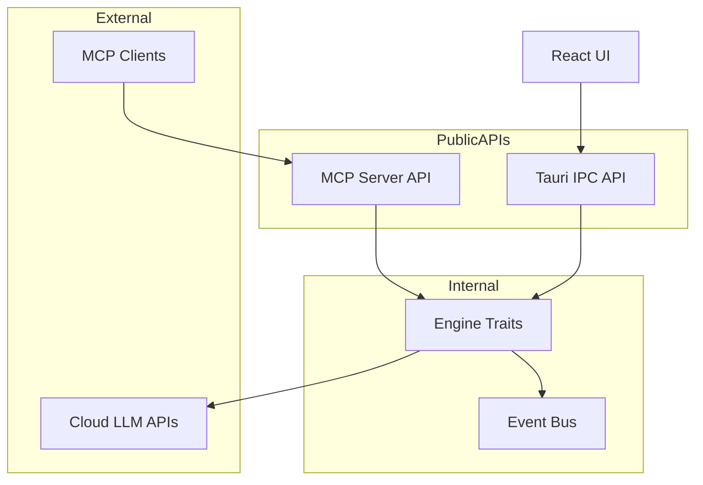
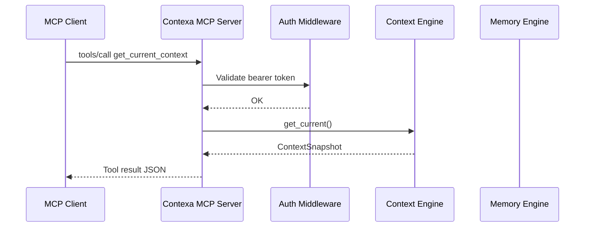
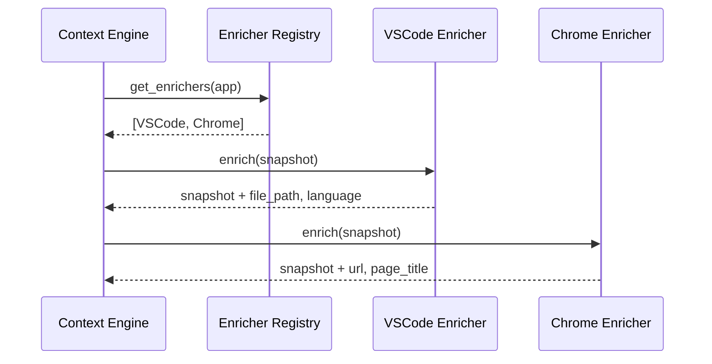

# API & Interface Specification

**Project:** Contexa — AI Context Platform  
**Version:** 1.3  
**Status:** Reviewed  
**Last Updated:** 2026-07-07

---

## 1. Overview

This document specifies all public interfaces for Contexa: Tauri IPC commands, internal Rust engine traits, MCP tool definitions, LLM provider adapters, and REST-like schemas for the web site.

---

## 2. Goals

1. Define stable, versioned contracts between UI, core engines, and external consumers
2. Enable third-party integration via MCP without coupling to internal implementation
3. Support multiple LLM providers through a unified adapter interface
4. Ensure all APIs are testable with mock implementations

---

## 3. Responsibilities

| Interface Layer | Consumers | Provider |
|-----------------|-----------|----------|
| Tauri IPC | React Overlay UI | `contexa-desktop` |
| Engine Traits | Internal crates | `contexa-core` |
| MCP Tools | External AI clients | `contexa-mcp` |
| LLM Adapters | Orchestrator | `contexa-llm` |
| Search Adapters | Orchestrator | `contexa-search` |
| Plugin API | Context enrichers | `contexa-core` |

---

## 4. Architecture



---

## 5. Tauri IPC API

### 5.1 Versioning

All commands include implicit schema version `v1`. Breaking changes require new command names (e.g., `get_current_context_v2`).

### 5.2 Commands (UI → Core)

#### `get_current_context`

Returns the latest context snapshot.

**Request:** `null`

**Response:**
```typescript
interface ContextSnapshot {
  id: string;
  timestamp: string; // ISO 8601
  window: {
    hwnd: number;
    title: string;
    bounds: { x: number; y: number; width: number; height: number };
  };
  application: {
    process_name: string;
    process_id: number;
    executable_path: string | null;
  };
  visible_text: string | null;
  selected_text: string | null;
  url: string | null;
  document_path: string | null;
  metadata: Record<string, string>;
  language: string | null; // ISO 639-1
  capture_method: "uia" | "ocr" | "hybrid";
}
```

#### `handle_request`

Initiates an AI request.

**Request:**
```typescript
interface HandleRequestParams {
  action: "chat" | "explain" | "summarize" | "translate" | "search" | "recall";
  query?: string;
  target_lang?: string; // Required for translate
  stream?: boolean; // Default: true
}
```

**Response:**
```typescript
interface HandleRequestResponse {
  request_id: string;
  status: "accepted" | "rejected";
  reason?: string;
}
```

#### `get_timeline`

**Request:**
```typescript
interface GetTimelineParams {
  start: string; // ISO 8601
  end: string;
  limit?: number; // Default: 100
  offset?: number;
}
```

**Response:**
```typescript
interface TimelineEvent {
  id: string;
  timestamp: string;
  event_type: "context_change" | "user_query" | "ai_response" | "app_switch";
  summary: string;
  application: string;
  window_title: string;
  duration_ms: number | null;
  context_id: string | null;
}

interface GetTimelineResponse {
  events: TimelineEvent[];
  total: number;
  has_more: boolean;
}
```

#### `search_context`

**Request:**
```typescript
interface SearchContextParams {
  query: string;
  limit?: number; // Default: 10
  min_score?: number; // Default: 0.7
  time_range?: { start: string; end: string };
}
```

**Response:**
```typescript
interface MemoryChunk {
  id: string;
  content: string;
  score: number;
  timestamp: string;
  application: string;
  metadata: Record<string, string>;
}

interface SearchContextResponse {
  results: MemoryChunk[];
}
```

#### `get_settings`

**Response:**
```typescript
interface Settings {
  llm: {
    provider: "openai" | "anthropic" | "gemini" | "ollama" | "lmstudio";
    model: string;
    base_url?: string;
    max_tokens: number;
    temperature: number;
  };
  capture: {
    enabled: boolean;
    excluded_apps: string[];
    excluded_urls: string[];
    excluded_window_titles: string[];
  };
  memory: {
    retention_days: number;
    embedding_model: string;
  };
  search: {
    enabled: boolean;
    provider: string;
  };
  hotkey: {
    overlay: string; // e.g., "Alt+Space"
  };
  privacy: {
    send_context_to_cloud: boolean;
  };
}
```

#### `update_settings`

**Request:** `Partial<Settings>`

**Response:** `{ success: boolean; settings: Settings }`

#### `delete_all_data`

**Request:** `{ confirm: true }`

**Response:** `{ success: boolean; deleted_records: number }`

### 5.3 Events (Core → UI)

| Event | Payload | Description |
|-------|---------|-------------|
| `context-update` | `ContextSnapshot` | Emitted on meaningful context change |
| `ai-chunk` | `{ request_id, content, done }` | Streaming token |
| `ai-complete` | `{ request_id, total_tokens, latency_ms }` | Response finished |
| `ai-error` | `{ request_id, error, code }` | Request failed |
| `engine-status` | `{ engine, status, message }` | Engine health update |

---

## 6. MCP Server API

### 6.1 Server Info

```json
{
  "name": "contexa",
  "version": "1.0.0",
  "description": "Contexa AI Context Platform — Desktop context and memory for AI"
}
```

### 6.2 Tools

#### `get_current_context`

Returns the current desktop context snapshot.

**Input Schema:**
```json
{
  "type": "object",
  "properties": {},
  "required": []
}
```

**Output:** `ContextSnapshot` JSON (see §5.2)

#### `get_visible_text`

Returns visible text from the active window.

**Input Schema:**
```json
{
  "type": "object",
  "properties": {
    "max_length": { "type": "integer", "default": 10000 }
  }
}
```

**Output:**
```json
{
  "text": "string",
  "capture_method": "uia | ocr | hybrid",
  "truncated": false
}
```

#### `get_recent_context`

Returns context snapshots from the recent time window.

**Input Schema:**
```json
{
  "type": "object",
  "properties": {
    "minutes": { "type": "integer", "default": 30, "maximum": 1440 }
  },
  "required": []
}
```

**Output:**
```json
{
  "snapshots": ["ContextSnapshot"],
  "count": 0
}
```

#### `get_timeline`

Returns chronological timeline events.

**Input Schema:**
```json
{
  "type": "object",
  "properties": {
    "start": { "type": "string", "format": "date-time" },
    "end": { "type": "string", "format": "date-time" },
    "limit": { "type": "integer", "default": 50 }
  },
  "required": ["start", "end"]
}
```

**Output:** Array of `TimelineEvent`

#### `search_context`

Semantic search over stored memory.

**Input Schema:**
```json
{
  "type": "object",
  "properties": {
    "query": { "type": "string" },
    "limit": { "type": "integer", "default": 10 }
  },
  "required": ["query"]
}
```

**Output:** Array of `MemoryChunk`

### 6.3 Resources (v1.1)

| URI | Description |
|-----|-------------|
| `contexa://context/current` | Live context snapshot (JSON) |
| `contexa://context/selection` | Current text selection (plain text) |
| `contexa://timeline/today` | Today's timeline events |
| `contexa://memory/recent` | Last 30 minutes working memory |
| `contexa://ide/current` | IDE LSP context (requires extension) |

See [11_MCP_Runtime.md](./11_MCP_Runtime.md) §13 for full resource specification.

### 6.4 Authorization

MCP connections require a bearer token generated in Contexa Settings. Token is validated on each request.

```
Authorization: Bearer ctx_<random_32_bytes_hex>
```

---

## 7. Internal Engine Traits (Rust)

### 7.1 VisionEngine

```rust
#[async_trait]
pub trait VisionEngine: Send + Sync {
    async fn start(&self) -> Result<()>;
    async fn stop(&self) -> Result<()>;
    fn capture_active_window(&self) -> Result<VisionResult>;
    fn extract_uia_text(&self, hwnd: isize) -> Result<UiaResult>;
    fn ocr_region(&self, region: &Region, image: &[u8]) -> Result<OcrResult>;
    fn compute_frame_hash(&self, frame: &Frame) -> u64;
    fn diff_frames(&self, prev: &Frame, curr: &Frame) -> Vec<Region>;
}
```

### 7.2 ContextEngine

```rust
#[async_trait]
pub trait ContextEngine: Send + Sync {
    fn get_current(&self) -> ContextSnapshot;
    fn get_recent(&self, duration: Duration) -> Vec<ContextSnapshot>;
    fn update(&self, vision: VisionResult) -> Result<ContextSnapshot>;
    fn subscribe(&self) -> broadcast::Receiver<ContextSnapshot>;
    fn get_selection(&self) -> Option<String>;
}
```

### 7.3 MemoryEngine

```rust
#[async_trait]
pub trait MemoryEngine: Send + Sync {
    async fn store(&self, snapshot: &ContextSnapshot) -> Result<String>;
    async fn search(&self, query: &str, opts: SearchOptions) -> Result<Vec<ScoredChunk>>;
    async fn get_timeline(&self, range: TimeRange) -> Result<Vec<TimelineEvent>>;
    async fn embed(&self, text: &str) -> Result<Vec<f32>>;
    async fn delete(&self, id: &str) -> Result<()>;
    async fn purge_before(&self, date: DateTime<Utc>) -> Result<u64>;
}
```

### 7.4 SearchAdapter

```rust
#[async_trait]
pub trait SearchAdapter: Send + Sync {
    async fn search(&self, query: &str, opts: WebSearchOptions) -> Result<Vec<SearchResult>>;
    fn provider_name(&self) -> &str;
}
```

### 7.5 LlmProvider

```rust
#[async_trait]
pub trait LlmProvider: Send + Sync {
    async fn complete(&self, messages: &[Message], opts: CompletionOptions)
        -> Result<ResponseStream>;
    async fn embed(&self, text: &str) -> Result<Vec<f32>>;
    fn provider_id(&self) -> &str;
    fn model(&self) -> &str;
    fn max_context_tokens(&self) -> usize;
}
```

### 7.6 ContextEnricher (Plugin)

```rust
pub trait ContextEnricher: Send + Sync {
    fn app_matcher(&self) -> AppMatcher;
    fn enrich(&self, snapshot: &mut ContextSnapshot) -> Result<()>;
    fn priority(&self) -> u32;
}
```

---

## 8. Data Structures

### 8.1 VisionResult

```rust
pub struct VisionResult {
    pub hwnd: isize,
    pub frame_hash: u64,
    pub changed_regions: Vec<Region>,
    pub uia_text: Option<String>,
    pub ocr_text: Option<String>,
    pub capture_timestamp: DateTime<Utc>,
    pub method: CaptureMethod,
}
```

### 8.2 AssembledPrompt

```rust
pub struct AssembledPrompt {
    pub system: String,
    pub messages: Vec<Message>,
    pub token_count: usize,
    pub sources: Vec<SourceRef>,
    pub truncated: bool,
}

pub struct SourceRef {
    pub source_type: SourceType, // Context | Memory | Search | Timeline
    pub id: String,
    pub label: String,
}
```

### 8.3 Error Types

```rust
pub enum ContexaError {
    CaptureFailed { reason: String },
    ContextUnavailable,
    MemoryNotFound { id: String },
    LlmProviderError { provider: String, message: String },
    SearchDisabled,
    Unauthorized,
    ConfigError { field: String },
    DatabaseError { message: String },
    RateLimited,
}
```

---

## 9. LLM Provider Adapter Mapping

| Provider | API | Streaming | Embeddings |
|----------|-----|-----------|------------|
| OpenAI | `/v1/chat/completions` | SSE | `/v1/embeddings` |
| Anthropic | `/v1/messages` | SSE | N/A (use local) |
| Gemini | `generateContent` | SSE | `embedContent` |
| Ollama | `/api/chat` | NDJSON | `/api/embeddings` |
| LM Studio | OpenAI-compatible | SSE | OpenAI-compatible |

### 9.1 Message Format (Internal)

```rust
pub struct Message {
    pub role: Role, // System | User | Assistant
    pub content: String,
}

pub struct CompletionOptions {
    pub max_tokens: u32,
    pub temperature: f32,
    pub stream: bool,
}
```

---

## 10. Flow Diagrams

### 10.1 MCP Tool Invocation



### 10.2 Plugin Enrichment



---

## 11. Threading

- IPC commands are handled on the Tauri async runtime
- Long-running operations (LLM, search) return immediately with `request_id`; results stream via events
- MCP server runs on dedicated thread with its own Tokio runtime
- Engine trait methods are `Send + Sync` for cross-thread invocation

---

## 12. Performance

| API | Target Latency |
|-----|----------------|
| `get_current_context` | < 5 ms |
| `get_recent_context` | < 20 ms |
| `search_context` | < 200 ms |
| `get_timeline` | < 100 ms |
| `handle_request` (accept) | < 50 ms |
| MCP tool call | < 10 ms (non-LLM tools) |

---

## 13. Security

- All IPC is local-only (no network exposure of Tauri commands)
- MCP server binds to `127.0.0.1` only
- API keys never returned via `get_settings`
- `delete_all_data` requires explicit `{ confirm: true }`
- Audit log records all MCP tool invocations

---

## 14. Future Expansion

- GraphQL API for web dashboard
- WebSocket context stream for real-time consumers
- gRPC for inter-process plugin communication
- OpenAPI spec generation from Rust types via `utoipa`

---

## 15. Best Practices

- Use `serde` with `#[serde(deny_unknown_fields)]` on all public types
- Version MCP tool schemas with `$id` URIs
- Provide mock implementations of all traits for unit tests
- Document breaking changes in CHANGELOG and ADRs

---

## 16. References

- [02_System_Architecture.md](./02_System_Architecture.md)
- [11_MCP_Runtime.md](./11_MCP_Runtime.md)
- [Model Context Protocol Specification](https://spec.modelcontextprotocol.io/)
- [Tauri Commands](https://tauri.app/develop/calling-rust/)
