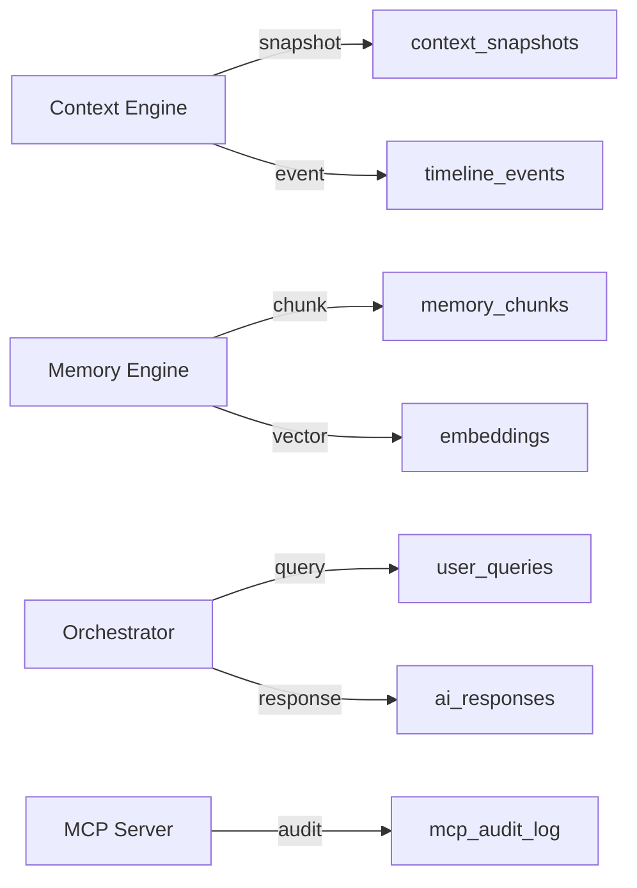
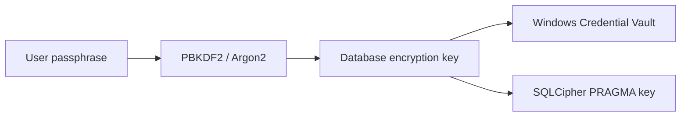

# Database Design

**Project:** Contexa — AI Context Platform  
**Version:** 1.3  
**Status:** Reviewed  
**Last Updated:** 2026-07-07

---

## 1. Overview

Contexa uses **SQLite 3** as its embedded, local-first database with the **sqlite-vec** extension for vector similarity search. All user data resides on the local filesystem. No cloud database is required or used by default.

**Database file location:** `%APPDATA%\Contexa\contexa.db`

---

## 2. Goals

1. Zero-configuration embedded storage for context, memory, and timeline
2. Efficient semantic search via vector embeddings
3. Crash-safe writes with WAL mode
4. Configurable retention with efficient purge operations
5. Schema migrations without data loss

---

## 3. Responsibilities

| Concern | Owner |
|---------|-------|
| Schema definition | `contexa-db` crate |
| Migrations | `refinery` (see [ADR/0010](../ADR/0010-rusqlite-database-access.md)) |
| DB access | `rusqlite` via `tokio::task::spawn_blocking` |
| Vector search | `sqlite-vec` extension |
| Connection pooling | Per-thread connections with WAL |
| Retention purge | `MemoryEngine` scheduled job |

---

## 4. Architecture

```mermaid
erDiagram
    CONTEXT_SNAPSHOTS ||--o{ TIMELINE_EVENTS : "referenced_by"
    CONTEXT_SNAPSHOTS ||--o| MEMORY_CHUNKS : "source"
    MEMORY_CHUNKS ||--|| EMBEDDINGS : "has_384"
    MEMORY_CHUNKS ||--o| EMBEDDINGS_768 : "has_quality"
    MEMORY_CHUNKS ||--o{ CHUNK_ENTITIES : "mentions"
    ENTITIES ||--o{ CHUNK_ENTITIES : "in"
    META_MEMORIES ||--o{ META_MEMORY_CHUNKS : "summarizes"
    MEMORY_CHUNKS ||--o{ META_MEMORY_CHUNKS : "source_of"
    USER_SETTINGS ||--|| SETTINGS_META : "version"
    USER_QUERIES ||--o{ AI_RESPONSES : "generates"
    MCP_AUDIT_LOG }o--|| MCP_TOKENS : "authorized_by"

    CONTEXT_SNAPSHOTS {
        text id PK
        text timestamp
        text window_title
        text process_name
        integer process_id
        text url
        text document_path
        text visible_text
        text selected_text
        text metadata_json
        text language
        text capture_method
    }

    TIMELINE_EVENTS {
        text id PK
        text timestamp
        text event_type
        text summary
        text application
        text window_title
        integer duration_ms
        text context_id FK
    }

    MEMORY_CHUNKS {
        text id PK
        text context_id FK
        text content
        text content_hash
        text timestamp
        text application
        text metadata_json
        integer token_count
    }

    EMBEDDINGS {
        text chunk_id PK_FK
        blob vector_384
    }

    EMBEDDINGS_768 {
        text chunk_id PK_FK
        blob vector_768
    }

    EMBEDDING_META {
        text chunk_id PK_FK
        text model
        integer dimensions
    }

    META_MEMORIES {
        text id PK
        text level
        text period_start
        text summary
    }

    ENTITIES {
        text id PK
        text name
        text entity_type
        text normalized_name
    }

    CHUNK_ENTITIES {
        text chunk_id FK
        text entity_id FK
        real confidence
    }

    WORK_THREADS {
        text id PK
        text title
        text entity_ids_json
    }

    ENCRYPTION_META {
        integer id PK
        integer enabled
        integer cipher_version
    }

    USER_SETTINGS {
        text key PK
        text value_json
        text updated_at
    }

    USER_QUERIES {
        text id PK
        text timestamp
        text action
        text query
        text context_id FK
        integer latency_ms
    }

    AI_RESPONSES {
        text id PK
        text query_id FK
        text content
        text model
        integer token_count
        text timestamp
    }

    MCP_TOKENS {
        text id PK
        text token_hash
        text label
        text created_at
        text last_used_at
        integer revoked
    }

    MCP_AUDIT_LOG {
        integer id PK
        text token_id FK
        text tool_name
        text timestamp
        text request_summary
    }

    EXCLUSIONS {
        integer id PK
        text exclusion_type
        text pattern
        text created_at
    }

    SCHEMA_VERSION {
        integer version PK
        text applied_at
    }
```

---

## 5. Schema Definitions

### 5.1 `context_snapshots`

Stores individual context captures.

```sql
CREATE TABLE context_snapshots (
    id              TEXT PRIMARY KEY NOT NULL,
    timestamp       TEXT NOT NULL,           -- ISO 8601 UTC
    window_title    TEXT NOT NULL,
    process_name    TEXT NOT NULL,
    process_id      INTEGER NOT NULL,
    hwnd            INTEGER,
    url             TEXT,
    document_path   TEXT,
    visible_text    TEXT,
    selected_text   TEXT,
    metadata_json   TEXT DEFAULT '{}',
    language        TEXT,
    capture_method  TEXT NOT NULL CHECK(capture_method IN ('uia', 'ocr', 'hybrid')),
    created_at      TEXT NOT NULL DEFAULT (datetime('now'))
);

CREATE INDEX idx_context_timestamp ON context_snapshots(timestamp);
CREATE INDEX idx_context_process ON context_snapshots(process_name);
CREATE INDEX idx_context_url ON context_snapshots(url) WHERE url IS NOT NULL;
```

### 5.2 `timeline_events`

Chronological activity log.

```sql
CREATE TABLE timeline_events (
    id              TEXT PRIMARY KEY NOT NULL,
    timestamp       TEXT NOT NULL,
    event_type      TEXT NOT NULL CHECK(event_type IN (
                        'context_change', 'app_switch', 'user_query', 'ai_response'
                    )),
    summary         TEXT NOT NULL,
    application     TEXT NOT NULL,
    window_title    TEXT NOT NULL,
    duration_ms     INTEGER,
    context_id      TEXT REFERENCES context_snapshots(id) ON DELETE SET NULL,
    created_at      TEXT NOT NULL DEFAULT (datetime('now'))
);

CREATE INDEX idx_timeline_timestamp ON timeline_events(timestamp);
CREATE INDEX idx_timeline_type ON timeline_events(event_type);
CREATE INDEX idx_timeline_app ON timeline_events(application);
```

### 5.3 `memory_chunks`

Searchable memory units derived from context.

```sql
CREATE TABLE memory_chunks (
    id              TEXT PRIMARY KEY NOT NULL,
    context_id      TEXT REFERENCES context_snapshots(id) ON DELETE CASCADE,
    content         TEXT NOT NULL,
    content_hash    TEXT NOT NULL,           -- SHA-256 for dedup
    timestamp       TEXT NOT NULL,
    application     TEXT NOT NULL,
    metadata_json   TEXT DEFAULT '{}',
    token_count     INTEGER DEFAULT 0,
    created_at      TEXT NOT NULL DEFAULT (datetime('now'))
);

CREATE UNIQUE INDEX idx_memory_hash ON memory_chunks(content_hash);
CREATE INDEX idx_memory_timestamp ON memory_chunks(timestamp);
CREATE INDEX idx_memory_app ON memory_chunks(application);
```

### 5.4 `embeddings`

Vector storage via sqlite-vec.

```sql
-- Load sqlite-vec extension at connection init (rusqlite — ADR/0010)
-- Default: all-MiniLM-L6-v2 (384-dim) via fastembed. See ADR/0006.
CREATE VIRTUAL TABLE embeddings USING vec0(
    chunk_id    TEXT PRIMARY KEY,
    embedding   FLOAT[384]
);

-- Quality mode: nomic-embed-text (768-dim) via Ollama
CREATE VIRTUAL TABLE embeddings_768 USING vec0(
    chunk_id    TEXT PRIMARY KEY,
    embedding   FLOAT[768]
);

-- Metadata table for embedding model tracking
CREATE TABLE embedding_meta (
    chunk_id        TEXT PRIMARY KEY REFERENCES memory_chunks(id) ON DELETE CASCADE,
    model           TEXT NOT NULL,
    dimensions      INTEGER NOT NULL,
    created_at      TEXT NOT NULL DEFAULT (datetime('now'))
);
```

### 5.5 `user_settings`

Key-value settings store.

```sql
CREATE TABLE user_settings (
    key             TEXT PRIMARY KEY NOT NULL,
    value_json      TEXT NOT NULL,
    updated_at      TEXT NOT NULL DEFAULT (datetime('now'))
);
```

### 5.6 `user_queries` and `ai_responses`

Interaction history.

```sql
CREATE TABLE user_queries (
    id              TEXT PRIMARY KEY NOT NULL,
    timestamp       TEXT NOT NULL,
    action          TEXT NOT NULL,
    query           TEXT,
    context_id      TEXT REFERENCES context_snapshots(id),
    latency_ms      INTEGER,
    created_at      TEXT NOT NULL DEFAULT (datetime('now'))
);

CREATE TABLE ai_responses (
    id              TEXT PRIMARY KEY NOT NULL,
    query_id        TEXT NOT NULL REFERENCES user_queries(id) ON DELETE CASCADE,
    content         TEXT NOT NULL,
    model           TEXT NOT NULL,
    token_count     INTEGER,
    timestamp       TEXT NOT NULL,
    created_at      TEXT NOT NULL DEFAULT (datetime('now'))
);

CREATE INDEX idx_queries_timestamp ON user_queries(timestamp);
```

### 5.7 `mcp_tokens` and `mcp_audit_log`

```sql
CREATE TABLE mcp_tokens (
    id              TEXT PRIMARY KEY NOT NULL,
    token_hash      TEXT NOT NULL UNIQUE,    -- bcrypt hash
    label           TEXT NOT NULL,
    created_at      TEXT NOT NULL DEFAULT (datetime('now')),
    last_used_at    TEXT,
    revoked         INTEGER NOT NULL DEFAULT 0
);

CREATE TABLE mcp_audit_log (
    id              INTEGER PRIMARY KEY AUTOINCREMENT,
    token_id        TEXT REFERENCES mcp_tokens(id),
    tool_name       TEXT NOT NULL,
    timestamp       TEXT NOT NULL DEFAULT (datetime('now')),
    request_summary TEXT
);

CREATE INDEX idx_audit_timestamp ON mcp_audit_log(timestamp);
```

### 5.8 `exclusions`

```sql
CREATE TABLE exclusions (
    id              INTEGER PRIMARY KEY AUTOINCREMENT,
    exclusion_type  TEXT NOT NULL CHECK(exclusion_type IN ('app', 'url', 'window_title')),
    pattern         TEXT NOT NULL,
    created_at      TEXT NOT NULL DEFAULT (datetime('now'))
);

CREATE UNIQUE INDEX idx_exclusion_pattern ON exclusions(exclusion_type, pattern);
```

### 5.9 `schema_version`

```sql
CREATE TABLE schema_version (
    version         INTEGER PRIMARY KEY,
    applied_at      TEXT NOT NULL DEFAULT (datetime('now')),
    description     TEXT
);
```

### 5.10 v1.1 Tables (Hierarchical Memory, Entity Linking)

Applied in migration `004_v1_1_memory_entities.sql`. Full specs in [07_Memory_Engine.md](./07_Memory_Engine.md) §13–14.

```sql
CREATE TABLE meta_memories (
    id              TEXT PRIMARY KEY NOT NULL,
    level           TEXT NOT NULL CHECK(level IN ('daily', 'weekly')),
    period_start    TEXT NOT NULL,
    period_end      TEXT NOT NULL,
    summary         TEXT NOT NULL,
    applications_json TEXT DEFAULT '[]',
    chunk_count     INTEGER DEFAULT 0,
    source_ids_json TEXT DEFAULT '[]',
    created_at      TEXT NOT NULL DEFAULT (datetime('now'))
);

CREATE INDEX idx_meta_period ON meta_memories(period_start, level);

CREATE TABLE entities (
    id              TEXT PRIMARY KEY NOT NULL,
    name            TEXT NOT NULL,
    entity_type     TEXT NOT NULL,
    normalized_name TEXT NOT NULL,
    first_seen      TEXT NOT NULL,
    last_seen       TEXT NOT NULL,
    occurrence_count INTEGER DEFAULT 1
);

CREATE UNIQUE INDEX idx_entity_normalized ON entities(normalized_name, entity_type);

CREATE TABLE chunk_entities (
    chunk_id        TEXT NOT NULL REFERENCES memory_chunks(id) ON DELETE CASCADE,
    entity_id       TEXT NOT NULL REFERENCES entities(id) ON DELETE CASCADE,
    confidence      REAL DEFAULT 1.0,
    PRIMARY KEY (chunk_id, entity_id)
);

CREATE TABLE work_threads (
    id              TEXT PRIMARY KEY NOT NULL,
    title           TEXT NOT NULL,
    entity_ids_json TEXT NOT NULL,
    started_at      TEXT NOT NULL,
    last_active     TEXT NOT NULL,
    chunk_ids_json  TEXT DEFAULT '[]'
);

CREATE TABLE encryption_meta (
    id              INTEGER PRIMARY KEY CHECK (id = 1),
    enabled         INTEGER NOT NULL DEFAULT 0,
    cipher_version  INTEGER NOT NULL DEFAULT 4,
    kdf_iter        INTEGER NOT NULL DEFAULT 256000,
    enabled_at      TEXT
);
```

---

## 6. Data Flow



---

## 7. Query Patterns

### 7.1 Semantic Search

```sql
SELECT
    mc.id,
    mc.content,
    mc.timestamp,
    mc.application,
    vec_distance_cosine(e.embedding, ?) AS distance
FROM embeddings e
JOIN memory_chunks mc ON mc.id = e.chunk_id
WHERE distance < ?
ORDER BY distance ASC
LIMIT ?;
```

### 7.2 Timeline for Date Range

```sql
SELECT *
FROM timeline_events
WHERE timestamp BETWEEN ? AND ?
ORDER BY timestamp DESC
LIMIT ? OFFSET ?;
```

### 7.3 Recent Context

```sql
SELECT *
FROM context_snapshots
WHERE timestamp > datetime('now', '-' || ? || ' minutes')
ORDER BY timestamp DESC;
```

### 7.4 Retention Purge

```sql
-- Delete old memory chunks (cascades to embeddings via FK)
DELETE FROM memory_chunks
WHERE timestamp < datetime('now', '-' || ? || ' days');

-- Delete orphaned context snapshots
DELETE FROM context_snapshots
WHERE timestamp < datetime('now', '-' || ? || ' days')
  AND id NOT IN (SELECT context_id FROM memory_chunks WHERE context_id IS NOT NULL);

-- Delete old timeline events
DELETE FROM timeline_events
WHERE timestamp < datetime('now', '-' || ? || ' days');

-- Vacuum periodically
VACUUM;
```

---

## 8. Interfaces

### 8.1 Database Repository Trait

```rust
#[async_trait]
pub trait ContextRepository: Send + Sync {
    async fn insert_snapshot(&self, snapshot: &ContextSnapshot) -> Result<()>;
    async fn get_snapshot(&self, id: &str) -> Result<Option<ContextSnapshot>>;
    async fn get_recent(&self, minutes: u32) -> Result<Vec<ContextSnapshot>>;
}

#[async_trait]
pub trait MemoryRepository: Send + Sync {
    async fn insert_chunk(&self, chunk: &MemoryChunk) -> Result<()>;
    async fn insert_embedding(&self, chunk_id: &str, vector: &[f32], model: &str) -> Result<()>;
    async fn search_similar(&self, vector: &[f32], limit: usize, max_distance: f32)
        -> Result<Vec<ScoredChunk>>;
    async fn purge_before(&self, date: DateTime<Utc>) -> Result<PurgeStats>;
}

#[async_trait]
pub trait TimelineRepository: Send + Sync {
    async fn insert_event(&self, event: &TimelineEvent) -> Result<()>;
    async fn get_range(&self, range: TimeRange, pagination: Pagination) -> Result<Page<TimelineEvent>>;
}
```

---

## 9. Threading & Concurrency

| Pattern | Implementation |
|---------|----------------|
| Write mode | WAL (Write-Ahead Logging) |
| Read connections | Unlimited concurrent readers |
| Write connections | Single writer per process; queued via channel |
| Busy timeout | 5000 ms |
| Embedding inserts | Batched in transactions (10 per batch) |
| Purge job | Runs on dedicated thread; daily at low-activity hours |

```sql
PRAGMA journal_mode = WAL;
PRAGMA synchronous = NORMAL;
PRAGMA cache_size = -64000;    -- 64 MB cache
PRAGMA temp_store = MEMORY;
PRAGMA mmap_size = 268435456;  -- 256 MB mmap
```

---

## 10. Performance

| Operation | Target | Notes |
|-----------|--------|-------|
| Insert snapshot | < 5 ms | Single row |
| Batch insert 10 chunks + embeddings | < 100 ms | Single transaction |
| Semantic search (10K vectors) | < 200 ms | sqlite-vec cosine |
| Timeline query (1 day) | < 50 ms | Indexed timestamp |
| Purge 90 days | < 30 s | Background; off-peak |

### 10.1 Indexing Strategy

- All timestamp columns indexed for range queries
- `content_hash` unique index prevents duplicate memory chunks
- sqlite-vec handles vector index internally
- Avoid full-text scan on `visible_text`; use memory chunks instead

### 10.2 Storage Estimates

| Data | Size per Record | Daily Estimate (8hr active) |
|------|-----------------|------------------------------|
| Context snapshot | ~2-10 KB | ~50 MB (1/min capture) |
| Memory chunk | ~1-5 KB | ~20 MB |
| Embedding (384-dim, default) | ~1.5 KB | ~6 MB |
| Embedding (768-dim, quality) | ~3 KB | N/A unless quality mode |
| Timeline event | ~0.5 KB | ~2 MB |
| **Total daily** | | **~80 MB** |
| **90-day retention** | | **~7 GB** (384-dim default) |

---

## 11. Security

- Database file permissions: owner-only read/write (Windows ACL)
- API keys NOT stored in database
- MCP token hashes use bcrypt; plaintext never stored
- `delete_all_data` drops all tables and re-runs migrations
- No network access to SQLite; local file only
- **SQLCipher** at-rest encryption — Pro tier, v1.1 (see §16; gated by SP-09)

---

## 16. SQLCipher Encryption (v1.1 — P2)

### 16.1 Overview

SQLCipher encrypts the entire `contexa.db` file at rest using AES-256. Protects context, memory, and timeline if the device is lost or stolen.

**Tier:** Pro (optional enable in Settings → Privacy → Encrypt Database)

### 16.2 Key Management



| Item | Storage | Notes |
|------|---------|-------|
| User passphrase | Never stored | Required on unlock if "lock on sleep" enabled |
| Derived DB key | OS Credential Vault (`contexa-db-key`) | Auto-unlock on login (default) |
| SQLCipher salt | First 16 bytes of DB file | Standard SQLCipher |

### 16.3 Implementation

```rust
// rusqlite with bundled-sqlcipher (ADR/0010, ADR/0009)
conn.execute_batch("PRAGMA key = 'x''...''';")?;
conn.load_extension("vec0", None)?; // after PRAGMA key — validate in SP-09
conn.execute_batch("PRAGMA cipher_page_size = 4096;")?;
conn.execute_batch("PRAGMA kdf_iter = 256000;")?;  // SQLCipher 4 defaults
```

**Rust crates:**
- `rusqlite` with `bundled-sqlcipher` feature (sole DB layer per ADR-0010)
- `refinery` for migrations

### 16.4 Migration Path

1. User enables encryption in Settings
2. App creates `contexa.db.encrypted` with SQLCipher
3. Copy all tables in transaction
4. Rename: `contexa.db` → `contexa.db.plain.bak`; encrypted → `contexa.db`
5. Secure-delete plain backup after user confirms

### 16.5 Schema Additions

```sql
CREATE TABLE encryption_meta (
    id              INTEGER PRIMARY KEY CHECK (id = 1),
    enabled         INTEGER NOT NULL DEFAULT 0,
    cipher_version  INTEGER NOT NULL DEFAULT 4,
    kdf_iter        INTEGER NOT NULL DEFAULT 256000,
    enabled_at      TEXT
);
```

### 16.6 Performance Impact

| Operation | Unencrypted | SQLCipher | Delta |
|-----------|-------------|-----------|-------|
| Insert snapshot | < 5 ms | < 8 ms | +60% |
| Semantic search 10K | < 200 ms | < 280 ms | +40% |
| App startup unlock | — | < 100 ms | — |

### 16.7 Recovery

- **Forgot passphrase:** Data unrecoverable — user warned at setup
- **Corrupt DB:** Restore from `contexa.db.bak` if available
- **Disable encryption:** Decrypt to new plain DB (user confirms)

See [ADR/0009-sqlcipher-encryption.md](../ADR/0009-sqlcipher-encryption.md).

---

## 17. Migration Strategy

```
migrations/
├── 001_initial_schema.sql
├── 002_add_mcp_audit.sql
├── 003_add_exclusions.sql
└── ...
```

- Migrations run automatically on app startup
- Each migration is idempotent where possible
- `schema_version` table tracks applied migrations
- Backup created before destructive migrations: `contexa.db.bak`

---

## 18. Future Expansion

- **FTS5** virtual table for keyword search alongside vector search
- **Partitioning** timeline by month for faster purge
- **Read replicas** for multi-process access (if plugin system needs it)
- **Export format** JSON/CSV for user data portability

---

## 19. Best Practices

- Always use parameterized queries
- Batch writes in transactions
- Run `VACUUM` after large purges
- Monitor database size in settings UI
- Test migrations against production-size fixtures

---

## 20. References

- [04_Database_Design.md](./04_Database_Design.md)
- [sqlite-vec Documentation](https://github.com/asg017/sqlite-vec)
- [SQLite WAL Mode](https://www.sqlite.org/wal.html)
- [ADR/0003-sqlite-local-storage.md](../ADR/0003-sqlite-local-storage.md)
