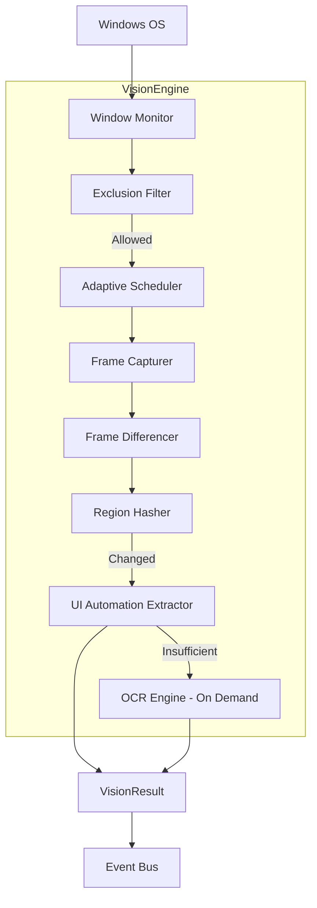
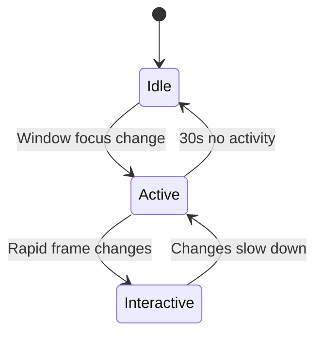
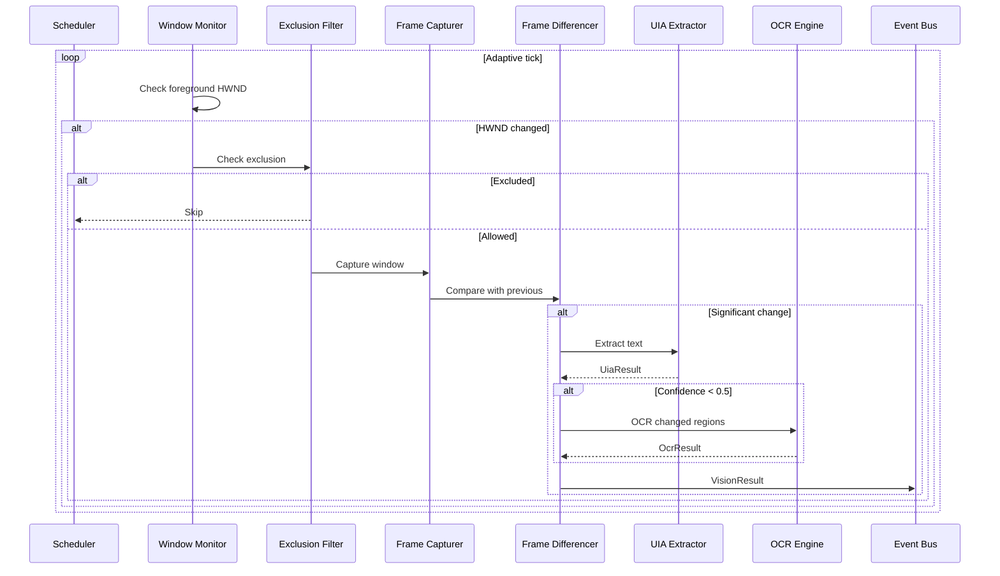
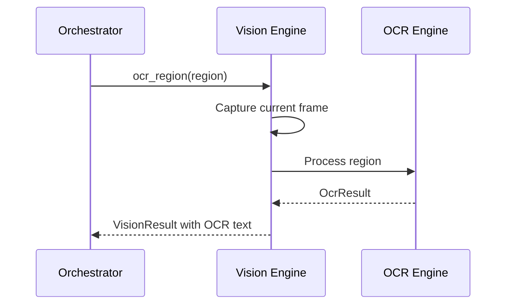

# Vision Engine

**Project:** Contexa — AI Context Platform  
**Version:** 1.1  
**Status:** Reviewed  
**Last Updated:** 2026-07-06

---

## 1. Overview

The Vision Engine is responsible for perceiving the desktop environment. It captures visual frames, extracts text via UI Automation (UIA), and performs selective OCR only when UIA is insufficient. The engine is optimized for **low CPU usage** and **minimal latency**.

**Core principle:** UI Automation first. OCR only when needed. Never OCR the entire screen continuously.

---

## 2. Goals

1. Extract accurate text from the active window with minimal resource usage
2. Detect meaningful visual changes without processing every pixel every frame
3. Provide targeted OCR as a fallback, not a default
4. Operate on a dedicated high-priority capture thread without blocking other engines
5. Respect user exclusion rules before any capture

---

## 3. Responsibilities

| Responsibility | Description |
|----------------|-------------|
| Window tracking | Monitor foreground window changes (HWND, title, process) |
| Frame capture | Capture active window via Windows Graphics Capture API |
| UI Automation | Walk UIA tree to extract text, controls, and structure |
| Frame differencing | Compare consecutive frames; identify changed regions |
| Region hashing | Hash UI regions to skip unchanged content |
| Selective OCR | OCR specific regions only when UIA fails |
| Exclusion enforcement | Skip capture for excluded apps, URLs, and window titles |

---

## 4. Architecture



---

## 5. Component Details

### 5.1 Window Monitor

Polls foreground window at 100ms intervals. Emits `WindowFocusEvent` on HWND change.

```rust
pub struct WindowMonitor {
    last_hwnd: AtomicIsize,
    poll_interval: Duration,
}

pub struct WindowFocusEvent {
    pub hwnd: isize,
    pub title: String,
    pub process_id: u32,
    pub process_name: String,
    pub timestamp: DateTime<Utc>,
}
```

### 5.2 Frame Capturer

Uses **Windows Graphics Capture API** (WinRT) to capture the active window.

- Captures only the target HWND, not the full desktop
- Returns BGRA bitmap at native resolution
- Downscales for hashing (1/4 resolution) to reduce compute

**Windows API mapping:**

| Operation | WinRT / Win32 API | Rust Crate |
|-----------|-------------------|------------|
| Create capture item | `GraphicsCaptureItem::CreateFromWindowId` | `windows::Graphics::Capture` |
| Start capture | `Direct3D11CaptureFramePool::Create` | `windows::Graphics::Capture` |
| Get frame buffer | `IDirect3D11CaptureFrameSurface` | `windows::Graphics::DirectX` |
| Foreground HWND | `GetForegroundWindow()` | `windows::Win32::UI::WindowsAndMessaging` |
| Window title | `GetWindowTextW` | `windows::Win32::UI::WindowsAndMessaging` |
| Process name | `GetModuleFileNameExW` via PID | `windows::Win32::System::Threading` |

**COM requirement:** WGC objects created and used on the dedicated STA capture thread. See [ADR/0008](../ADR/0008-windows-com-threading.md).

### 5.3 Frame Differencer

Compares consecutive frames using perceptual hashing.

```rust
pub struct FrameDifferencer {
    prev_hash: u64,
    threshold: f32, // Default: 0.05 (5% change)
}

impl FrameDifferencer {
    pub fn has_significant_change(&mut self, frame: &Frame) -> bool {
        let hash = compute_perceptual_hash(frame);
        let diff = hamming_distance(self.prev_hash, hash) as f32 / 64.0;
        self.prev_hash = hash;
        diff > self.threshold
    }

    pub fn diff_regions(&self, prev: &Frame, curr: &Frame) -> Vec<Region> {
        // Divide frame into 16x16 grid
        // Return regions where cell hash differs
    }
}
```

### 5.4 Region Hasher

Maintains a cache of region hashes per HWND. Skips UIA/OCR for regions with unchanged hashes.

```rust
pub struct RegionHashCache {
    regions: HashMap<(isize, u32, u32), u64>, // (hwnd, row, col) -> hash
}
```

### 5.5 UI Automation Extractor

Primary text extraction method. Walks the UIA tree from the root element of the target window.

**Windows API mapping:**

| Operation | API | Rust Crate |
|-----------|-----|------------|
| Create automation | `CoCreateInstance(CLSID_CUIAutomation)` | `windows::Win32::System::Com` |
| Get root element | `IUIAutomation::ElementFromHandle` | `uiautomation` |
| Walk tree | `IUIAutomationTreeWalker` depth-first | `uiautomation` |
| Get text | `CurrentName`, `CurrentValue` | `uiautomation` |
| Detect password | `CurrentIsPassword` → redact | `uiautomation` |
| Get selection | `ITextPattern::GetSelection` | `uiautomation` |

**Extracted properties:**
- `Name` — element label/text
- `Value` — editable content
- `ControlType` — button, edit, document, etc.
- `BoundingRectangle` — element position
- `IsOffscreen` — skip offscreen elements

```rust
pub struct UiaExtractor;

impl UiaExtractor {
    pub fn extract_text(&self, hwnd: isize) -> Result<UiaResult> {
        // 1. Get IUIAutomation root for HWND
        // 2. Walk tree depth-first (max depth: 20)
        // 3. Collect text from Name + Value properties
        // 4. Filter: skip offscreen, empty, duplicate
        // 5. Return structured text with element metadata
    }
}

pub struct UiaResult {
    pub text: String,
    pub element_count: u32,
    pub tree_depth: u32,
    pub confidence: f32, // 0.0-1.0 based on text density
    pub duration_ms: u64,
}
```

**Confidence scoring:**
- High (> 0.8): Proceed without OCR
- Medium (0.5-0.8): Use UIA text; flag for potential OCR
- Low (< 0.5): Trigger targeted OCR on visible regions

### 5.6 OCR Engine (On Demand)

Uses **Windows.Media.Ocr** (WinRT) for targeted region OCR.

**Rules:**
- NEVER called in the continuous capture loop
- Only triggered when UIA confidence < 0.5
- Only processes changed regions (from frame differencer)
- Maximum 2 OCR operations per second
- Results cached by region hash

```rust
pub struct OcrEngine {
    rate_limiter: RateLimiter, // 2/sec
    cache: LruCache<u64, String>, // region_hash -> text
}

impl OcrEngine {
    pub fn ocr_region(&self, image: &Frame, region: &Region) -> Result<OcrResult> {
        self.rate_limiter.acquire()?;
        let hash = hash_region(image, region);
        if let Some(cached) = self.cache.get(&hash) {
            return Ok(OcrResult { text: cached.clone(), cached: true });
        }
        // Crop region from frame
        // Call Windows.Media.Ocr
        // Cache result
    }
}
```

### 5.7 Adaptive Scheduler

Controls capture frequency based on activity state.

| State | Capture Rate | Trigger |
|-------|-------------|---------|
| Idle | 1 fps | No focus change for 30s |
| Active | 5 fps | Window focus or input detected |
| Interactive | 10 fps | User interacting with overlay or rapid changes |



---

## 6. Flow

### 6.1 Continuous Capture Loop



### 6.2 On-Demand OCR (Orchestrator Triggered)



---

## 7. Interfaces

```rust
pub trait VisionEngine: Send + Sync {
    fn start(&self) -> Result<()>;
    fn stop(&self) -> Result<()>;
    fn capture_active_window(&self) -> Result<VisionResult>;
    fn extract_uia_text(&self, hwnd: isize) -> Result<UiaResult>;
    fn ocr_region(&self, region: &Region) -> Result<OcrResult>;
    fn get_window_info(&self) -> Result<WindowInfo>;
    fn is_excluded(&self, hwnd: isize) -> bool;
}
```

---

## 8. Data Structures

```rust
pub struct VisionResult {
    pub hwnd: isize,
    pub window_title: String,
    pub process_name: String,
    pub process_id: u32,
    pub frame_hash: u64,
    pub changed_regions: Vec<Region>,
    pub uia_result: Option<UiaResult>,
    pub ocr_result: Option<OcrResult>,
    pub capture_method: CaptureMethod,
    pub timestamp: DateTime<Utc>,
}

pub enum CaptureMethod {
    Uia,
    Ocr,
    Hybrid,
    None,
}

pub struct Region {
    pub x: u32,
    pub y: u32,
    pub width: u32,
    pub height: u32,
}

pub struct Frame {
    pub data: Vec<u8>,     // BGRA
    pub width: u32,
    pub height: u32,
    pub timestamp: DateTime<Utc>,
}

pub struct OcrResult {
    pub text: String,
    pub regions: Vec<Region>,
    pub confidence: f32,
    pub cached: bool,
    pub duration_ms: u64,
}
```

---

## 9. Threading

| Component | Thread | Priority |
|-----------|--------|----------|
| Window Monitor | Capture Thread | Above Normal |
| Frame Capturer | Capture Thread | Above Normal |
| UIA Extractor | Capture Thread | Above Normal |
| OCR Engine | OCR Thread Pool (1-2 workers) | Normal |
| Scheduler | Capture Thread | Above Normal |

**Communication:**
- `VisionResult` sent to Context Engine via `crossbeam-channel` (bounded, capacity 16)
- Frame dropping: if channel is full, drop oldest frame
- OCR requests from Orchestrator via `tokio::sync::oneshot` channel

---

## 10. Performance

| Metric | Target |
|--------|--------|
| UIA extraction (typical window) | < 100 ms |
| Frame capture | < 16 ms |
| Frame hash computation | < 5 ms |
| OCR single region | < 500 ms |
| CPU (idle state) | < 1% |
| CPU (active state) | < 5% |
| Memory (frame buffer) | < 50 MB |

### 10.1 Optimization Strategies

1. **Downscale for hashing** — 1/4 resolution for perceptual hash
2. **Region-level skip** — unchanged regions never processed
3. **UIA tree depth limit** — max depth 20; skip deep nesting
4. **OCR rate limit** — max 2/second; prevents CPU spikes
5. **LRU cache** — OCR results cached by region hash
6. **Frame dropping** — skip frames when behind schedule

---

## 11. Security

- Exclusion filter runs BEFORE any capture or UIA access
- No screenshots stored to disk; frames exist only in memory
- OCR results not persisted independently; passed to Context Engine
- Password fields detected via UIA `IsPassword` property; text redacted

```rust
fn sanitize_uia_text(element: &UiaElement) -> Option<String> {
    if element.is_password() {
        return Some("[REDACTED]".to_string());
    }
    element.text()
}
```

---

## 12. Future Expansion

- **GPU-accelerated** frame differencing via DirectX compute shaders
- **Custom OCR models** (ONNX runtime) for code-specific fonts
- **Multi-monitor** support with per-monitor capture
- **macOS**: ScreenCaptureKit + Accessibility API
- **Linux**: PipeWire + AT-SPI
- **PDF text layer** detection to avoid OCR on text-based PDFs

---

## 13. Best Practices

- Always check exclusion list before capture
- Log UIA confidence scores for quality monitoring
- Never call OCR from the capture thread; delegate to pool
- Profile with `tracing` spans: `vision.capture`, `vision.uia`, `vision.ocr`
- Test against top 20 Windows applications for UIA coverage

---

## 14. References

- [02_System_Architecture.md](./02_System_Architecture.md)
- [06_Context_Engine.md](./06_Context_Engine.md)
- [Windows Graphics Capture API](https://learn.microsoft.com/en-us/windows/uwp/audio-video-camera/screen-capture)
- [UI Automation Overview](https://learn.microsoft.com/en-us/windows/win32/winauto/uiauto-uiautomationoverview)
- [ADR/0002-uia-first-ocr-fallback.md](../ADR/0002-uia-first-ocr-fallback.md)
