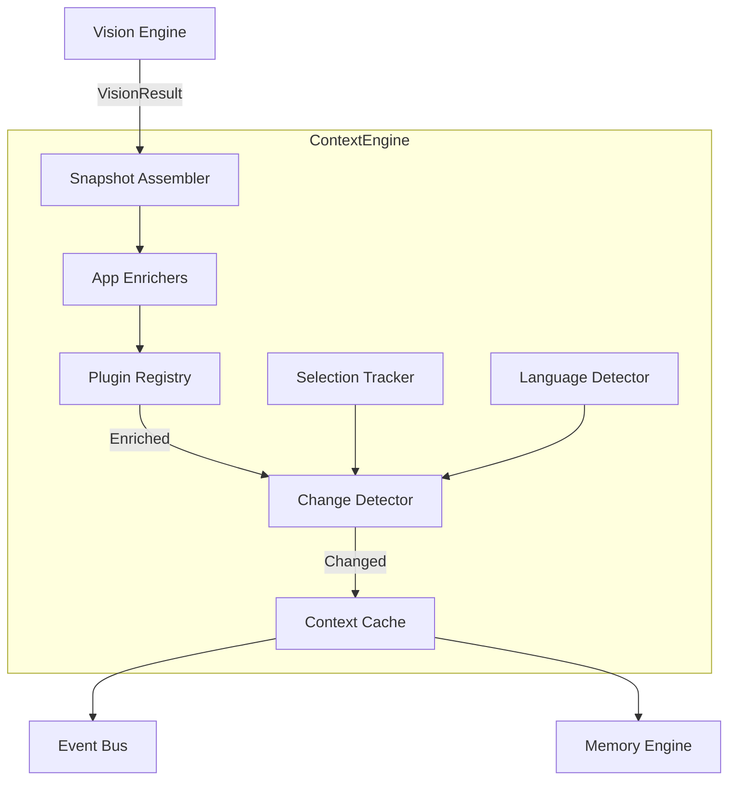
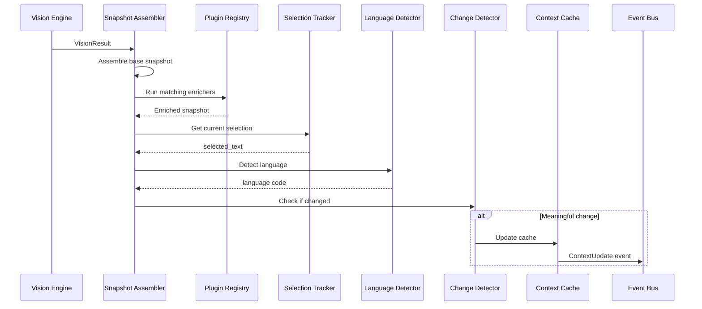

# Context Engine

**Project:** Contexa — AI Context Platform  
**Version:** 1.3  
**Status:** Reviewed  
**Last Updated:** 2026-07-07

---

## 1. Overview

The Context Engine is the **heart of Contexa**. It assembles structured `ContextSnapshot` objects from Vision Engine output, enriches them with application-specific metadata, maintains a thread-safe cache, and emits context update events to the Memory Engine and UI.

---

## 2. Goals

1. Produce accurate, structured context snapshots within 500ms of window switch
2. Enrich generic vision data with application-specific metadata (URL, file path, selection)
3. Maintain sub-millisecond read access to current context via in-memory cache
4. Support plugin-based context enrichers for extensibility
5. Detect and report meaningful context changes only (not every frame)

---

## 3. Responsibilities

| Responsibility | Description |
|----------------|-------------|
| Snapshot assembly | Combine vision data into ContextSnapshot |
| Application enrichment | Extract URL, document path, selection per app |
| Context caching | Thread-safe LRU cache with TTL |
| Change detection | Emit events only on meaningful state changes |
| Selection tracking | Monitor clipboard and UIA selection changes |
| Language detection | Detect content language of visible text |
| Plugin orchestration | Run registered ContextEnricher plugins |

---

## 4. Architecture



---

## 5. Component Details

### 5.1 Snapshot Assembler

Transforms `VisionResult` into a `ContextSnapshot`.

```rust
impl SnapshotAssembler {
    pub fn assemble(&self, vision: VisionResult) -> ContextSnapshot {
        ContextSnapshot {
            id: Uuid::new_v4(),
            timestamp: Utc::now(),
            window: WindowInfo {
                hwnd: vision.hwnd,
                title: vision.window_title,
                bounds: self.get_window_bounds(vision.hwnd),
            },
            application: ApplicationInfo {
                process_name: vision.process_name,
                process_id: vision.process_id,
                executable_path: self.resolve_exe_path(vision.process_id),
            },
            visible_text: self.merge_text(&vision),
            selected_text: None, // Filled by Selection Tracker
            url: None,           // Filled by enrichers
            document_path: None, // Filled by enrichers
            metadata: HashMap::new(),
            language: None,      // Filled by Language Detector
            capture_method: vision.capture_method,
        }
    }

    fn merge_text(&self, vision: &VisionResult) -> Option<String> {
        match (&vision.uia_result, &vision.ocr_result) {
            (Some(uia), None) => Some(uia.text.clone()),
            (None, Some(ocr)) => Some(ocr.text.clone()),
            (Some(uia), Some(ocr)) => Some(format!("{}\n{}", uia.text, ocr.text)),
            (None, None) => None,
        }
    }
}
```

### 5.2 Application Enrichers

Built-in enrichers for common applications.

| Enricher | Process Match | Extracts |
|----------|--------------|----------|
| `ChromeEnricher` | `chrome.exe` | URL, page title, selected text |
| `EdgeEnricher` | `msedge.exe` | URL, page title, selected text |
| `FirefoxEnricher` | `firefox.exe` | URL, page title |
| `VSCodeEnricher` | `Code.exe` | File path, language, selected code |
| `WordEnricher` | `WINWORD.EXE` | Document path, selected text |
| `ExcelEnricher` | `EXCEL.EXE` | Workbook path, active sheet |
| `ExplorerEnricher` | `explorer.exe` | Current directory path |
| `TerminalEnricher` | `WindowsTerminal.exe`, `pwsh.exe` | Current command context |

```rust
pub trait ContextEnricher: Send + Sync {
    fn matches(&self, process_name: &str) -> bool;
    fn enrich(&self, snapshot: &mut ContextSnapshot) -> Result<()>;
    fn priority(&self) -> u32; // Higher = runs first
}
```

**Example: ChromeEnricher**

```rust
impl ContextEnricher for ChromeEnricher {
    fn matches(&self, process_name: &str) -> bool {
        process_name.eq_ignore_ascii_case("chrome.exe")
    }

    fn enrich(&self, snapshot: &mut ContextSnapshot) -> Result<()> {
        let hwnd = snapshot.window.hwnd;
        // Walk UIA tree for address bar (ControlType: Edit, AutomationId: "addressEditBox")
        if let Some(url) = self.extract_url(hwnd) {
            snapshot.url = Some(url);
        }
        snapshot.metadata.insert("browser".into(), "chrome".into());
        Ok(())
    }
}
```

### 5.3 Change Detector

Prevents event flooding by detecting meaningful changes only.

```rust
pub struct ChangeDetector {
    last_snapshot: Option<ContextSnapshot>,
}

impl ChangeDetector {
    pub fn has_changed(&self, new: &ContextSnapshot) -> bool {
        let Some(prev) = &self.last_snapshot else { return true };

        prev.window.hwnd != new.window.hwnd                    // App switch
            || prev.window.title != new.window.title           // Title change
            || prev.url != new.url                             // URL change
            || prev.document_path != new.document_path         // Document change
            || text_diff_significant(&prev.visible_text, &new.visible_text)
            || prev.selected_text != new.selected_text         // Selection change
    }

    fn text_diff_significant(prev: &Option<String>, new: &Option<String>) -> bool {
        // Consider significant if > 10% text changed or > 100 chars different
    }
}
```

### 5.4 Context Cache

Thread-safe in-memory cache for instant context access.

```rust
pub struct ContextCache {
    current: Arc<RwLock<ContextSnapshot>>,
    recent: Arc<RwLock<LruCache<Uuid, ContextSnapshot>>>, // Last 100 snapshots
    ttl: Duration, // Default: 5 minutes
}

impl ContextCache {
    pub fn get_current(&self) -> ContextSnapshot {
        self.current.read().unwrap().clone()
    }

    pub fn update(&self, snapshot: ContextSnapshot) {
        *self.current.write().unwrap() = snapshot.clone();
        self.recent.write().unwrap().put(snapshot.id, snapshot);
    }

    pub fn get_recent(&self, duration: Duration) -> Vec<ContextSnapshot> {
        let cutoff = Utc::now() - duration;
        self.recent.read().unwrap()
            .iter()
            .filter(|(_, s)| s.timestamp > cutoff)
            .map(|(_, s)| s.clone())
            .collect()
    }
}
```

### 5.5 Selection Tracker

Monitors text selection changes via UIA and clipboard.

```rust
pub struct SelectionTracker {
    last_selection: Option<String>,
    poll_interval: Duration, // 500ms
}

impl SelectionTracker {
    pub fn poll(&mut self, hwnd: isize) -> Option<String> {
        // 1. Try UIA TextPattern selection
        // 2. Fallback: clipboard monitoring (if user copies)
        // 3. Return selection if changed
    }
}
```

### 5.6 Language Detector

Detects content language using a lightweight heuristic library (`whatlang`).

```rust
pub fn detect_language(text: &str) -> Option<String> {
  if text.len() < 20 { return None; }
    let info = whatlang::detect(text)?;
    Some(info.lang().code().to_string())
}
```

---

## 6. Flow



---

## 7. Interfaces

```rust
pub trait ContextEngine: Send + Sync {
    fn get_current(&self) -> ContextSnapshot;
    fn get_recent(&self, duration: Duration) -> Vec<ContextSnapshot>;
    fn process_vision_result(&self, result: VisionResult) -> Result<Option<ContextSnapshot>>;
    fn subscribe(&self) -> broadcast::Receiver<ContextSnapshot>;
    fn get_selection(&self) -> Option<String>;
    fn register_enricher(&self, enricher: Box<dyn ContextEnricher>);
}
```

---

## 8. Data Structures

```rust
pub struct ContextSnapshot {
    pub id: Uuid,
    pub timestamp: DateTime<Utc>,
    pub window: WindowInfo,
    pub application: ApplicationInfo,
    pub visible_text: Option<String>,
    pub selected_text: Option<String>,
    pub url: Option<String>,
    pub document_path: Option<String>,
    pub metadata: HashMap<String, String>,
    pub language: Option<String>,
    pub capture_method: CaptureMethod,
}

pub struct WindowInfo {
    pub hwnd: isize,
    pub title: String,
    pub bounds: Rect,
}

pub struct ApplicationInfo {
    pub process_name: String,
    pub process_id: u32,
    pub executable_path: Option<String>,
}

pub struct Rect {
    pub x: i32,
    pub y: i32,
    pub width: u32,
    pub height: u32,
}
```

---

## 9. Threading

| Component | Thread | Notes |
|-----------|--------|-------|
| Snapshot Assembler | Context Update Thread | Receives from Vision via channel |
| Enrichers | Context Update Thread | Sequential per snapshot |
| Change Detector | Context Update Thread | |
| Context Cache | Any (RwLock) | Read-heavy; write on change only |
| Selection Tracker | Context Update Thread | Polled every 500ms |

---

## 10. Performance

| Metric | Target |
|--------|--------|
| Snapshot assembly | < 10 ms |
| Enrichment (all plugins) | < 50 ms |
| Cache read | < 1 ms |
| Change detection | < 1 ms |
| End-to-end (vision → cache) | < 500 ms |

---

## 11. Security

- Enrichers cannot access network; local UIA/process info only
- Password field content redacted before entering snapshot
- Excluded apps never reach the assembler (filtered in Vision Engine)
- `visible_text` truncated to 50,000 chars to prevent memory abuse

---

## 12. IDE Deep Integration (v1.1)

Full specification: [27_IDE_LSP_Integration.md](./27_IDE_LSP_Integration.md).

VS Code / Cursor extension pushes LSP context (symbols, git branch, diagnostics) via local IPC. Merged into `ContextSnapshot` by IDE enricher.

---

## 13. Future Expansion

- **Email context** — Subject and sender from Outlook UIA
- **Meeting context** — Detect Zoom/Teams meetings; capture title/participants
- **Cross-window context** — Aggregate context from related windows
- **Context diffing** — Structured diff between snapshots for timeline summaries

---

## 14. Best Practices

- Register enrichers at startup; avoid runtime registration in production
- Keep enricher `enrich()` under 20ms; profile each one
- Use `metadata` map for app-specific data; avoid schema changes
- Test change detector against rapid window switching
- Log enrichment failures without blocking the pipeline

---

## 15. References

- [05_Vision_Engine.md](./05_Vision_Engine.md)
- [07_Memory_Engine.md](./07_Memory_Engine.md)
- [18_Plugin_System.md](./18_Plugin_System.md)
