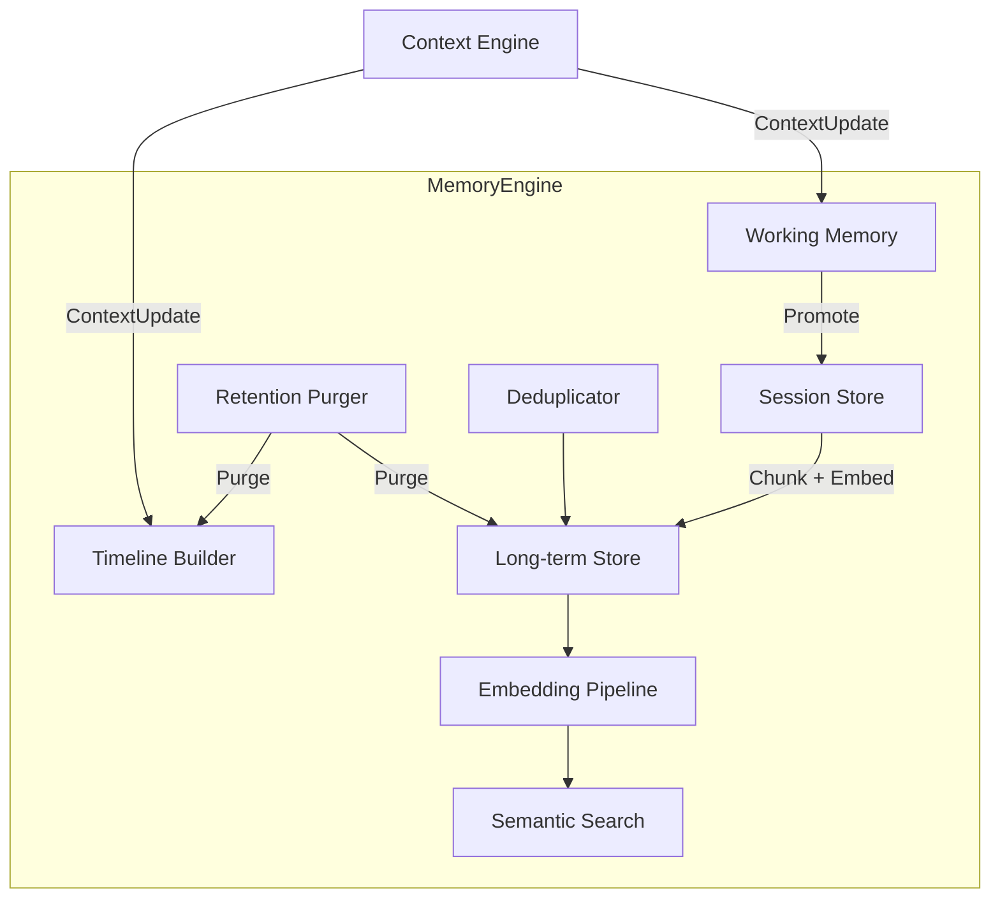
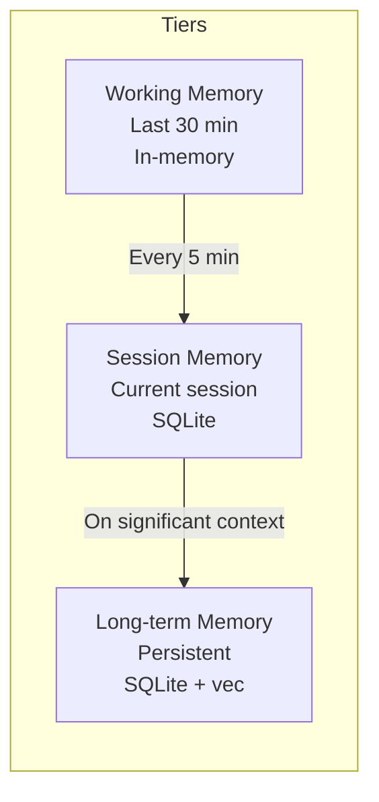
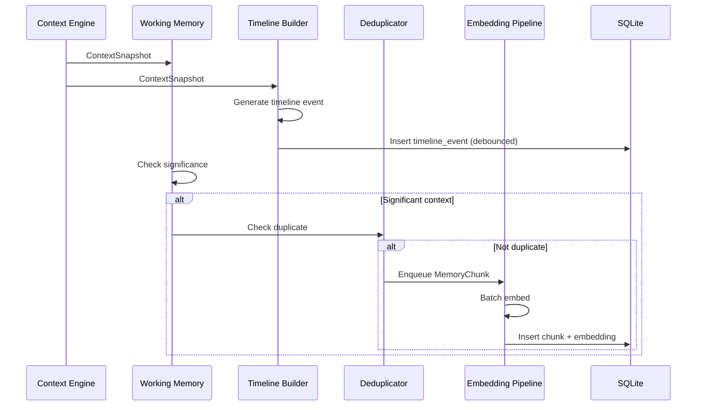
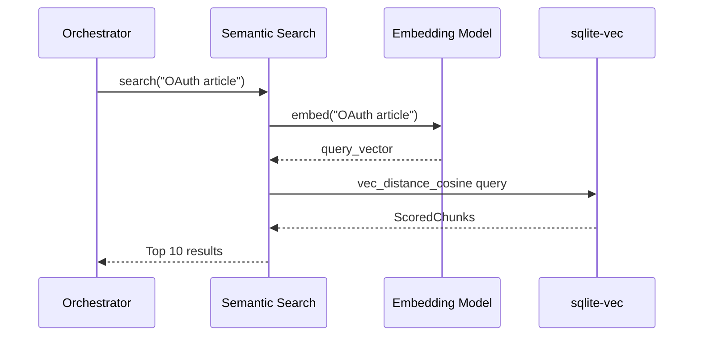
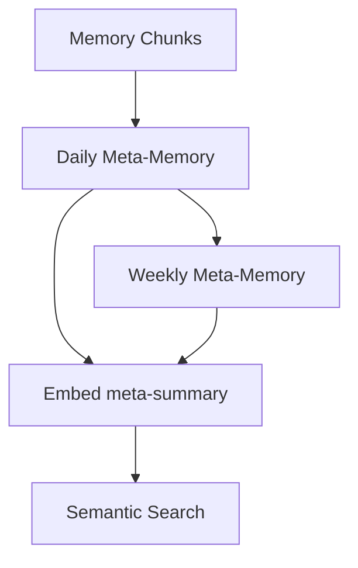
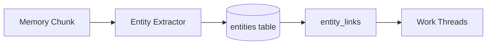

# Memory Engine

**Project:** Contexa — AI Context Platform  
**Version:** 1.3  
**Status:** Reviewed  
**Last Updated:** 2026-07-07

---

## 1. Overview

The Memory Engine manages Contexa's persistent knowledge layer: working memory, session memory, long-term memory, timeline, and semantic search. It transforms ephemeral context snapshots into searchable, embeddable memory chunks that power recall queries like "What did I work on today?"

---

## 2. Goals

1. Maintain a chronological timeline of all user activity
2. Enable semantic search over work history with sub-200ms latency
3. Tier memory across working, session, and long-term stores
4. Generate and store embeddings efficiently via batching
5. Support configurable retention with automatic purge

---

## 3. Responsibilities

| Responsibility | Description |
|----------------|-------------|
| Working memory | In-memory ring buffer of last 30 minutes |
| Session memory | Current login session persisted to SQLite |
| Long-term memory | Persistent chunks with embeddings |
| Timeline | Chronological event log with summaries |
| Embedding | Generate vector embeddings for memory chunks |
| Semantic search | Vector similarity search via sqlite-vec |
| Retention | Purge expired data per user policy |
| Deduplication | Skip duplicate content via content hash |

---

## 4. Architecture



---

## 5. Memory Tiers



| Tier | Storage | Capacity | TTL | Use Case |
|------|---------|----------|-----|----------|
| Working | `VecDeque` in-memory | 200 snapshots | 30 min | Instant recent context |
| Session | SQLite `context_snapshots` | Unlimited session | Until logout | Session recall |
| Long-term | SQLite `memory_chunks` + `embeddings` | Per retention policy | 30-365 days | Semantic search, timeline |

---

## 6. Component Details

### 6.1 Working Memory

```rust
pub struct WorkingMemory {
    buffer: VecDeque<ContextSnapshot>,
    max_size: usize,       // Default: 200
    max_age: Duration,     // Default: 30 minutes
}

impl WorkingMemory {
    pub fn push(&mut self, snapshot: ContextSnapshot) {
        self.buffer.push_back(snapshot);
        while self.buffer.len() > self.max_size {
            self.buffer.pop_front();
        }
        self.evict_expired();
    }

    pub fn get_all(&self) -> Vec<&ContextSnapshot> {
        self.buffer.iter().collect()
    }
}
```

### 6.2 Timeline Builder

Creates human-readable timeline events from context changes.

```rust
pub struct TimelineBuilder {
    last_event: Option<TimelineEvent>,
    min_duration: Duration, // Default: 30 seconds
}

impl TimelineBuilder {
    pub fn process_context_change(&mut self, snapshot: &ContextSnapshot) -> Option<TimelineEvent> {
        let event = TimelineEvent {
            id: Uuid::new_v4().to_string(),
            timestamp: snapshot.timestamp,
            event_type: self.classify_event(snapshot),
            summary: self.generate_summary(snapshot),
            application: snapshot.application.process_name.clone(),
            window_title: snapshot.window.title.clone(),
            duration_ms: None,
            context_id: Some(snapshot.id.to_string()),
        };

        // Close previous event with duration
        if let Some(prev) = &mut self.last_event {
            if prev.application == event.application && prev.window_title == event.window_title {
                return None; // Same context; don't create duplicate event
            }
            prev.duration_ms = Some(
                (event.timestamp - prev.timestamp).num_milliseconds() as u32
            );
        }

        self.last_event = Some(event.clone());
        Some(event)
    }

    fn generate_summary(&self, snapshot: &ContextSnapshot) -> String {
        match (&snapshot.url, &snapshot.document_path) {
            (Some(url), _) => format!("Browsing: {}", truncate(url, 80)),
            (_, Some(path)) => format!("Editing: {}", file_name(path)),
            _ => format!("Using {}: {}", snapshot.application.process_name, truncate(&snapshot.window.title, 60)),
        }
    }
}
```

### 6.3 Embedding Pipeline

**Default model:** `all-MiniLM-L6-v2` (384-dim) via **fastembed** (in-process). **Quality opt-in:** `nomic-embed-text` (768-dim) via Ollama. See [ADR/0006](../ADR/0006-embedding-model.md).

```rust
pub enum EmbeddingProvider {
    Fastembed { model: String },    // Default: "all-MiniLM-L6-v2"
    Ollama { model: String },       // Quality: "nomic-embed-text"
    OpenAi { model: String },       // Opt-in cloud
}

pub struct EmbeddingPipeline {
    provider: EmbeddingProvider,
    batch_queue: VecDeque<MemoryChunk>,
    batch_size: usize,     // Default: 10
    flush_interval: Duration, // Default: 5 seconds
}

impl EmbeddingPipeline {
    pub async fn enqueue(&mut self, chunk: MemoryChunk) {
        self.batch_queue.push_back(chunk);
        if self.batch_queue.len() >= self.batch_size {
            self.flush().await;
        }
    }

    async fn flush(&mut self) {
        let batch: Vec<_> = self.batch_queue.drain(..).collect();
        let texts: Vec<&str> = batch.iter().map(|c| c.content.as_str()).collect();
        let embeddings = self.model.embed_batch(&texts).await?;
        
        for (chunk, embedding) in batch.into_iter().zip(embeddings) {
            self.store_chunk_with_embedding(chunk, embedding).await?;
        }
    }
}
```

### 6.4 Semantic Search

```rust
pub struct SemanticSearch {
    db: Arc<Database>,
    embedding_model: EmbeddingModel,
}

impl SemanticSearch {
    pub async fn search(&self, query: &str, opts: SearchOptions) -> Result<Vec<ScoredChunk>> {
        let query_embedding = self.embedding_model.embed(query).await?;
        
        let results = self.db.search_similar(
            &query_embedding,
            opts.limit,
            opts.min_score,
        ).await?;

        // Optional: re-rank with keyword overlap
        Ok(results)
    }
}
```

### 6.5 Deduplicator

```rust
pub struct Deduplicator {
    recent_hashes: LruCache<String, ()>, // content_hash -> ()
}

impl Deduplicator {
    pub fn is_duplicate(&mut self, content: &str) -> bool {
        let hash = sha256(content);
        if self.recent_hashes.contains(&hash) {
            return true;
        }
        self.recent_hashes.put(hash, ());
        false
    }
}
```

### 6.6 Retention Purger

Runs daily during low-activity hours.

```rust
pub struct RetentionPurger {
    retention_days: u32, // Default: 90
}

impl RetentionPurger {
    pub async fn purge(&self, db: &Database) -> Result<PurgeStats> {
        let cutoff = Utc::now() - Duration::days(self.retention_days as i64);
        let stats = db.purge_before(cutoff).await?;
        if stats.deleted_chunks > 1000 {
            db.vacuum().await?;
        }
        Ok(stats)
    }
}
```

---

## 7. Flow

### 7.1 Context to Memory Pipeline



### 7.2 Semantic Search Flow



---

## 8. Interfaces

```rust
pub trait MemoryEngine: Send + Sync {
    async fn ingest(&self, snapshot: &ContextSnapshot) -> Result<()>;
    async fn search(&self, query: &str, opts: SearchOptions) -> Result<Vec<ScoredChunk>>;
    async fn get_timeline(&self, range: TimeRange) -> Result<Vec<TimelineEvent>>;
    async fn get_working_memory(&self) -> Vec<ContextSnapshot>;
    async fn delete_chunk(&self, id: &str) -> Result<()>;
    async fn delete_all(&self) -> Result<u64>;
    async fn get_stats(&self) -> Result<MemoryStats>;
}
```

---

## 9. Data Structures

```rust
pub struct MemoryChunk {
    pub id: String,
    pub context_id: Option<String>,
    pub content: String,
    pub content_hash: String,
    pub timestamp: DateTime<Utc>,
    pub application: String,
    pub metadata: HashMap<String, String>,
    pub token_count: u32,
}

pub struct ScoredChunk {
    pub chunk: MemoryChunk,
    pub score: f32, // 0.0 - 1.0 (cosine similarity)
}

pub struct TimelineEvent {
    pub id: String,
    pub timestamp: DateTime<Utc>,
    pub event_type: TimelineEventType,
    pub summary: String,
    pub application: String,
    pub window_title: String,
    pub duration_ms: Option<u32>,
    pub context_id: Option<String>,
}

pub enum TimelineEventType {
    ContextChange,
    AppSwitch,
    UserQuery,
    AiResponse,
}

pub struct SearchOptions {
    pub limit: usize,          // Default: 10
    pub min_score: f32,        // Default: 0.7
    pub time_range: Option<TimeRange>,
    pub application_filter: Option<String>,
}

pub struct MemoryStats {
    pub total_chunks: u64,
    pub total_timeline_events: u64,
    pub database_size_mb: f64,
    pub oldest_record: Option<DateTime<Utc>>,
}
```

---

## 10. Threading

| Component | Thread | Notes |
|-----------|--------|-------|
| Working Memory | Context Update Thread | Synchronous push |
| Timeline Builder | Context Update Thread | Debounced DB writes |
| Embedding Pipeline | Memory Thread | Async batch processing |
| Semantic Search | Tokio Runtime | Async DB queries |
| Retention Purger | Background Thread | Daily schedule |

**Write serialization:** All SQLite writes go through a single write channel to prevent lock contention.

---

## 11. Performance

| Metric | Target |
|--------|--------|
| Working memory push | < 1 ms |
| Timeline event creation | < 5 ms |
| Embedding batch (10 chunks, fastembed) | < 0.5 s |
| Embedding batch (10 chunks, nomic quality) | < 2 s |
| Semantic search (10K vectors) | < 200 ms |
| Retention purge (90 days) | < 30 s |

### 11.1 Chunking Strategy

Large `visible_text` is split into chunks for embedding:

| Parameter | Value |
|-----------|-------|
| Max chunk size | 512 tokens |
| Overlap | 50 tokens |
| Min chunk size | 50 tokens |

---

## 12. Security

- Memory data stored locally only
- User can delete individual chunks or all data
- Password field content never enters memory pipeline
- Excluded app context never ingested (filtered upstream)
- MCP audit log tracks external memory access

---

## 13. Hierarchical Memory (v1.1 — P1)

### 13.1 Overview

Hierarchical Memory rolls up raw memory chunks into **meta-memories** at daily and weekly levels. This enables recall queries like "What did I work on this week?" without retrieving hundreds of fragments.



### 13.2 Memory Hierarchy

| Level | Source | TTL | Embedding |
|-------|--------|-----|-----------|
| L0 — Chunk | Context snapshots | 90 days | Yes |
| L1 — Daily | Rollup of L0 per calendar day | 365 days | Yes |
| L2 — Weekly | Rollup of L1 per ISO week | 2 years | Yes |

### 13.3 Rollup Pipeline

```rust
pub struct MetaMemory {
    pub id: String,
    pub level: MetaLevel,       // Daily | Weekly
    pub period_start: DateTime<Utc>,
    pub period_end: DateTime<Utc>,
    pub summary: String,        // LLM-generated narrative
    pub applications: Vec<String>,
    pub chunk_count: u32,
    pub source_chunk_ids: Vec<String>,
    pub embedding: Option<Vec<f32>>,
}

pub enum MetaLevel {
    Daily,
    Weekly,
}
```

**Schedule:**
- **Daily rollup:** 23:00 local time or first idle period after 8 hours active
- **Weekly rollup:** Sunday 23:00 local time

**LLM prompt (daily):**
```
Summarize the user's work today based on these timeline events and memory chunks.
Focus on: projects, topics, applications used, key decisions.
Max 500 words. Use bullet points.
```

### 13.4 Search Priority

When `search_context` or recall queries run:

1. Search L2 weekly meta-memories (broad)
2. Search L1 daily meta-memories (medium)
3. Search L0 chunks (granular)
4. Merge and deduplicate by `source_chunk_ids`

### 13.5 Schema

```sql
CREATE TABLE meta_memories (
    id              TEXT PRIMARY KEY NOT NULL,
    level           TEXT NOT NULL CHECK(level IN ('daily', 'weekly')),
    period_start    TEXT NOT NULL,
    period_end      TEXT NOT NULL,
    summary         TEXT NOT NULL,
    applications_json TEXT DEFAULT '[]',
    chunk_count     INTEGER DEFAULT 0,
    source_ids_json TEXT DEFAULT '[]',
    created_at      TEXT NOT NULL DEFAULT (datetime('now'))
);

CREATE INDEX idx_meta_period ON meta_memories(period_start, level);
```

---

## 14. Entity Extraction & Cross-Session Linking (v1.1 — P2)

### 14.1 Overview

Entity extraction identifies **people, projects, topics, and URLs** in memory chunks. Cross-session linking connects chunks that share entities across different days.



### 14.2 Entity Types

| Type | Examples | Extraction |
|------|----------|------------|
| `person` | "John", "@jane" | NER + email/Slack patterns |
| `project` | "Contexa", "Q3 Report" | Capitalized phrases + user-defined |
| `topic` | "OAuth", "kubernetes" | TF-IDF + LLM batch (daily rollup) |
| `url` | `github.com/...` | Regex from context |
| `file` | `auth.rs`, `README.md` | IDE LSP + document_path |

### 14.3 Schema

```sql
CREATE TABLE entities (
    id              TEXT PRIMARY KEY NOT NULL,
    name            TEXT NOT NULL,
    entity_type     TEXT NOT NULL,
    normalized_name TEXT NOT NULL,  -- lowercase, trimmed
    first_seen      TEXT NOT NULL,
    last_seen       TEXT NOT NULL,
    occurrence_count INTEGER DEFAULT 1
);

CREATE UNIQUE INDEX idx_entity_normalized ON entities(normalized_name, entity_type);

CREATE TABLE chunk_entities (
    chunk_id        TEXT NOT NULL REFERENCES memory_chunks(id) ON DELETE CASCADE,
    entity_id       TEXT NOT NULL REFERENCES entities(id) ON DELETE CASCADE,
    confidence      REAL DEFAULT 1.0,
    PRIMARY KEY (chunk_id, entity_id)
);

CREATE TABLE work_threads (
    id              TEXT PRIMARY KEY NOT NULL,
    title           TEXT NOT NULL,       -- Auto: "OAuth implementation"
    entity_ids_json TEXT NOT NULL,       -- Entities that define this thread
    started_at      TEXT NOT NULL,
    last_active     TEXT NOT NULL,
    chunk_count     INTEGER DEFAULT 0
);
```

### 14.4 Cross-Session Linking

```rust
impl EntityLinker {
    /// Find or create work thread when entity appears in new chunk
    pub async fn link_chunk(&self, chunk_id: &str, entities: &[Entity]) -> Result<Option<WorkThread>> {
        // 1. Match entities to existing threads (≥2 shared entities)
        // 2. If match: append chunk to thread, update last_active
        // 3. If no match and ≥1 project/topic: create new thread
    }

    /// Query: "Show everything related to OAuth"
    pub async fn get_thread(&self, entity_name: &str) -> Result<WorkThreadDetail> {
        // Return chronologically linked chunks across sessions
    }
}
```

### 14.5 User Controls

- **Ignore entity** — exclude from linking
- **Merge entities** — "OAuth" + "OAuth 2.0" → one entity
- **Pin project** — user-defined project names always tracked

### 14.6 Extraction Strategy

| Phase | Method | When |
|-------|--------|------|
| v1.1 | Rule-based (URLs, files, apps) + LLM batch on daily rollup | Low cost |
| v1.2 | Local NER model (ONNX) | Offline, faster |

---

## 15. Future Expansion

- **Memory importance scoring** — prioritize frequently accessed chunks
- **Federated memory** — E2E encrypted sync (see roadmap Phase 8)

---

## 16. Best Practices

- Batch embeddings; never embed one chunk at a time in production
- Debounce timeline writes (5-second window)
- Monitor database size; warn user at 5 GB
- Test semantic search quality with realistic work-history datasets
- Run retention purge during detected idle periods

---

## 17. References

- [04_Database_Design.md](./04_Database_Design.md)
- [06_Context_Engine.md](./06_Context_Engine.md)
- [08_AI_Orchestrator.md](./08_AI_Orchestrator.md)
- [sqlite-vec](https://github.com/asg017/sqlite-vec)
