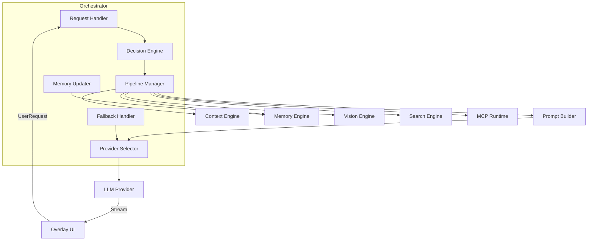
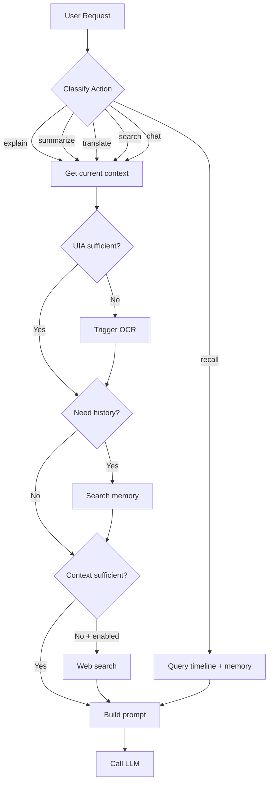
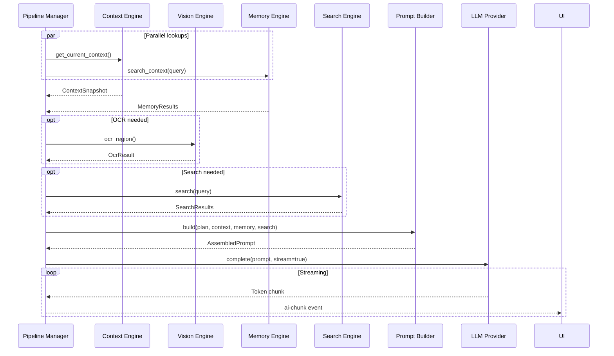

# AI Orchestrator

**Project:** Contexa — AI Context Platform  
**Version:** 1.3  
**Status:** Reviewed  
**Last Updated:** 2026-07-07

---

## 1. Overview

The AI Orchestrator is the decision-making brain of Contexa. It receives user requests from the Overlay UI, determines which capabilities to invoke (OCR, search, memory, MCP), assembles context via the Prompt Builder, routes to the appropriate LLM provider, and streams responses back to the UI.

---

## 2. Goals

1. Route user requests to the optimal combination of engines
2. Minimize latency by parallelizing independent operations
3. Decide intelligently when OCR, search, or memory lookup is needed
4. Support multiple LLM providers with automatic fallback
5. Stream responses to the UI for perceived low latency

---

## 3. Responsibilities

| Responsibility | Description |
|----------------|-------------|
| Request routing | Classify and route user requests by action type |
| Capability decisions | Determine if OCR, search, memory, or MCP is needed |
| Provider selection | Choose LLM provider based on config and availability |
| Parallel execution | Run independent lookups concurrently |
| Prompt assembly | Delegate to Prompt Builder |
| Response streaming | Stream LLM tokens to UI via events |
| Memory update | Store significant interactions in memory |
| Error handling | Graceful degradation and fallback |

---

## 4. Architecture



---

## 5. Decision Engine

The Decision Engine determines which capabilities to activate for each request.



### 5.1 Decision Rules

| Action | Context | OCR | Memory | Search |
|--------|---------|-----|--------|--------|
| `explain` | Required | If UIA < 0.5 | If code/doc | No |
| `summarize` | Required | If UIA < 0.5 | No | No |
| `translate` | Selection preferred | If no selection | No | No |
| `search` | Required | No | Yes | Yes |
| `recall` | No | No | Yes (timeline) | No |
| `chat` | Required | If UIA < 0.5 | If query implies history | If enabled + insufficient |

```rust
pub struct DecisionEngine;

impl DecisionEngine {
    pub fn decide(&self, request: &UserRequest, context: &ContextSnapshot) -> ExecutionPlan {
        let mut plan = ExecutionPlan::default();

        plan.need_context = true;
        
        match request.action {
            RequestAction::Explain | RequestAction::Summarize => {
                plan.need_ocr = context.uia_confidence() < 0.5;
                plan.need_memory = matches!(request.action, RequestAction::Explain);
            }
            RequestAction::Translate => {
                plan.need_ocr = context.selected_text.is_none() && context.uia_confidence() < 0.5;
            }
            RequestAction::Search => {
                plan.need_memory = true;
                plan.need_search = true;
            }
            RequestAction::Recall => {
                plan.need_timeline = true;
                plan.need_memory = true;
            }
            RequestAction::Chat => {
                plan.need_ocr = context.uia_confidence() < 0.5;
                plan.need_memory = self.query_implies_history(&request.query);
                plan.need_search = self.should_search(&request.query, context);
            }
        }

        plan
    }
}
```

---

## 6. Pipeline Manager

Executes the plan with maximum parallelism.



```rust
impl PipelineManager {
    pub async fn execute(&self, plan: ExecutionPlan, request: &UserRequest) -> Result<ResponseStream> {
        let (context, memory) = tokio::join!(
            self.fetch_context(&plan),
            self.fetch_memory(&plan, &request.query),
        );

        let ocr = if plan.need_ocr {
            Some(self.trigger_ocr().await?)
        } else {
            None
        };

        let search = if plan.need_search {
            Some(self.search_web(&request.query).await?)
        } else {
            None
        };

        let prompt = self.prompt_builder.build(PromptInput {
            request,
            context: context?,
            memory: memory?,
            ocr,
            search,
            timeline: if plan.need_timeline {
                Some(self.fetch_timeline().await?)
            } else {
                None
            },
        })?;

        let stream = self.provider.complete(&prompt.messages, CompletionOptions {
            max_tokens: self.config.max_tokens,
            temperature: self.config.temperature,
            stream: true,
        }).await?;

        Ok(stream)
    }
}
```

---

## 7. Provider Selector

```rust
pub struct ProviderSelector {
    primary: Box<dyn LlmProvider>,
    fallback: Option<Box<dyn LlmProvider>>,
}

impl ProviderSelector {
    pub async fn complete(&self, messages: &[Message], opts: CompletionOptions) 
        -> Result<ResponseStream> 
    {
        match self.primary.complete(messages, opts.clone()).await {
            Ok(stream) => Ok(stream),
            Err(e) if self.fallback.is_some() => {
                tracing::warn!("Primary provider failed: {}; trying fallback", e);
                self.fallback.as_ref().unwrap().complete(messages, opts).await
            }
            Err(e) => Err(e),
        }
    }
}
```

---

## 8. Interfaces

```rust
pub trait AiOrchestrator: Send + Sync {
    async fn handle_request(&self, request: UserRequest) -> Result<RequestHandle>;
    async fn cancel_request(&self, request_id: &str) -> Result<()>;
    fn get_active_requests(&self) -> Vec<RequestHandle>;
}

pub struct ExecutionPlan {
    pub need_context: bool,
    pub need_ocr: bool,
    pub need_memory: bool,
    pub need_timeline: bool,
    pub need_search: bool,
    pub need_mcp: bool,
}

pub struct RequestHandle {
    pub id: String,
    pub status: RequestStatus,
    pub started_at: DateTime<Utc>,
}

pub enum RequestStatus {
    Planning,
    Gathering,
    Generating,
    Complete,
    Failed(String),
    Cancelled,
}
```

---

## 9. Data Structures

```rust
pub struct UserRequest {
    pub id: Uuid,
    pub action: RequestAction,
    pub query: Option<String>,
    pub context_override: Option<ContextSnapshot>,
    pub preferences: RequestPreferences,
}

pub enum RequestAction {
    Chat,
    Explain,
    Summarize,
    Translate { target_lang: String },
    Search,
    Recall,
}

pub struct RequestPreferences {
    pub stream: bool,
    pub max_tokens: Option<u32>,
    pub temperature: Option<f32>,
    pub force_search: bool,
    pub force_ocr: bool,
}
```

---

## 10. Threading

| Component | Runtime | Notes |
|-----------|---------|-------|
| Request Handler | Tokio | Async; one per request |
| Decision Engine | Tokio | Synchronous; < 1ms |
| Pipeline Manager | Tokio | Spawns parallel futures |
| Provider Selector | Tokio | Async HTTP to LLM APIs |
| Memory Updater | Tokio | Fire-and-forget after response |
| Response Stream | Tokio → Tauri | Channels to UI events |

**Concurrency limit:** Maximum 3 concurrent AI requests to prevent resource exhaustion.

---

## 11. Performance

| Metric | Target |
|--------|--------|
| Decision engine | < 1 ms |
| Parallel context + memory fetch | < 200 ms |
| OCR (if needed) | < 500 ms |
| Search (if needed) | < 2 s |
| Prompt assembly | < 50 ms |
| Time to first token | < 1 s (after prompt ready) |

---

## 12. Security

- LLM API keys retrieved from OS credential vault per request
- User query and context sent to LLM only when user initiates action
- Search queries logged but not sent to LLM without user action
- Request cancellation immediately aborts LLM stream
- No automatic background LLM calls

---

## 13. Error Handling

```rust
pub enum OrchestratorError {
    ContextUnavailable,
    LlmProviderDown { provider: String },
    SearchFailed { reason: String },
    OcrFailed { reason: String },
    TokenLimitExceeded { requested: usize, available: usize },
    RateLimited,
    Cancelled,
}
```

**Fallback chain:**
1. Primary LLM provider fails → fallback provider
2. Both providers fail → return cached context summary (no AI)
3. OCR fails → proceed with UIA text only
4. Search fails → proceed with local context only

---

## 14. Future Expansion

- **Multi-step reasoning** — chain-of-thought with intermediate tool calls
- **Agent mode** — autonomous multi-step task execution via MCP tools
- **Request queuing** — priority queue for concurrent requests
- **Cost tracking** — token usage and cost per request
- **A/B testing** — compare prompt strategies

---

## 15. Best Practices

- Always fetch context and memory in parallel
- Set request timeout: 30s for cloud LLM, 60s for local
- Log decision engine output for debugging
- Cancel in-flight LLM requests when overlay is dismissed
- Store interaction in memory only after successful response

---

## 16. References

- [08_AI_Orchestrator.md](./08_AI_Orchestrator.md)
- [09_Search_Engine.md](./09_Search_Engine.md)
- [10_Prompt_Builder.md](./10_Prompt_Builder.md)
- [07_Memory_Engine.md](./07_Memory_Engine.md)
