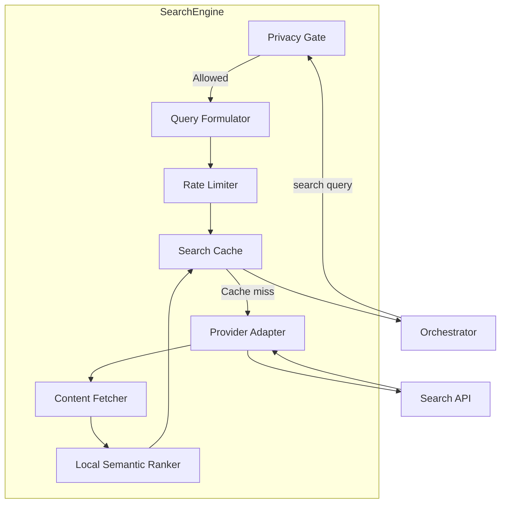
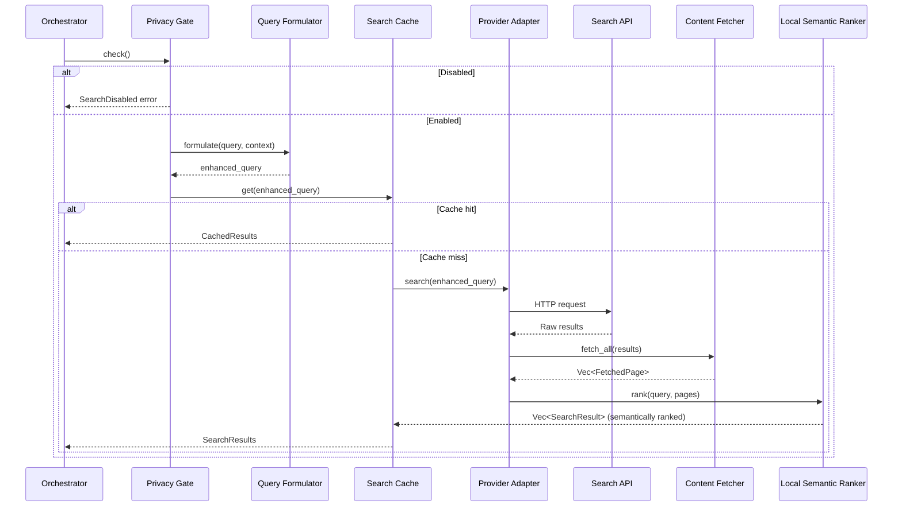

# Search Engine

**Project:** Contexa — AI Context Platform  
**Version:** 1.4  
**Status:** Reviewed  
**Last Updated:** 2026-07-15

---

## 1. Overview

The Search Engine provides external internet search capabilities when local context and memory are insufficient to answer a user query. It is invoked **only by the AI Orchestrator's decision** — never by default, never in the background.

---

## 2. Goals

1. Fill context gaps when local data is insufficient
2. Return structured, citation-ready search results
3. Support pluggable search providers via adapter pattern
4. Respect user privacy settings (globally disableable)
5. Merge search results into prompt context seamlessly

---

## 3. Responsibilities

| Responsibility | Description |
|----------------|-------------|
| Provider abstraction | Pluggable search adapters |
| Query formulation | Optimize query from user request + context |
| Result parsing | Extract title, snippet, URL from results |
| Rate limiting | Prevent excessive API calls |
| Caching | Cache recent search results (TTL: 1 hour) |
| Privacy gate | Check user settings before any external call |
| Semantic ranking | Reorder results by meaning, not just provider order (ADR-0014) |

---

## 4. Architecture



Content Fetcher and Local Semantic Ranker implement the "Exa-lite" semantic layer decided in ADR-0014: DuckDuckGo stays the retrieval provider, but results are reranked locally by meaning before reaching the Orchestrator — no cloud AI search API involved.

---

## 5. Component Details

### 5.1 Privacy Gate

```rust
pub struct PrivacyGate {
    settings: Arc<RwLock<SearchSettings>>,
}

impl PrivacyGate {
    pub fn is_allowed(&self) -> bool {
        let settings = self.settings.read().unwrap();
        settings.enabled
    }

    pub fn check(&self) -> Result<()> {
        if !self.is_allowed() {
            return Err(ContexaError::SearchDisabled);
        }
        Ok(())
    }
}
```

### 5.2 Query Formulator

Enhances user query with context for better search results.

```rust
pub struct QueryFormulator;

impl QueryFormulator {
    pub fn formulate(&self, user_query: &str, context: &ContextSnapshot) -> String {
        let mut parts = vec![user_query.to_string()];

        // Add context hints
        if let Some(url) = &context.url {
            if let Some(domain) = extract_domain(url) {
                parts.push(format!("site:{}", domain));
            }
        }

        if let Some(doc) = &context.document_path {
            if let Some(ext) = path_extension(doc) {
                parts.push(format!("filetype:{}", ext));
            }
        }

        parts.join(" ")
    }
}
```

### 5.3 Provider Adapter Trait

```rust
#[async_trait]
pub trait SearchAdapter: Send + Sync {
    async fn search(&self, query: &str, opts: WebSearchOptions) -> Result<Vec<SearchResult>>;
    fn provider_name(&self) -> &str;
    fn max_results(&self) -> usize;
}

pub struct WebSearchOptions {
    pub max_results: usize,    // Default: 5
    pub language: Option<String>,
    pub safe_search: bool,     // Default: true
}
```

### 5.4 Built-in Providers

| Provider | API | Auth | Notes |
|----------|-----|------|-------|
| DuckDuckGo | HTML/lite API | None | **Default** — zero config (ADR-0011) |
| Brave Search | Brave Search API | API key | Opt-in; recommended for Pro |
| SerpAPI | Google via SerpAPI | API key | Alternative |
| Custom | User-defined endpoint | Configurable | Plugin adapter |

### 5.5 Content Fetcher

Retrieves full page text for provider results so the Local Semantic Ranker has more than a snippet to score against. Runs after the Provider Adapter, before ranking. See ADR-0014.

```rust
pub struct ContentFetcher {
    client: reqwest::Client,
    timeout: Duration,      // Default: 800 ms per URL
    concurrency: usize,     // Default: 3
}

impl ContentFetcher {
    pub async fn fetch_all(&self, results: &[SearchResult]) -> Vec<FetchedPage> {
        // Respects robots.txt; per-URL failures degrade to snippet-only,
        // never fail the whole search.
    }
}

pub struct FetchedPage {
    pub url: String,
    pub text: Option<String>, // None on fetch failure/timeout
}
```

### 5.6 Local Semantic Ranker

Reorders results by semantic similarity to the query using the same local embedding + reranking stack already accepted for the Memory Engine — no new model, no cloud call. See ADR-0006 (embeddings), ADR-0012 (reranking), ADR-0014 (this application to web search).

```rust
pub struct LocalSemanticRanker {
    embedder: Arc<dyn Embedder>,   // fastembed, same instance as Memory Engine
    reranker: Arc<dyn Reranker>,   // cross-encoder, same instance as ADR-0012
    candidates: usize,             // Default: 10
    keep: usize,                   // Default: 5
}

impl LocalSemanticRanker {
    pub async fn rank(&self, query: &str, pages: Vec<FetchedPage>) -> Vec<SearchResult> {
        // On embed/rerank failure or timeout, return provider order unranked —
        // this stage is an enhancement, never a dependency (ADR-0012 principle).
    }
}
```

### 5.7 Search Cache

```rust
pub struct SearchCache {
    cache: LruCache<String, CachedResults>, // query_hash -> results
    ttl: Duration, // Default: 1 hour
}

pub struct CachedResults {
    pub results: Vec<SearchResult>,
    pub cached_at: DateTime<Utc>,
}
```

Caches the final, semantically-ranked results — not raw provider output — so cache hits skip fetch + rank entirely.

---

## 6. Flow



---

## 7. Interfaces

```rust
pub trait SearchEngine: Send + Sync {
    async fn search(&self, query: &str, context: &ContextSnapshot) -> Result<SearchResponse>;
    fn is_enabled(&self) -> bool;
    fn set_provider(&self, provider: Box<dyn SearchAdapter>) -> Result<()>;
}

pub struct SearchResponse {
    pub results: Vec<SearchResult>,
    pub query_used: String,
    pub provider: String,
    pub cached: bool,
    pub latency_ms: u64,
}

pub struct SearchResult {
    pub title: String,
    pub snippet: String,
    pub url: String,
    pub published_date: Option<String>,
    pub relevance_score: f32,
}
```

---

## 8. Data Structures

```rust
pub struct SearchSettings {
    pub enabled: bool,              // Default: false (opt-in)
    pub provider: String,           // Default: "duckduckgo"
    pub api_key_ref: Option<String>, // Reference to credential vault key
    pub max_results: usize,         // Default: 5
    pub safe_search: bool,          // Default: true
}
```

---

## 9. Threading

| Component | Thread | Notes |
|-----------|--------|-------|
| Privacy Gate | Tokio | Synchronous check |
| Query Formulator | Tokio | Synchronous |
| Provider Adapter | Tokio | Async HTTP |
| Content Fetcher | Tokio | Async HTTP, bounded concurrency |
| Local Semantic Ranker | Rayon (CPU) via fastembed/ONNX | Same runtime as Memory Engine embed/rerank |
| Search Cache | Tokio | In-memory LRU |

Search runs on the Tokio runtime; never blocks capture or context threads.

---

## 10. Performance

| Metric | Target |
|--------|--------|
| Privacy gate check | < 1 ms |
| Query formulation | < 5 ms |
| Cache hit | < 5 ms |
| API call (network) | < 2 s |
| Content fetch (parallelized, per query) | < 800 ms |
| Local semantic rank (embed + rerank) | < 450 ms (300 ms embed + 150 ms rerank, ADR-0014) |
| Total (cache miss) | < 4.5 s (fallback to unranked order on fetch/rank timeout) |

### 10.1 Rate Limiting

| Limit | Value |
|-------|-------|
| Max searches per minute | 10 |
| Max searches per hour | 100 |
| Max concurrent searches | 2 |

---

## 11. Security

- Search disabled by default; user must opt in
- API keys stored in OS credential vault
- Search queries logged locally in audit table (not sent to Contexa servers)
- Safe search enabled by default
- No search results stored permanently (cache TTL: 1 hour)
- User can clear search cache in settings
- Content Fetcher and Local Semantic Ranker run entirely on-device — fetched page text and embeddings never leave the machine (ADR-0014); this differs from cloud AI search APIs (Exa/Tavily/Jina), which are not used by default
- Content Fetcher respects robots.txt; per-URL failures degrade to unranked provider order, never block the search

---

## 12. Integration with Prompt Builder

Search results are formatted for prompt injection:

```markdown
## Web Search Results
Query: "OAuth 2.0 authorization code flow"

1. **OAuth 2.0 Authorization Framework** (ietf.org)
   The authorization code flow is designed for clients that can...
   URL: https://datatracker.ietf.org/doc/html/rfc6749

2. **Understanding OAuth 2.0** (auth0.com)
   OAuth 2.0 is an authorization framework that enables...
   URL: https://auth0.com/docs/authenticate/protocols/oauth
```

---

## 13. Future Expansion

- **Academic search** — arXiv, Google Scholar adapters
- **Code search** — GitHub, Stack Overflow specialized adapters
- **Image search** — for visual context queries
- **Local file search** — Windows Search integration as a "local provider"
- ~~**Search result ranking** — re-rank with embedding similarity to context~~ — done via Local Semantic Ranker (ADR-0014)
- **Cloud AI search adapters** — Tavily, Jina AI, Exa as opt-in `SearchAdapter` implementations (same pattern as Brave/SerpAPI) if a user wants provider-side neural search and supplies their own API key; evaluated but not adopted as default in ADR-0014

---

## 14. Best Practices

- Never search without orchestrator decision
- Always check privacy gate first
- Cache aggressively; most queries repeat within a session
- Include source URLs in prompt for citation
- Log search latency for provider comparison

---

## 15. References

- [08_AI_Orchestrator.md](./08_AI_Orchestrator.md)
- [10_Prompt_Builder.md](./10_Prompt_Builder.md)
- [16_Security_Privacy.md](./16_Security_Privacy.md)
- [ADR/0011-duckduckgo-default-search.md](../ADR/0011-duckduckgo-default-search.md)
- [ADR/0014-local-semantic-web-search.md](../ADR/0014-local-semantic-web-search.md)
- [ADR/0006-embedding-model.md](../ADR/0006-embedding-model.md)
- [ADR/0012-local-reranking.md](../ADR/0012-local-reranking.md)
- [DuckDuckGo](https://duckduckgo.com/)
- [Brave Search API](https://brave.com/search/api/)
