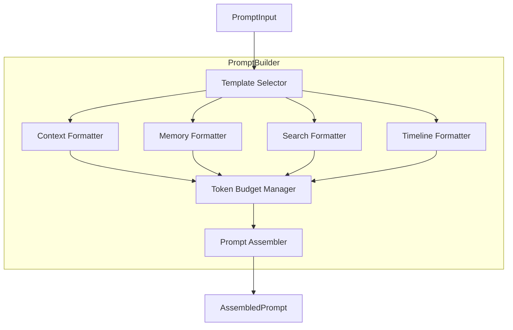
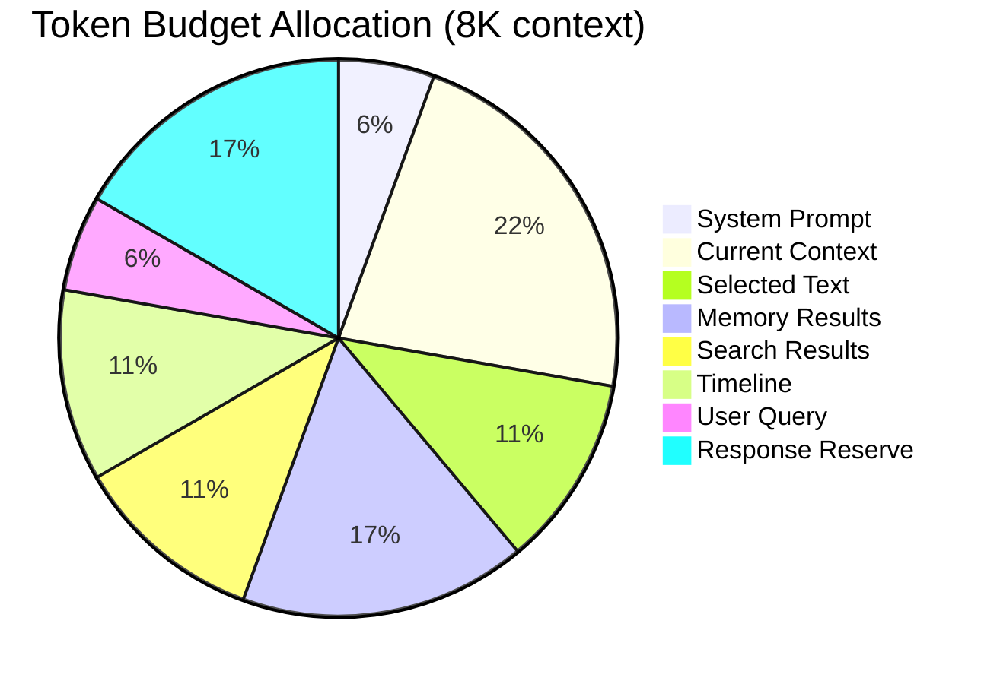
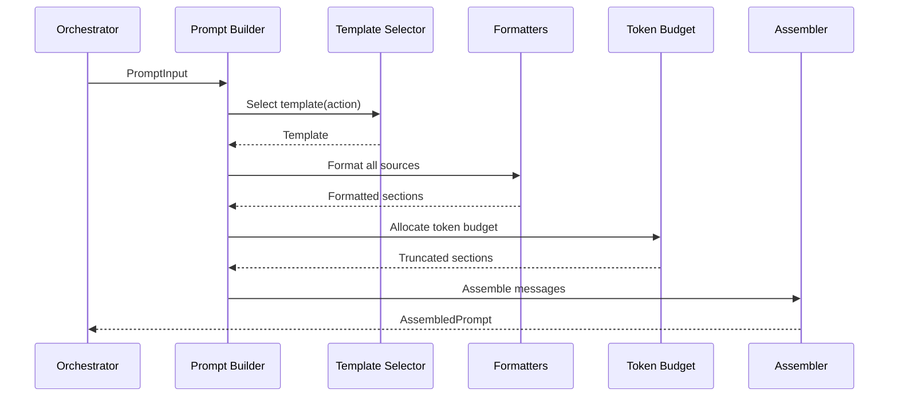

# Prompt Builder

**Project:** Contexa — AI Context Platform  
**Version:** 1.3  
**Status:** Reviewed  
**Last Updated:** 2026-07-07

---

## 1. Overview

The Prompt Builder assembles optimized prompts for LLM providers by combining current context, timeline data, memory search results, web search results, and action-specific templates. It manages token budgets with intelligent truncation to maximize relevance within provider limits.

---

## 2. Goals

1. Produce high-quality prompts that leverage all available context sources
2. Respect LLM token limits with priority-based truncation
3. Support action-specific templates (explain, summarize, translate, recall)
4. Track prompt sources for transparency and debugging
5. Optimize token usage to minimize cost and latency

---

## 3. Responsibilities

| Responsibility | Description |
|----------------|-------------|
| Template selection | Choose template based on request action |
| Context injection | Format and inject current desktop context |
| Memory injection | Include relevant memory search results |
| Search injection | Format web search results with citations |
| Timeline injection | Include timeline events for recall queries |
| Token budgeting | Count tokens; truncate with priority ordering |
| Source tracking | Record which sources contributed to the prompt |

---

## 4. Architecture



---

## 5. Token Budget



### 5.1 Priority Order (Truncation)

When total tokens exceed the budget, truncate in reverse priority:

| Priority | Source | Min Tokens | Max Tokens |
|----------|--------|------------|------------|
| 1 (highest) | System prompt | 300 | 500 |
| 2 | User query | 50 | 500 |
| 3 | Selected text | 0 | 1000 |
| 4 | Current context | 200 | 2000 |
| 5 | Memory results | 0 | 1500 |
| 6 | Search results | 0 | 1000 |
| 7 (lowest) | Timeline | 0 | 1000 |

---

## 6. Templates

### 6.1 System Prompt (Base)

```
You are Contexa, an AI assistant with access to the user's desktop context.
You can see what application they are using, what text is visible, and their recent work history.
Answer based on the provided context. If context is insufficient, say so clearly.
Always cite sources when using search results or memory.
```

### 6.2 Explain Template

```
{{system_prompt}}

## Current Context
Application: {{app_name}}
Window: {{window_title}}
{{#if url}}URL: {{url}}{{/if}}
{{#if document_path}}Document: {{document_path}}{{/if}}

## Visible Content
{{visible_text}}

{{#if selected_text}}
## Selected Text
{{selected_text}}
{{/if}}

{{memory_section}}
{{search_section}}

## Task
Explain the content the user is currently viewing. Be concise and specific.
Focus on the selected text if available, otherwise explain the visible content.
```

### 6.3 Summarize Template

```
{{system_prompt}}

## Content to Summarize
{{#if selected_text}}{{selected_text}}{{else}}{{visible_text}}{{/if}}

## Task
Provide a concise summary of the above content. Use bullet points for key takeaways.
```

### 6.4 Translate Template

```
{{system_prompt}}

## Text to Translate
{{selected_text}}

## Task
Translate the above text to {{target_language}}. Preserve formatting and technical terms.
Provide only the translation, no explanation.
```

### 6.5 Recall Template

```
{{system_prompt}}

## Timeline ({{date_range}})
{{#each timeline_events}}
- [{{time}}] {{summary}} ({{application}}, {{duration}})
{{/each}}

{{memory_section}}

## Task
{{user_query}}
Summarize the user's activity based on the timeline and memory above.
```

### 6.6 Chat Template

```
{{system_prompt}}

## Current Context
{{context_section}}

{{memory_section}}
{{search_section}}

## User Message
{{user_query}}
```

---

## 7. Component Details

### 7.1 Context Formatter

```rust
pub struct ContextFormatter;

impl ContextFormatter {
    pub fn format(&self, context: &ContextSnapshot, max_tokens: usize) -> String {
        let mut parts = vec![
            format!("Application: {}", context.application.process_name),
            format!("Window: {}", context.window.title),
        ];

        if let Some(url) = &context.url {
            parts.push(format!("URL: {}", url));
        }
        if let Some(path) = &context.document_path {
            parts.push(format!("Document: {}", path));
        }
        if let Some(lang) = &context.language {
            parts.push(format!("Language: {}", lang));
        }

        let header = parts.join("\n");
        let text = context.visible_text.as_deref().unwrap_or("[No visible text]");

        truncate_to_tokens(&format!("{}\n\n{}", header, text), max_tokens)
    }
}
```

### 7.2 Memory Formatter

```rust
pub struct MemoryFormatter;

impl MemoryFormatter {
    pub fn format(&self, chunks: &[ScoredChunk], max_tokens: usize) -> String {
        if chunks.is_empty() { return String::new(); }

        let mut section = String::from("## Relevant Memory\n");
        for (i, scored) in chunks.iter().enumerate() {
            section.push_str(&format!(
                "{}. [{}] {} (relevance: {:.0}%)\n   {}\n",
                i + 1,
                scored.chunk.timestamp.format("%H:%M"),
                scored.chunk.application,
                scored.score * 100.0,
                truncate(&scored.chunk.content, 200),
            ));
        }

        truncate_to_tokens(&section, max_tokens)
    }
}
```

### 7.3 Token Budget Manager

```rust
pub struct TokenBudgetManager {
    max_tokens: usize,
    response_reserve: usize, // Default: 1500
}

impl TokenBudgetManager {
    pub fn allocate(&self, sources: &mut PromptSources) -> AllocationResult {
        let available = self.max_tokens - self.response_reserve;
        let mut used = 0;
        let mut truncated = false;

        // Allocate in priority order
        for source in sources.by_priority() {
            let budget = source.max_budget();
            let tokens = count_tokens(&source.content);
            
            if used + tokens > available {
                let remaining = available.saturating_sub(used);
                source.content = truncate_to_tokens(&source.content, remaining);
                truncated = true;
            }
            used += count_tokens(&source.content);
        }

        AllocationResult { total_tokens: used, truncated }
    }
}
```

---

## 8. Flow



---

## 9. Interfaces

```rust
pub trait PromptBuilder: Send + Sync {
    fn build(&self, input: PromptInput) -> Result<AssembledPrompt>;
}

pub struct PromptInput {
    pub request: UserRequest,
    pub context: ContextSnapshot,
    pub memory: Vec<ScoredChunk>,
    pub search: Option<SearchResponse>,
    pub timeline: Option<Vec<TimelineEvent>>,
    pub ocr: Option<OcrResult>,
}

pub struct AssembledPrompt {
    pub system: String,
    pub messages: Vec<Message>,
    pub token_count: usize,
    pub sources: Vec<SourceRef>,
    pub truncated: bool,
}

pub struct SourceRef {
    pub source_type: SourceType,
    pub id: String,
    pub label: String,
    pub token_count: usize,
}

pub enum SourceType {
    Context,
    Selection,
    Memory,
    Search,
    Timeline,
    Ocr,
}
```

---

## 10. Data Structures

```rust
pub struct Message {
    pub role: Role,
    pub content: String,
}

pub enum Role {
    System,
    User,
    Assistant,
}
```

---

## 11. Threading

Prompt Builder is **synchronous** and runs on the Tokio runtime thread handling the request. Token counting and truncation are CPU-bound but complete in < 50ms.

---

## 12. Performance

| Metric | Target |
|--------|--------|
| Template selection | < 1 ms |
| Context formatting | < 10 ms |
| Token counting (8K tokens) | < 20 ms |
| Total build time | < 50 ms |

### 12.1 Token Counting

Use **per-provider** `count_tokens()` on each LLM adapter:

| Provider | Method |
|----------|--------|
| OpenAI | `tiktoken-rs` (cl100k_base) |
| Anthropic, Google, Ollama | Provider API or `chars / 4` estimate |
| Unknown | `chars / 4` conservative estimate |

Do not rely on a single tokenizer across providers — budgets must be provider-aware.

---

## 13. Security

- Never include API keys or credentials in prompts
- Redact password fields from context before injection
- Truncate aggressively to prevent prompt injection via captured text
- Log prompt token count but not full content in production

---

## 14. Future Expansion

- **Dynamic template learning** — optimize templates based on response quality
- **Multi-turn context** — include previous overlay conversation in prompt
- **Provider-specific optimization** — different templates for Claude vs GPT vs Gemini
- **Prompt compression** — summarize context sections before injection
- **Citation enforcement** — require LLM to cite source IDs

---

## 15. Best Practices

- Always reserve tokens for the response
- Prioritize selected text over visible text
- Include source metadata for debugging
- Test truncation with maximum-size context fixtures
- Version templates; track changes in ADRs

---

## 16. References

- [08_AI_Orchestrator.md](./08_AI_Orchestrator.md)
- [09_Search_Engine.md](./09_Search_Engine.md)
- [06_Context_Engine.md](./06_Context_Engine.md)
- [tiktoken-rs](https://github.com/ZilongTan/tiktoken-rs)
