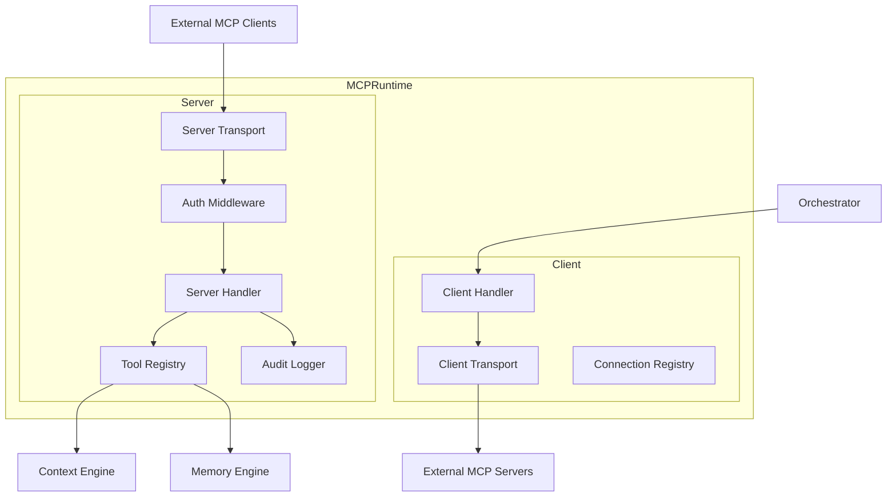
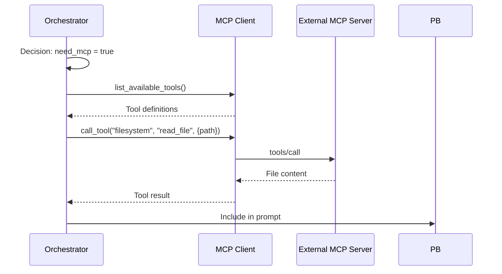
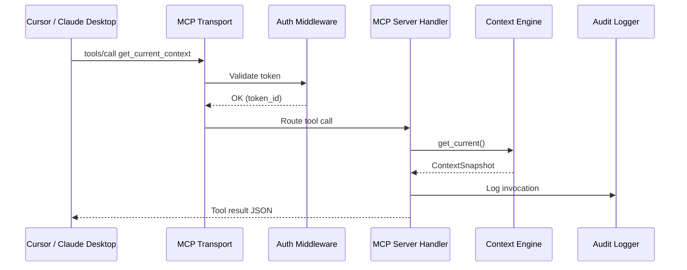
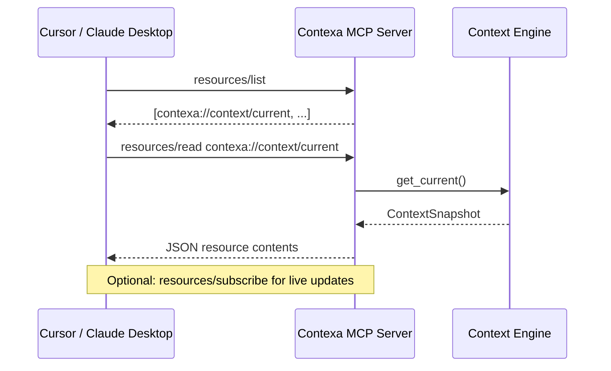

# MCP Runtime

**Project:** Contexa — AI Context Platform  
**Version:** 1.3  
**Status:** Reviewed  
**Last Updated:** 2026-07-07

---

## 1. Overview

The MCP Runtime enables Contexa to function as both an **MCP Server** (exposing desktop context to external AI clients) and an **MCP Client** (connecting to external MCP servers for additional tools). This positions Contexa as the Context Layer for the broader AI ecosystem.

---

## 2. Goals

1. Expose desktop context, memory, and timeline via standard MCP tools
2. Enable any MCP-compatible AI client to consume Contexa context
3. Support MCP client mode for extending Contexa with external tools
4. Enforce authorization and audit all MCP access
5. Align with the latest MCP specification

---

## 3. Responsibilities

| Mode | Responsibility |
|------|----------------|
| **Server** | Expose context tools to external AI clients |
| **Client** | Connect to external MCP servers for additional capabilities |
| **Auth** | Token-based authorization for server access |
| **Audit** | Log all tool invocations |
| **Transport** | Support stdio and HTTP/SSE transports |

---

## 4. Architecture



---

## 5. MCP Server

### 5.1 Server Configuration

```json
{
  "name": "contexa",
  "version": "1.0.0",
  "description": "Contexa AI Context Platform — Real-time desktop context and memory for AI",
  "transport": "stdio",
  "host": "127.0.0.1",
  "port": 9100
}
```

### 5.2 Exposed Tools

| Tool | Description | Latency Target |
|------|-------------|----------------|
| `get_current_context` | Returns current desktop context snapshot | < 5 ms |
| `get_visible_text` | Returns visible text from active window | < 10 ms |
| `get_recent_context` | Returns context from last N minutes | < 20 ms |
| `get_timeline` | Returns chronological timeline events | < 100 ms |
| `search_context` | Semantic search over memory | < 200 ms |

### 5.3 Tool Implementations

```rust
pub struct ContexaMcpServer {
    context_engine: Arc<dyn ContextEngine>,
    memory_engine: Arc<dyn MemoryEngine>,
    auth: Arc<AuthMiddleware>,
    audit: Arc<AuditLogger>,
}

impl ContexaMcpServer {
    pub async fn handle_tool_call(&self, request: ToolCallRequest) -> Result<ToolCallResponse> {
        self.auth.validate(&request.token)?;
        
        let result = match request.name.as_str() {
            "get_current_context" => {
                let ctx = self.context_engine.get_current();
                serde_json::to_value(ctx)?
            }
            "get_visible_text" => {
                let ctx = self.context_engine.get_current();
                let max_length = request.args.get("max_length")
                    .and_then(|v| v.as_u64())
                    .unwrap_or(10000) as usize;
                let text = ctx.visible_text.unwrap_or_default();
                serde_json::to_value(json!({
                    "text": truncate(&text, max_length),
                    "capture_method": ctx.capture_method,
                    "truncated": text.len() > max_length,
                }))?
            }
            "get_recent_context" => {
                let minutes = request.args.get("minutes")
                    .and_then(|v| v.as_u64())
                    .unwrap_or(30);
                let snapshots = self.context_engine.get_recent(Duration::minutes(minutes as i64));
                serde_json::to_value(json!({ "snapshots": snapshots, "count": snapshots.len() }))?
            }
            "get_timeline" => {
                let range = parse_time_range(&request.args)?;
                let events = self.memory_engine.get_timeline(range).await?;
                serde_json::to_value(events)?
            }
            "search_context" => {
                let query = request.args.get("query")
                    .and_then(|v| v.as_str())
                    .ok_or(ContexaError::InvalidArgs)?;
                let limit = request.args.get("limit")
                    .and_then(|v| v.as_u64())
                    .unwrap_or(10) as usize;
                let results = self.memory_engine.search(query, SearchOptions {
                    limit,
                    ..Default::default()
                }).await?;
                serde_json::to_value(results)?
            }
            _ => return Err(ContexaError::UnknownTool(request.name)),
        };

        self.audit.log(&request.token_id, &request.name, &request.args).await?;
        Ok(ToolCallResponse { content: result })
    }
}
```

### 5.4 Transport Options

| Transport | Use Case | Binding |
|-----------|----------|---------|
| stdio | IDE integration (Cursor, VS Code) | Process pipe |
| HTTP/SSE | Remote clients, web tools | `127.0.0.1:9100` |

**Security:** HTTP transport binds to localhost only. No external network exposure.

---

## 6. MCP Client

### 6.1 Client Mode

Contexa can connect to external MCP servers to extend its capabilities.

```rust
pub struct ContexaMcpClient {
    connections: HashMap<String, McpConnection>,
}

pub struct McpConnection {
    pub name: String,
    pub transport: TransportType,
    pub tools: Vec<ToolDefinition>,
    pub status: ConnectionStatus,
}

impl ContexaMcpClient {
    pub async fn connect(&mut self, config: McpClientConfig) -> Result<()> {
        let transport = match config.transport {
            TransportType::Stdio => StdioTransport::new(&config.command)?,
            TransportType::Http => HttpTransport::new(&config.url)?,
        };
        
        let init_response = transport.initialize().await?;
        self.connections.insert(config.name, McpConnection {
            name: config.name,
            tools: init_response.tools,
            status: ConnectionStatus::Connected,
            transport: config.transport,
        });
        Ok(())
    }

    pub async fn call_tool(&self, server: &str, tool: &str, args: Value) -> Result<Value> {
        let conn = self.connections.get(server)
            .ok_or(ContexaError::ServerNotConnected)?;
        conn.transport.call_tool(tool, args).await
    }
}
```

### 6.2 Orchestrator Integration

When the Orchestrator's decision engine determines MCP tools are needed:



---

## 7. Authorization

### 7.1 Token Management

```rust
pub struct AuthMiddleware {
    tokens: Arc<RwLock<HashMap<String, TokenInfo>>>,
}

pub struct TokenInfo {
    pub id: String,
    pub label: String,
    pub token_hash: String,  // bcrypt
    pub created_at: DateTime<Utc>,
    pub last_used_at: Option<DateTime<Utc>>,
    pub revoked: bool,
}

impl AuthMiddleware {
    pub fn generate_token(&self, label: &str) -> Result<(String, String)> {
        let raw = format!("ctx_{}", hex::encode(rand::random::<[u8; 32]>()));
        let hash = bcrypt::hash(&raw, bcrypt::DEFAULT_COST)?;
        // Store hash; return raw token to user (shown once)
        Ok((raw, hash))
    }

    pub fn validate(&self, token: &str) -> Result<String> {
        let tokens = self.tokens.read().unwrap();
        for (id, info) in tokens.iter() {
            if !info.revoked && bcrypt::verify(token, &info.token_hash).unwrap_or(false) {
                return Ok(id.clone());
            }
        }
        Err(ContexaError::Unauthorized)
    }
}
```

### 7.2 User Flow

1. User opens Settings → MCP → "Generate Token"
2. Contexa generates token; displays once
3. User configures external MCP client with token
4. All requests validated; audit logged

---

## 8. Flow

### 8.1 External Client Context Request



---

## 9. Interfaces

```rust
pub trait McpServer: Send + Sync {
    async fn start(&self, transport: TransportConfig) -> Result<()>;
    async fn stop(&self) -> Result<()>;
    fn register_tool(&self, tool: ToolDefinition, handler: ToolHandler);
    fn list_tools(&self) -> Vec<ToolDefinition>;
}

pub trait McpClient: Send + Sync {
    async fn connect(&self, config: McpClientConfig) -> Result<()>;
    async fn disconnect(&self, name: &str) -> Result<()>;
    async fn list_tools(&self, server: &str) -> Result<Vec<ToolDefinition>>;
    async fn call_tool(&self, server: &str, tool: &str, args: Value) -> Result<Value>;
}
```

---

## 10. Threading

| Component | Thread | Notes |
|-----------|--------|-------|
| MCP Server (stdio) | Dedicated thread | Blocking read on stdin |
| MCP Server (HTTP) | Tokio runtime | Axum HTTP server |
| MCP Client | Tokio runtime | Async connections |
| Auth Middleware | Any | Synchronous bcrypt |
| Audit Logger | Tokio | Async DB writes |

---

## 11. Performance

| Metric | Target |
|--------|--------|
| Tool call (context) | < 10 ms |
| Tool call (search) | < 200 ms |
| Server startup | < 500 ms |
| Client connect | < 2 s |

---

## 12. Security

- Tokens are bcrypt-hashed; plaintext shown once at generation
- HTTP server binds to `127.0.0.1` only
- All tool invocations audit-logged with timestamp and token ID
- Revoked tokens rejected immediately
- No sensitive data (API keys, passwords) exposed via MCP tools
- Rate limit: 60 tool calls per minute per token

---

## 13. MCP Resources (v1.1 — P1)

MCP Resources allow AI clients to **read context as persistent URIs** without invoking tools on every turn. Resources complement tools: tools for actions/queries, resources for ambient context.

### 13.1 Resource Registry

| URI | MIME Type | Description | Update Frequency |
|-----|-----------|-------------|------------------|
| `contexa://context/current` | `application/json` | Latest `ContextSnapshot` | On context change |
| `contexa://context/selection` | `text/plain` | Current text selection | On selection change |
| `contexa://timeline/today` | `application/json` | Today's timeline events | Every 5 min |
| `contexa://memory/recent` | `application/json` | Last 30 min working memory | On ingest |
| `contexa://ide/current` | `application/json` | IDE LSP context (if extension connected) | On IDE push |

### 13.2 Resource Handler

```rust
pub struct ResourceRegistry {
    resources: HashMap<String, ResourceDefinition>,
}

pub struct ResourceDefinition {
    pub uri: String,
    pub name: String,
    pub description: String,
    pub mime_type: String,
    pub handler: Arc<dyn ResourceHandler>,
}

#[async_trait]
pub trait ResourceHandler: Send + Sync {
    async fn read(&self) -> Result<ResourceContents>;
    fn subscribe(&self) -> Option<broadcast::Receiver<ResourceUpdate>>;
}

pub struct ResourceContents {
    pub uri: String,
    pub mime_type: String,
    pub text: String,
}
```

### 13.3 Client Flow



### 13.4 Subscription (Optional v1.2)

Clients may subscribe to `contexa://context/current` for push updates when context changes significantly (app switch, URL change).

### 13.5 Auth & Audit

- Same bearer token as tools
- All `resources/read` logged in `mcp_audit_log`
- Resources never expose API keys or excluded app data

---

## 14. Future Expansion

- **MCP Prompts** — pre-built prompt templates for common context queries
- **MCP Sampling** — allow external clients to request LLM completions through Contexa (v1.2, requires consent UI)
- **Multi-transport** — simultaneous stdio and HTTP
- **OAuth 2.0** — for enterprise MCP client authorization

---

## 15. Best Practices

- Follow MCP specification versioning strictly
- Test with Cursor and Claude Desktop as reference clients
- Document tool schemas with JSON Schema
- Rotate tokens periodically; provide UI for revocation
- Monitor audit log for anomalous access patterns

---

## 16. References

- [03_API_Interface_Specification.md](./03_API_Interface_Specification.md)
- [Model Context Protocol Specification](https://spec.modelcontextprotocol.io/)
- [16_Security_Privacy.md](./16_Security_Privacy.md)
- [ADR/0004-mcp-first-integration.md](../ADR/0004-mcp-first-integration.md)
