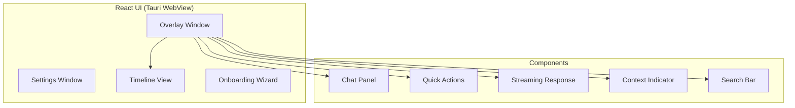
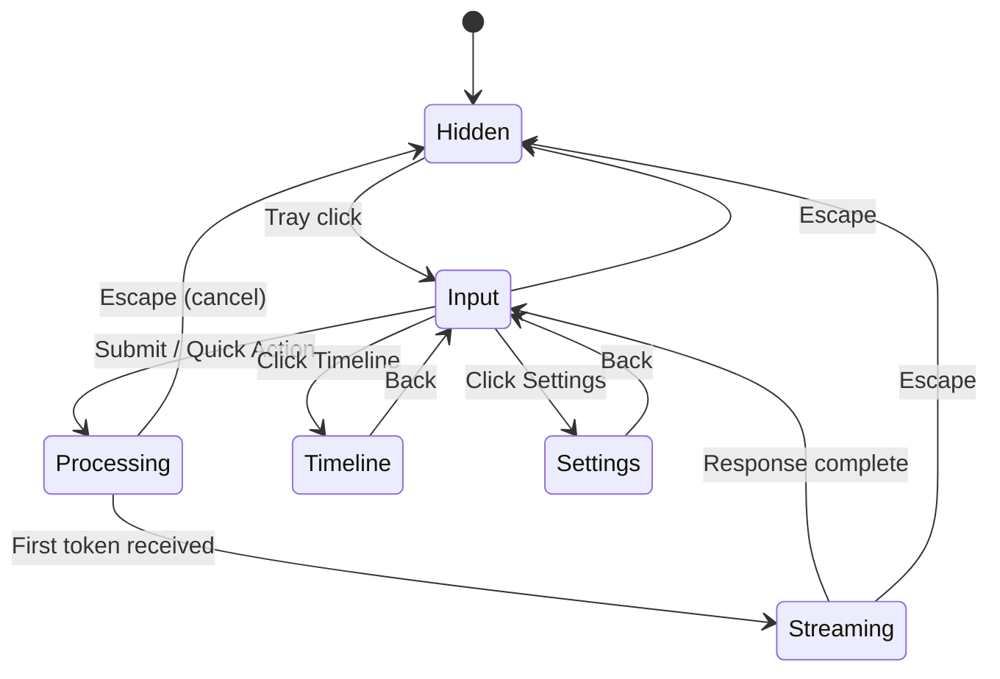
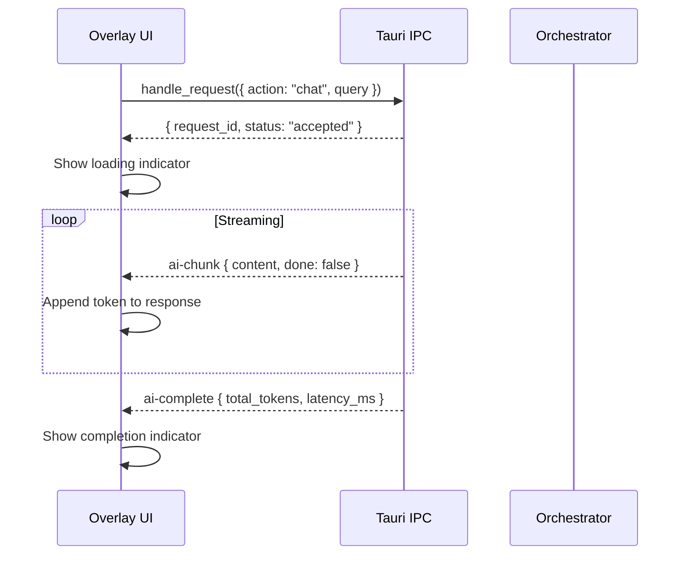
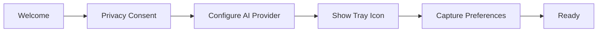

# UI / UX Design

**Project:** Contexa — AI Context Platform  
**Version:** 1.4  
**Status:** Reviewed  
**Last Updated:** 2026-07-21

---

## 1. Overview

The Contexa user interface consists of three primary surfaces: the **Overlay** (opened from the **System Tray**), the **Settings** window, and the System Tray itself. The design prioritizes speed, minimal disruption, and context-aware interactions.

---

## 2. Goals

1. Open overlay within 200ms of tray-icon click
2. Enable one-keystroke access to common AI actions
3. Display AI responses with streaming for perceived instant feedback
4. Provide timeline and settings without leaving the overlay
5. Maintain a clean, modern aesthetic that feels native to Windows

---

## 3. Responsibilities

| Surface | Responsibility |
|---------|----------------|
| Overlay | Primary AI interaction; chat, quick actions, streaming responses |
| Settings | Configuration for LLM, capture, privacy, MCP |
| System Tray | Status indicator, quick access, quit |
| Timeline View | Browse chronological work history |
| Onboarding | First-run setup wizard |

---

## 4. Architecture



---

## 5. Overlay Design

### 5.1 Layout

**v1.4 pivot — Claude.ai-style rail + bottom input:** the footer nav and
top-anchored input from v1.3 were replaced with a left icon-rail (New /
Timeline / Settings) and a bottom-pinned input, to match the reference
layout family (§5.3) more closely and to support multi-turn conversation
within one overlay session (a single query/response no longer clears the
prior turn — see §7).

```
┌────┬──────────────────────────────────────────┐
│ +  │  📄 VS Code — main.rs        (context)    │
│ 🕐 │──────────────────────────────────────────│
│ ⚙  │  (message list, scrollable)               │
│    │   ┌───────────────────────────┐           │
│    │   │              user bubble ►│           │
│    │   └───────────────────────────┘           │
│    │   assistant text, no bubble               │
│    │                                            │
│    │──────────────────────────────────────────│
│    │  [Explain] [Summarize] [Translate] [🔍]    │
│    │  ┌──────────────────────────────────────┐ │
│    │  │ Ask anything about your screen…       │ │
│    │  └──────────────────────────────────────┘ │
└────┴──────────────────────────────────────────┘
```

Rail is 48px, icon-only, three items: **New** (accent-filled `+`, starts a
fresh conversation), **Timeline** (disabled — unimplemented), **Settings**
(opens the panel in §9, in-overlay view swap, not a separate window). User
messages render as a right-aligned bubble; assistant responses stay plain
text, no bubble (unchanged minimal direction from v1.3).

### 5.2 Overlay States



### 5.3 Dimensions & Positioning

**v1.2 pivot:** the overlay is a regular OS-decorated window (native title
bar — minimize/maximize/close, resizable, draggable), not a frameless
Spotlight/Raycast-style popup. Reason: user testing of the v1.1 frameless
popup (fixed 600×500, no decorations, always-on-top, transparent) found
users expected standard window controls, consistent with reference layouts
(Claude.ai, Cursor, Codex CLI) — those are persistent app surfaces, not
transient popups. Closing via the native title-bar X hides rather than
quits (background capture keeps running — docs/16 §7.1; quit is
tray-menu only, §10).

**v1.3 pivot:** the global hotkey (`Alt+Space`) was removed in favor of the
System Tray as the sole way to open the overlay — left-click the tray icon,
or use "Open Overlay" in its menu. Decision: the hotkey added a
system-wide input hook and a rebind-conflict surface for a product still
finding its interaction model; the tray is one click, needs no
registration, and never collides with another app's shortcut. Revisit if
user feedback shows tray-click latency (moving to the icon) is a real
friction point — the FR (§1 FR-DA-04 in docs/01) can be re-added as an
additional trigger, not a replacement.

| Property | Value |
|----------|-------|
| Initial size | 900×640px (`minWidth` 480, `minHeight` 360) |
| Resizable | Yes |
| Decorations | Native OS title bar (minimize/maximize/close) |
| Position | Centered on first launch; OS remembers position while running |
| Background | Solid `--bg-primary` (theme-dependent, no transparency — see §12.1) |
| Border radius | Outer frame: none (edge-to-edge, matches native frame). Inner elements (bubbles, input, buttons) use rounded corners — see §12.1/component specs |
| Z-order | Normal (not always-on-top) |
| Animation | Content fade in 150ms, slide up 10px on show |

### 5.4 Context Indicator

Shows the current desktop context at a glance:

```
📄 VS Code — src/main.rs
🌐 Chrome — github.com/contexa
📊 Excel — Q3_Report.xlsx
```

Clicking expands to show full context details (app, URL, visible text preview).

---

## 6. Quick Actions

| Action | Icon | Shortcut | Behavior |
|--------|------|----------|----------|
| Explain | 💡 | `E` | Explain current content/selection |
| Summarize | 📝 | `S` | Summarize visible content |
| Translate | 🌐 | `T` | Translate selection (language picker) |
| Search | 🔍 | `/` | Search with context + web |

Quick actions send predefined requests to the Orchestrator without requiring typed input.

---

## 7. Chat Interaction

### 7.1 Input Bar

- Placeholder: "Ask anything about your screen..."
- Supports multi-line input (`Shift + Enter`)
- Submit: `Enter`
- Shows context indicator badge when context is available
- Auto-focus on overlay open

### 7.2 Streaming Response



### 7.3 Response Rendering

- Markdown rendering (headings, lists, code blocks, links)
- Code blocks with syntax highlighting and copy button
- Source citations from memory/search displayed as footnotes
- "Copy" button on hover for response blocks

---

## 8. Timeline View

### 8.1 Layout

```
┌─────────────────────────────────────────────────┐
│  ← Back          Timeline — Today                  │
├─────────────────────────────────────────────────┤
│  09:15  📄 Opened VS Code — main.rs       45m   │
│  10:00  🌐 Chrome — GitHub PR review       30m   │
│  10:30  📄 VS Code — fix auth module       1h    │
│  11:30  📊 Excel — Q3 budget review        20m   │
│  11:50  💬 "Explain OAuth flow"                   │
│  12:00  🌐 Chrome — OAuth documentation    45m   │
├─────────────────────────────────────────────────┤
│  [Today] [Yesterday] [This Week] [Custom]        │
└─────────────────────────────────────────────────┘
```

### 8.2 Interactions

- Click event → expand to show context snapshot details
- Filter by application type
- Search within timeline
- Date range selector

---

## 9. Settings

**v1.4 status:** only **General → Theme** is implemented, as an in-overlay
view swap opened from the rail (§5.1), not a separate window. It is the
sole control shipped so far — `Light / Dark / System`, persisted to
`localStorage`. All other sections below remain unbuilt (design only).

### 9.1 Sections

| Section | Settings | Status |
|---------|----------|--------|
| **General** | Auto-start, language, **Theme** ✅ | Theme implemented; rest unbuilt |
| **AI Provider** | Provider, model, API key, temperature, max tokens | Unbuilt |
| **Capture** | Enable/disable, excluded apps, excluded URLs | Unbuilt |
| **Memory** | Retention period, embedding model, clear data | Unbuilt |
| **Search** | Enable/disable, provider, API key | Unbuilt |
| **Privacy** | Send context to cloud, data export, delete all | Unbuilt |
| **MCP** | Server status, generate/revoke tokens, connected clients | Unbuilt |
| **About** | Version, license, documentation links | Unbuilt |

### 9.2 Settings Layout

Target layout (once the remaining sections are built) is a sidebar of
section names; today's shipped panel has no sidebar of its own — it's a
single "General" block with one row (Theme), reachable via the rail's
gear icon, with a "Back" action to return to chat.

```
┌──────────┬──────────────────────────────────────┐
│ General  │  ☐ Start Contexa on login            │
│ AI       │                                      │
│ Capture  │  Language: [English ▾]               │
│ Memory   │  Theme: [System ▾]                   │
│ Search   │                                      │
│ Privacy  │                                      │
│ MCP      │                                      │
│ About    │                                      │
│          │                                      │
└──────────┴──────────────────────────────────────┘
```

---

## 10. System Tray

| State | Icon | Tooltip |
|-------|------|---------|
| Active | Green dot | "Contexa — Active" |
| Paused | Yellow dot | "Contexa — Capture paused" |
| Error | Red dot | "Contexa — Error" |

**Tray menu:**
- Open Overlay (also: left-click the icon)
- Pause/Resume Capture
- Settings
- Timeline
- Quit

---

## 11. Onboarding Flow



| Step | Content |
|------|---------|
| Welcome | "Contexa gives AI real-time awareness of your desktop" |
| Privacy | Explain what is captured; opt-in for cloud LLM and search |
| AI Provider | Select provider; enter API key or configure Ollama |
| Show Tray Icon | Point out the Contexa tray icon; explain left-click opens the overlay |
| Capture | Default exclusions; option to add apps |
| Ready | "Click the tray icon anytime to try it" |

---

## 12. Design System

### 12.1 Colors (Dark + Light, Claude.ai-style)

**v1.4 pivot:** replaced the single purple-accent dark palette with a
warm terracotta-accent palette matched to the reference layout family
(§5.3), and added a light theme (§9, toggled via Settings → General →
Theme). Tokens switch via a `[data-theme="light"]` attribute on `<html>`;
dark is the default when no attribute is set. Light-theme `--accent` is
darkened from an initial `#C15F3C` to `#A84E2F` — the lighter value only
hit 4.01:1 contrast against `--bg-primary` (fails WCAG AA 4.5:1 for text
uses like markdown links); `#A84E2F` hits 5.25:1.

| Token | Dark | Light | Usage |
|-------|------|-------|-------|
| `--bg-primary` | `#262624` | `#FAF9F5` | Overlay background |
| `--bg-secondary` | `#1E1E1C` | `#F4F3EE` | Rail, cards, input fields |
| `--bg-tertiary` | `#3A3A37` | `#E8E6DC` | User message bubble |
| `--text-primary` | `#F0EEE6` | `#1F1E1D` | Body text |
| `--text-secondary` | `#8F8D86` | `#6B6A66` | Labels, hints |
| `--accent` | `#D97757` | `#A84E2F` | Buttons, links, focus |
| `--accent-hover` | `#E08966` | `#8F3F24` | Hover states |
| `--success` | `#00B894` | `#00966F` | Active status |
| `--warning` | `#FDCB6E` | `#B8860B` | Paused status |
| `--error` | `#E17055` | `#C44F36` | Error states |
| `--border` | `#3A3A37` | `#E5E3DA` | Borders, dividers |

### 12.2 Typography

| Element | Font | Size | Weight |
|---------|------|------|--------|
| Heading | Inter | 16px | 600 |
| Body | Inter | 14px | 400 |
| Small | Inter | 12px | 400 |
| Code | JetBrains Mono | 13px | 400 |
| Input | Inter | 14px | 400 |

### 12.3 Spacing

Base unit: 4px. Common values: 4, 8, 12, 16, 24, 32.

---

## 13. Accessibility

- Full keyboard navigation (Tab, Enter, Escape)
- ARIA labels on all interactive elements
- Focus indicators visible on all focusable elements
- Color contrast ratio ≥ 4.5:1 (WCAG AA)
- Screen reader announces context changes and AI responses
- Reduced motion option respects `prefers-reduced-motion`

---

## 14. Performance

| Metric | Target |
|--------|--------|
| Overlay open animation | 150ms |
| Input focus | Immediate |
| First render | < 100ms |
| Streaming update | < 16ms per token (60fps) |
| Timeline scroll | 60fps with 1000+ events |

---

## 15. Security

- API keys displayed as masked; never shown in full after initial entry
- "Delete all data" requires confirmation dialog with type-to-confirm
- MCP tokens shown once; copy-to-clipboard only
- No sensitive data in overlay screenshots or logs

---

---

## 16. Component Specifications

### 16.1 Component Tree

```
App
├── SystemTray (always running)
├── OverlayWindow (from tray)
│   ├── Sidebar (icon rail — v1.4, replaces OverlayFooter)
│   │   ├── NewConversationButton
│   │   ├── TimelineButton (disabled — unimplemented)
│   │   └── SettingsButton
│   ├── ContextIndicator
│   ├── MessageList (v1.4, replaces ResponsePanel — multi-turn)
│   │   ├── MessageBubble (role: user | assistant)
│   │   ├── CopyButton (per assistant message)
│   │   └── LoadingIndicator
│   ├── QuickActionBar
│   │   ├── ExplainButton
│   │   ├── SummarizeButton
│   │   ├── TranslateButton (disabled — needs language picker)
│   │   └── SearchButton
│   └── InputBar (bottom-pinned — v1.4, was top-anchored)
├── SettingsView (overlay sub-view — v1.4, in-overlay swap not a window)
│   └── SettingsPanel
│       └── ThemeSelect (System | Light | Dark) — only implemented control
├── TimelinePanel (overlay sub-view, unimplemented)
│   ├── DateFilter
│   ├── TimelineList (virtualized)
│   └── EventDetail
├── SettingsWindow (future — full multi-section settings, not yet built)
│   ├── SettingsSidebar
│   └── SettingsContent (per section)
└── OnboardingWizard (first-run modal)
```

### 16.2 Interaction Matrix

| User Action | Key/Input | System Response | Latency Target |
|-------------|-----------|-----------------|----------------|
| Open overlay | Tray left-click | Show overlay, focus input, load context badge | < 200 ms |
| Submit query | `Enter` | Send to orchestrator, show loading, stream response | < 50 ms accept |
| Quick explain | `E` or click | Trigger explain action on current context | < 50 ms accept |
| Quick summarize | `S` or click | Trigger summarize action | < 50 ms accept |
| Quick translate | `T` or click | Show language picker, then translate | < 50 ms accept |
| Cancel / close | `Escape` | Hide overlay, cancel in-flight request | < 100 ms |
| Open timeline | Click footer | Switch to timeline sub-view | < 50 ms |
| Open settings | Click footer | Open settings window | < 200 ms |
| Copy response | Click copy icon | Copy markdown to clipboard | < 50 ms |
| Navigate timeline | Arrow keys | Scroll timeline list | 60 fps |
| Pause capture | Tray menu | Yellow indicator, stop context updates | < 100 ms |

### 16.3 Responsive Behavior

| Display | Overlay Width | Font Scale | Notes |
|---------|--------------|------------|-------|
| 1080p | 600 px | 1.0× | Default |
| 1440p | 640 px | 1.0× | Slightly wider |
| 4K (150% DPI) | 600 px logical | 1.0× | Tauri handles DPI scaling |
| 4K (200% DPI) | 600 px logical | 1.0× | Test touch targets ≥ 44px |

### 16.4 Error States

| Error | UI Display | Recovery |
|-------|-----------|----------|
| LLM provider down | "AI provider unavailable. [Check Settings]" | Retry button; suggest fallback |
| No context captured | Context badge: "No active window" | Explain limitation; suggest focus app |
| OCR failed | Response uses UIA text only | Transparent to user unless no text |
| Search disabled | "Web search is off. [Enable in Settings]" | Link to settings |
| MCP token invalid | Settings → MCP: "Token revoked" | Regenerate token |
| Rate limited | "Too many requests. Try again in 30s." | Auto-retry countdown |

### 16.5 Animation Specifications

| Animation | Duration | Easing | Trigger |
|-----------|----------|--------|---------|
| Overlay fade in | 150 ms | ease-out | Tray click |
| Overlay slide up | 150 ms | ease-out | Tray click (10px translateY) |
| Overlay fade out | 100 ms | ease-in | Escape |
| Token stream | — | — | Append text, no per-token animation |
| Loading pulse | 1000 ms | ease-in-out | Waiting for first token |
| Context badge update | 200 ms | ease | Context change event |

---

## 17. Future Expansion

- **Light theme** option
- **Custom themes** via CSS variables
- **Widget mode** — small persistent context pill
- **Voice input** — microphone button in overlay
- **Multi-monitor** — overlay appears on active monitor
- **Notification toasts** — proactive context suggestions

---

## 18. Best Practices

- Use TailwindCSS utility classes; avoid custom CSS where possible
- Implement virtual scrolling for timeline (react-window)
- Debounce input for search-as-you-type
- Preload overlay WebView on app startup for instant open
- Test overlay on 1080p, 1440p, and 4K displays

---

## 19. References

- [01_Software_Requirements_Specification.md](./01_Software_Requirements_Specification.md)
- [03_API_Interface_Specification.md](./03_API_Interface_Specification.md)
- [TailwindCSS](https://tailwindcss.com/)
- [Tauri Window API](https://tauri.app/reference/javascript/api/namespacewindow/)
