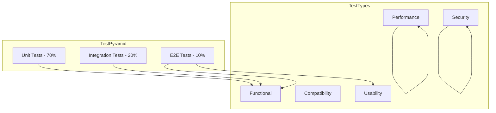
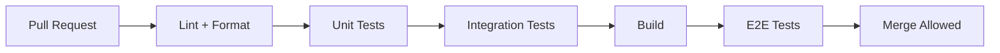

# Test Plan

**Project:** Contexa — AI Context Platform  
**Version:** 1.1  
**Status:** Reviewed  
**Last Updated:** 2026-07-06

---

## 1. Overview

This document defines the testing strategy, test categories, test cases, and acceptance criteria for Contexa. Testing follows a pyramid approach: unit tests (70%), integration tests (20%), end-to-end tests (10%).

---

## 2. Goals

1. Verify all Must-priority requirements from the SRS
2. Achieve ≥ 80% code coverage on Rust core engines
3. Validate performance targets on reference hardware
4. Ensure privacy and security requirements are enforced
5. Automate regression testing in CI/CD pipeline

---

## 3. Responsibilities

| Role | Responsibility |
|------|----------------|
| Developers | Unit tests, integration tests |
| QA | E2E tests, manual exploratory testing |
| CI/CD | Automated test execution on every PR |
| Performance Engineer | Benchmark suite, regression detection |

---

## 4. Test Architecture



---

## 5. Test Environment

### 5.1 Reference Hardware

| Spec | Value |
|------|-------|
| CPU | Intel i5-12400 / AMD Ryzen 5 5600 |
| RAM | 16 GB |
| OS | Windows 11 23H2 |
| Display | 1920×1080 |
| Storage | NVMe SSD |

### 5.2 Test Applications

| Application | Purpose |
|-------------|---------|
| Google Chrome | Browser context, URL extraction |
| Visual Studio Code | IDE context, file path, code selection |
| Microsoft Word | Document context, text selection |
| Microsoft Excel | Spreadsheet context |
| Windows Terminal | Terminal context |
| Notepad | Basic text, OCR fallback testing |
| Adobe Acrobat Reader | PDF context, OCR testing |

### 5.3 Test Tools

| Tool | Purpose |
|------|---------|
| `cargo test` | Rust unit and integration tests |
| `vitest` | React component tests |
| `playwright` | E2E UI tests |
| `criterion` | Rust benchmarks |
| `mockall` | Rust mock generation |
| `wiremock` | HTTP mock for LLM/search APIs |
| `sqlite` (in-memory) | Database test fixtures |

---

## 6. Unit Tests

### 6.1 Vision Engine

| ID | Test Case | Expected |
|----|-----------|----------|
| UT-VE-01 | Frame differencer detects 5% change | `has_significant_change` returns true |
| UT-VE-02 | Frame differencer ignores < 5% change | Returns false |
| UT-VE-03 | Region hasher skips unchanged regions | Unchanged regions not in diff list |
| UT-VE-04 | OCR rate limiter blocks 3rd call in 1s | Returns `RateLimited` error |
| UT-VE-05 | Exclusion filter blocks excluded app | `is_excluded` returns true |
| UT-VE-06 | Password field redacted in UIA | Text replaced with `[REDACTED]` |
| UT-VE-07 | Adaptive scheduler transitions idle → active | Capture rate increases |

### 6.2 Context Engine

| ID | Test Case | Expected |
|----|-----------|----------|
| UT-CE-01 | Snapshot assembler merges UIA + OCR text | Hybrid text in snapshot |
| UT-CE-02 | Chrome enricher extracts URL | `url` field populated |
| UT-CE-03 | VSCode enricher extracts file path | `document_path` populated |
| UT-CE-04 | Change detector ignores minor text changes | No event emitted |
| UT-CE-05 | Change detector detects app switch | Event emitted |
| UT-CE-06 | Context cache returns latest snapshot | `get_current()` matches last update |
| UT-CE-07 | Language detector identifies English text | `language` = "en" |

### 6.3 Memory Engine

| ID | Test Case | Expected |
|----|-----------|----------|
| UT-ME-01 | Working memory evicts after 30 min | Old snapshots removed |
| UT-ME-02 | Working memory respects max size (200) | Oldest removed on overflow |
| UT-ME-03 | Deduplicator blocks duplicate content | Second insert skipped |
| UT-ME-04 | Timeline builder generates summary for Chrome | Summary contains URL |
| UT-ME-05 | Timeline builder calculates duration | `duration_ms` set on close |
| UT-ME-06 | Embedding pipeline batches 10 chunks | Single API call for batch |
| UT-ME-07 | Semantic search returns relevant results | Score > 0.7 for match |
| UT-ME-08 | Retention purger deletes old records | Records before cutoff removed |

### 6.4 AI Orchestrator

| ID | Test Case | Expected |
|----|-----------|----------|
| UT-AO-01 | Explain action triggers OCR when UIA < 0.5 | `need_ocr` = true |
| UT-AO-02 | Recall action queries timeline + memory | Both flags set |
| UT-AO-03 | Search disabled returns error | `SearchDisabled` error |
| UT-AO-04 | Provider fallback on primary failure | Fallback provider called |
| UT-AO-05 | Request cancellation aborts stream | Status = Cancelled |
| UT-AO-06 | Max 3 concurrent requests enforced | 4th request rejected |

### 6.5 Prompt Builder

| ID | Test Case | Expected |
|----|-----------|----------|
| UT-PB-01 | Token budget respects max tokens | Total ≤ max |
| UT-PB-02 | Truncation follows priority order | Timeline truncated before context |
| UT-PB-03 | Explain template includes selected text | Selected text in prompt |
| UT-PB-04 | Recall template includes timeline events | Events formatted correctly |
| UT-PB-05 | Source refs track all included sources | All sources listed |

### 6.6 MCP Runtime

| ID | Test Case | Expected |
|----|-----------|----------|
| UT-MCP-01 | Valid token passes auth | Returns token_id |
| UT-MCP-02 | Invalid token rejected | `Unauthorized` error |
| UT-MCP-03 | Revoked token rejected | `Unauthorized` error |
| UT-MCP-04 | get_current_context returns valid JSON | Schema validated |
| UT-ME-09 | Daily meta-memory rollup | Summary created for test day |
| UT-ME-10 | Entity linker connects chunks | Same topic across days → one thread |
| UT-MCP-06 | resources/read current context | Valid JSON returned |
| ST-09 | SQLCipher enabled | DB file not readable without key |

---

## 7. Integration Tests

| ID | Test Case | Components | Expected |
|----|-----------|------------|----------|
| IT-01 | Vision → Context pipeline | VE + CE | ContextSnapshot created on frame change |
| IT-02 | Context → Memory pipeline | CE + ME | Timeline event + memory chunk created |
| IT-03 | Full query pipeline (mock LLM) | AO + PB + CE + ME | Streaming response returned |
| IT-04 | Search integration (mock API) | AO + SE + PB | Search results in prompt |
| IT-05 | MCP tool → Context Engine | MCP + CE | Valid context JSON returned |
| IT-06 | Settings update → Engine config | UI + Core | Exclusion list enforced |
| IT-07 | Database migration | DB + ME | Schema applied; data preserved |
| IT-08 | Embedding + search roundtrip | ME + DB | Insert chunk → search returns it |

---

## 8. End-to-End Tests

| ID | Test Case | Steps | Expected |
|----|-----------|-------|----------|
| E2E-01 | Overlay hotkey open | Press Alt+Space | Overlay visible < 200ms |
| E2E-02 | Explain code in VS Code | Open file → select code → Explain | Relevant explanation streamed |
| E2E-03 | Timeline recall | Work in 3 apps → "What did I do today?" | Accurate summary |
| E2E-04 | Translate selection | Select text → Translate to Vietnamese | Translation displayed |
| E2E-05 | App exclusion | Exclude Notepad → switch to Notepad | No context captured |
| E2E-06 | Delete all data | Settings → Delete all → Confirm | Database empty |
| E2E-07 | MCP external access | Generate token → call from test client | Valid context returned |
| E2E-08 | Provider switch | Change from OpenAI to Ollama → Chat | Response from Ollama |
| E2E-09 | Onboarding flow | Fresh install → complete wizard | App ready to use |
| E2E-10 | Overlay dismiss | Press Escape | Overlay hidden; app focused |

---

## 9. Performance Tests

| ID | Metric | Target | Method |
|----|--------|--------|--------|
| PT-01 | Overlay open latency | < 200 ms | Measure hotkey to visible |
| PT-02 | Context update on app switch | < 500 ms | Switch app; measure context update event |
| PT-03 | Background CPU (idle) | < 1% | 5-min idle monitoring |
| PT-04 | Background CPU (active) | < 5% | 5-min active use monitoring |
| PT-05 | Background memory | < 300 MB | Process memory after 1 hour |
| PT-06 | Semantic search (10K chunks) | < 200 ms | Benchmark with fixture data |
| PT-07 | UIA extraction | < 100 ms | Benchmark across test apps |
| PT-08 | OCR single region | < 500 ms | Benchmark with test image |
| PT-09 | Time to first token | < 1 s | Mock LLM with realistic delay |
| PT-10 | Prompt build time | < 50 ms | Benchmark with max context |

---

## 10. Security Tests

| ID | Test Case | Expected |
|----|-----------|----------|
| ST-01 | API keys not in SQLite | No keys in database file |
| ST-02 | API keys not in logs | Grep logs for key patterns |
| ST-03 | MCP HTTP binds localhost only | Connection from external IP fails |
| ST-04 | Excluded app data not in memory | No snapshots from excluded app |
| ST-05 | Password fields redacted | UIA password elements show [REDACTED] |
| ST-06 | Search disabled = no outbound HTTP | Network monitor shows no search calls |
| ST-07 | MCP token required for tool calls | Request without token returns 401 |
| ST-08 | Delete all data removes everything | Database file empty after delete |

---

## 11. Compatibility Tests

| ID | Environment | Expected |
|----|-------------|----------|
| CT-01 | Windows 10 22H2 | All features functional |
| CT-02 | Windows 11 23H2 | All features functional |
| CT-03 | 1080p display | Overlay renders correctly |
| CT-04 | 4K display (150% scaling) | Overlay renders correctly |
| CT-05 | Chrome 120+ | URL extraction works |
| CT-06 | VS Code 1.85+ | File path extraction works |
| CT-07 | Ollama 0.1+ | Local LLM responses work |
| CT-08 | OpenAI API v1 | Cloud LLM responses work |

---

## 12. Test Automation

### 12.1 CI Pipeline



### 12.2 CI Configuration

```yaml
# .github/workflows/test.yml
jobs:
  rust-tests:
    runs-on: windows-latest
    steps:
      - uses: actions/checkout@v4
      - uses: dtolnay/rust-toolchain@stable
      - run: cargo test --workspace
      - run: cargo bench --no-run

  ui-tests:
    runs-on: windows-latest
    steps:
      - uses: actions/checkout@v4
      - run: pnpm install
      - run: pnpm test
      - run: pnpm e2e
```

---

## 13. Acceptance Criteria

All Must-priority SRS requirements must pass corresponding test cases before release.

| Milestone | Required Tests |
|-----------|---------------|
| Alpha | Unit tests (all engines), IT-01 through IT-04 |
| Beta | All integration tests, E2E-01 through E2E-06, PT-01 through PT-05 |
| GA | All tests, including security and compatibility |

---

## 14. Requirements Traceability Matrix

| SRS ID | Requirement | Test ID(s) | Priority |
|--------|-------------|------------|----------|
| FR-DA-04 | Alt+Space overlay | E2E-01, PT-01 | Must |
| FR-VE-03 | OCR only when needed | UT-VE-04, UT-AO-01, SP-03 | Must |
| FR-CE-01 | Track active window | IT-01, E2E-02 | Must |
| FR-ME-06 | Semantic search | UT-ME-07, IT-08, SP-04 | Must |
| FR-AO-05 | Route to LLM provider | UT-AO-04, E2E-08 | Must |
| FR-MCP-03 | get_current_context | UT-MCP-04, E2E-07, SP-06 | Must |
| FR-ST-04 | Delete all data | E2E-06, ST-08 | Must |
| NFR-P-05 | CPU < 5% | PT-03, PT-04, SP-02 | Must |
| NFR-S-01 | Local storage | ST-01, ST-06 | Must |

---

## 15. Benchmark Methodology

### 15.1 Environment

- Reference hardware per Section 5.1
- Clean boot; no other background agents (Recall, Screenpipe disabled)
- Contexa running ≥ 15 minutes before measurement (warm state)
- 3 runs per benchmark; report median and p95

### 15.2 Measurement Tools

| Tool | Measures |
|------|----------|
| `criterion` | Rust micro-benchmarks (UIA, search, prompt build) |
| Windows Performance Monitor | CPU%, working set |
| Custom tracing spans | End-to-end pipeline latency |
| Playwright + `performance.now()` | Overlay open latency |

### 15.3 Baseline Recording

After Phase 0.5 spikes, record baselines in `benchmarks/BASELINE.md`:

```
| Benchmark | Target | Baseline (Spike) | Date |
|-----------|--------|------------------|------|
| UIA extract (Chrome) | < 100ms | TBD | SP-01 |
| Capture CPU (active) | < 5% | TBD | SP-02 |
| Search 50K vectors p95 | < 200ms | TBD | SP-04 |
| Overlay open p95 | < 200ms | TBD | SP-07 |
```

CI regression gate: fail if any benchmark exceeds baseline by > 15%.

---

## 16. Future Expansion

- **Fuzz testing** for MCP input parsing and prompt injection
- **Chaos testing** for engine crash recovery
- **Load testing** for MCP server under concurrent clients
- **Visual regression** testing for overlay UI
- **Accessibility audit** with automated WCAG checker

---

## 17. Best Practices

- Write tests before implementation for critical paths (TDD for engines)
- Use in-memory SQLite for database tests
- Mock all external APIs (LLM, search) in unit/integration tests
- Run performance benchmarks on dedicated hardware; track trends
- Maintain test fixtures for realistic context snapshots

---

## 18. References

- [01_Software_Requirements_Specification.md](./01_Software_Requirements_Specification.md)
- [13_Test_Plan.md](./13_Test_Plan.md)
- [criterion.rs](https://github.com/bheisler/criterion.rs)
- [Playwright](https://playwright.dev/)
