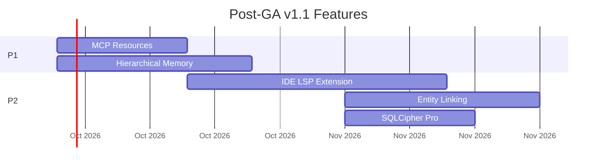
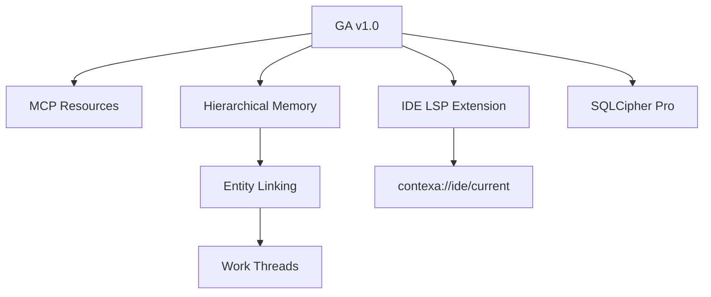
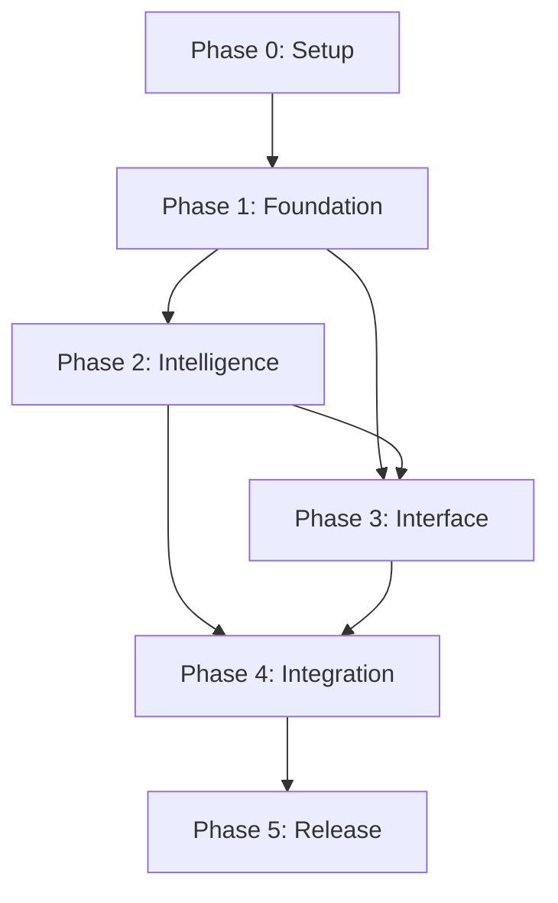
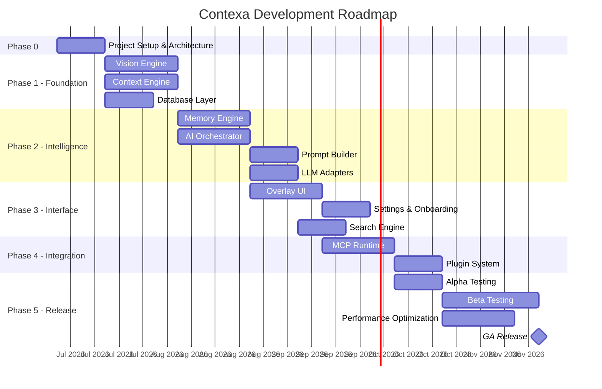

# Development Roadmap

**Project:** Contexa — AI Context Platform
**Version:** 1.3
**Status:** Reviewed
**Last Updated:** 2026-07-07

---

## 1. Overview

This document outlines the phased development plan for Contexa from initial prototype to general availability, including milestones, deliverables, dependencies, and team allocation.

---

## 2. Goals

1. Ship a functional Windows desktop agent within 6 months
2. Validate core value proposition (context-aware AI) with early adopters
3. Establish MCP ecosystem integration by Beta
4. Achieve performance and privacy targets before GA
5. Build foundation for multi-platform expansion

---

## 3. Phase Overview

---

## 4. Phase 0: Project Setup (Weeks 1-2)

### Deliverables

- [X] Architecture documentation (this docs/ folder)
- [X] Cargo workspace scaffolding
- [X] Tauri application skeleton
- [X] CI/CD pipeline (GitHub Actions) — PR checks only; release/signing pipeline deferred to Phase 5
- [X] Development environment setup guide ([docs/29](./29_Dev_Environment_Setup.md))
- [X] ADR initial decisions

### Team

| Role              | Allocation |
| ----------------- | ---------- |
| Architect         | 100%       |
| Rust Engineer     | 50%        |
| Frontend Engineer | 25%        |

---

## 4. Phase 0.5: Technical Spikes (Weeks 2–3)

Validate risky assumptions before full engine implementation. See [22_Technical_Spike_Plan.md](./22_Technical_Spike_Plan.md).

| Spike                           | Gate?         | Duration |
| ------------------------------- | ------------- | -------- |
| SP-01 UIA coverage (10 apps)    | **Yes** | 3 days   |
| SP-02 Capture CPU measurement   | **Yes** | 2 days   |
| SP-04 sqlite-vec 50K search     | **Yes** | 2 days   |
| SP-05 Embedding model selection | **Yes** | 2 days   |
| SP-07 Tauri overlay latency     | **Yes** | 1 day    |
| SP-08 COM threading model       | **Yes** | 2 days   |
| SP-03 OCR fallback              | No            | 2 days   |
| SP-06 MCP + Cursor integration  | No            | 2 days   |

**Gate:** Phase 1 cannot start until all "Yes" spikes pass.

### Milestone: M0.5 — Technical Validation

**Criteria:** UIA ≥ 8/10 apps; CPU < 5%; search < 200ms; overlay < 200ms; ADR-0006 and ADR-0008 recorded.

---

## 5. Phase 1: Foundation (Weeks 4–7)

### 5.1 Vision Engine

| Task                                 | Priority | Duration |
| ------------------------------------ | -------- | -------- |
| Window monitor (foreground tracking) | Must     | 3d       |
| Windows Graphics Capture integration | Must     | 5d       |
| UI Automation text extraction        | Must     | 5d       |
| Frame differencing + region hashing  | Must     | 3d       |
| Selective OCR (Windows.Media.Ocr)    | Must     | 3d       |
| Exclusion filter                     | Must     | 2d       |
| Adaptive scheduler                   | Should   | 2d       |

**Status:** Done except Selective OCR — `crates/contexa-vision` (window monitor, WGC capture, UIA extraction, frame differencing + region hashing, exclusion filter, adaptive scheduler, `VisionEngine`/`ContexaVisionEngine` with the ADR-0008 Pattern A capture thread). OCR is an explicit stub (`ocr_region` errors) — `spikes/SP-03-ocr-fallback` was never run, so building real `Windows.Media.Ocr` integration now would skip this project's own spike-first gate. 23 unit tests pass (pure logic only); WinAPI/COM/GPU paths verified via `examples/vision_smoke.rs` against a real window.

### 5.2 Context Engine

| Task                      | Priority | Duration |
| ------------------------- | -------- | -------- |
| Snapshot assembler        | Must     | 3d       |
| Context cache (in-memory) | Must     | 2d       |
| Change detector           | Must     | 2d       |
| Chrome/Edge enricher      | Must     | 3d       |
| VS Code enricher          | Must     | 3d       |
| Selection tracker         | Should   | 2d       |
| Language detector         | Should   | 1d       |

**Status:** Done except Selection Tracker — `crates/contexa-context` (`SnapshotAssembler`, `ContextCache`, `ChangeDetector`, `PluginRegistry`/`PluginSandbox`, Chrome/Edge enricher via targeted UIA address-bar lookup, VS Code enricher via window-title parsing — see its module doc for why, not live UIA — Language Detector via `whatlang`, and `ContexaContextEngine` wiring it all together with a `tokio::sync::broadcast` `subscribe()`). Selection Tracker is an explicit stub (`get_selection()` always returns `None`) — deferred, not required by M1. 40 unit tests pass; live UIA-dependent paths (Chrome/Edge/VS Code enrichment) verified via `examples/context_smoke.rs` — mirrors the caveat already on Vision Engine's own smoke example: this needs a real interactive desktop session (an automated/headless shell run showed `UIA: no result` on both `vision_smoke` and `context_smoke` alike, i.e. a session limitation, not a regression), so re-run it manually with Chrome and VS Code focused to confirm `url`/`document_path` before relying on this in production.

### 5.3 Database Layer

| Task                                | Priority | Duration |
| ----------------------------------- | -------- | -------- |
| SQLite schema + migrations          | Must     | 3d       |
| sqlite-vec integration              | Must     | 3d       |
| Repository traits + implementations | Must     | 4d       |
| Connection management (WAL)         | Must     | 2d       |

**Status:** Done — `crates/contexa-db` (schema `V1__initial_schema.sql` via refinery, `Database` with WAL + read pool + sqlite-vec extension loading, `ContextRepository`/`MemoryRepository`/`TimelineRepository` implementations). 3 integration tests pass against the real vendored `vec0.dll`.

### Milestone: M1 — Context Pipeline

**Criteria:** Switch between apps; context snapshot available via API within 500ms.

---

## 6. Phase 2: Intelligence (Weeks 7-10)

### 6.1 Memory Engine

| Task                       | Priority | Duration |
| -------------------------- | -------- | -------- |
| Working memory (in-memory) | Must     | 2d       |
| Timeline builder           | Must     | 3d       |
| Memory chunk storage       | Must     | 3d       |
| Embedding pipeline (batch) | Must     | 5d       |
| Semantic search            | Must     | 3d       |
| Deduplication              | Should   | 2d       |
| Retention purger           | Should   | 2d       |

### 6.2 AI Orchestrator

| Task                                  | Priority | Duration |
| ------------------------------------- | -------- | -------- |
| Decision engine                       | Must     | 3d       |
| Pipeline manager (parallel execution) | Must     | 5d       |
| Provider selector + fallback          | Must     | 3d       |
| Request lifecycle management          | Must     | 3d       |
| Response streaming                    | Must     | 3d       |

### 6.3 Prompt Builder

| Task                             | Priority | Duration |
| -------------------------------- | -------- | -------- |
| Template system                  | Must     | 3d       |
| Context/memory/search formatters | Must     | 3d       |
| Token budget manager             | Must     | 3d       |
| Action-specific templates        | Must     | 2d       |

### 6.4 LLM Adapters

| Task              | Priority | Duration |
| ----------------- | -------- | -------- |
| OpenAI adapter    | Must     | 3d       |
| Ollama adapter    | Must     | 2d       |
| Anthropic adapter | Should   | 3d       |
| Gemini adapter    | Should   | 3d       |
| LM Studio adapter | Could    | 2d       |

### Milestone: M2 — AI Pipeline

**Criteria:** Ask "Explain this" in VS Code; receive streamed AI response using context.

---

## 7. Phase 3: Interface (Weeks 9-12)

### 7.1 Overlay UI

| Task                                          | Priority | Duration |
| --------------------------------------------- | -------- | -------- |
| Overlay window (Tauri)                        | Must     | 3d       |
| Global hotkey (Alt+Space)                     | Must     | 2d       |
| Chat input + streaming response               | Must     | 5d       |
| Quick actions (Explain, Summarize, Translate) | Must     | 3d       |
| Context indicator                             | Must     | 2d       |
| Markdown rendering                            | Must     | 2d       |

### 7.2 Settings & Onboarding

| Task                      | Priority | Duration |
| ------------------------- | -------- | -------- |
| Settings window           | Must     | 3d       |
| AI provider configuration | Must     | 2d       |
| Capture exclusions UI     | Must     | 2d       |
| Onboarding wizard         | Must     | 3d       |
| System tray               | Must     | 2d       |

### 7.3 Search Engine

| Task                      | Priority | Duration |
| ------------------------- | -------- | -------- |
| Search adapter trait      | Must     | 2d       |
| DuckDuckGo Search adapter | Must     | 2d       |
| Brave Search adapter      | Should   | 2d       |
| Privacy gate              | Must     | 1d       |
| Search cache              | Should   | 2d       |
| Query formulator          | Should   | 2d       |

### 7.4 Timeline View

| Task                    | Priority | Duration |
| ----------------------- | -------- | -------- |
| Timeline list component | Must     | 3d       |
| Date range filter       | Must     | 2d       |
| Event detail expansion  | Should   | 2d       |

### Milestone: M3 — Usable Product

**Criteria:** Complete user flow from hotkey to AI response with settings and timeline.

---

## 8. Phase 4: Integration (Weeks 13-16)

### 8.1 MCP Runtime

| Task                           | Priority | Duration |
| ------------------------------ | -------- | -------- |
| MCP server (stdio transport)   | Must     | 5d       |
| Tool implementations (5 tools) | Must     | 3d       |
| Auth middleware (token-based)  | Must     | 3d       |
| Audit logging                  | Must     | 2d       |
| MCP client (basic)             | Should   | 5d       |
| HTTP/SSE transport             | Could    | 3d       |

### 8.2 Plugin System

| Task                        | Priority | Duration |
| --------------------------- | -------- | -------- |
| ContextEnricher trait       | Must     | 2d       |
| Plugin registry             | Must     | 2d       |
| Built-in enrichers (6 apps) | Must     | 5d       |
| Plugin documentation        | Should   | 2d       |

### Milestone: M4 — Ecosystem Ready

**Criteria:** External MCP client (Cursor) can call `get_current_context` successfully.

---

## 9. Phase 5: Release (Weeks 17-22)

### 9.1 Alpha (Weeks 17-18)

- Internal team testing
- Fix critical bugs
- Performance baseline measurement
- Security audit (internal)

### 9.2 Beta (Weeks 19-22)

- 50-100 external beta testers
- Feedback collection and prioritization
- Performance optimization pass
- Compatibility testing matrix
- Documentation finalization

### 9.3 Performance Optimization

| Area                   | Target      |
| ---------------------- | ----------- |
| Vision Engine CPU      | < 5% active |
| Context update latency | < 500ms     |
| Overlay open           | < 200ms     |
| Memory footprint       | < 300MB     |
| Semantic search        | < 200ms     |

### 9.4 GA Release

- Signed installer (MSI/NSIS)
- Auto-update mechanism
- Marketing website (Next.js)
- Release notes and documentation

### Milestone: M5 — General Availability

**Criteria:** All Must-priority SRS requirements pass; performance targets met; beta feedback addressed.

---

## 10. Post-GA Roadmap — v1.1 Intelligence & Security

**Timeline:** Months 1–3 after GA
**Theme:** Memory intelligence, MCP ecosystem, developer context, Pro security

### 10.1 Phase 6: v1.1 — Memory & MCP (Weeks 1–6 post-GA)

| Feature                            | Priority | Duration | Deliverable                            |
| ---------------------------------- | -------- | -------- | -------------------------------------- |
| MCP Resources (5 URIs)             | P1       | 2w       | `resources/list`, `resources/read` |
| Hierarchical Memory (daily rollup) | P1       | 3w       | `meta_memories` table, nightly job   |
| Weekly meta-memory rollup          | P1       | 1w       | Sunday batch job                       |
| Recall query uses meta-memory      | P1       | 1w       | Orchestrator search priority           |

**Milestone M6:** "What did I work on this week?" answers from weekly meta-memory.

### 10.2 Phase 7: v1.1 — Developer & Entities (Weeks 4–10 post-GA)

| Feature                           | Priority | Duration | Deliverable                      |
| --------------------------------- | -------- | -------- | -------------------------------- |
| VS Code extension (LSP IPC)       | P1       | 4w       | Marketplace publish              |
| `get_ide_context` MCP tool      | P1       | 1w       | MCP + resource                   |
| Entity extraction (rule + LLM)    | P2       | 2w       | `entities`, `chunk_entities` |
| Work threads / cross-session link | P2       | 2w       | `work_threads` table           |
| SQLCipher encryption (Pro)        | P2       | 2w       | Settings toggle, migration       |

**Milestone M7:** Cursor user gets IDE symbols + git branch in context via extension.

### 10.3 Feature Dependencies

### 10.4 Later Quarters

| Quarter    | Features                                             |
| ---------- | ---------------------------------------------------- |
| Q2 post-GA | MCP Sampling, JetBrains IDE spike, light theme       |
| Q3 post-GA | Team context (E2E encrypted), enterprise policies    |
| Q4 post-GA | Federated memory, Linux support, context marketplace |

---

## 11. Dependencies

**Critical path:** Vision → Context → Memory → Orchestrator → Overlay → MCP → Release

---

## 12. Risk Mitigation in Roadmap

| Risk                           | Mitigation                                    | Phase |
| ------------------------------ | --------------------------------------------- | ----- |
| UIA insufficient for some apps | OCR fallback ready in Phase 1                 | P1    |
| LLM provider API changes       | Adapter pattern; mock tests                   | P2    |
| Performance targets not met    | Dedicated optimization sprint                 | P5    |
| MCP spec changes               | Pin to stable version; adapter layer          | P4    |
| Low beta adoption              | Early MCP integration for developer community | P4    |

---

## 13. Team Structure

| Role                  | Phase 0-1 | Phase 2-3 | Phase 4-5 |
| --------------------- | --------- | --------- | --------- |
| Tech Lead / Architect | 1         | 1         | 1         |
| Rust Engineers        | 1-2       | 2         | 2         |
| Frontend Engineer     | 0.5       | 1         | 1         |
| QA Engineer           | 0         | 0.5       | 1         |
| DevOps                | 0.5       | 0.25      | 0.5       |
| Product Manager       | 0.5       | 0.5       | 0.5       |

---

## 14. Success Metrics

| Metric                  | Alpha | Beta | GA   |
| ----------------------- | ----- | ---- | ---- |
| Core pipeline works     | ✅    | ✅   | ✅   |
| Performance targets met | —    | 80%  | 100% |
| Beta testers            | —    | 50+  | —   |
| MCP integrations        | —    | 2+   | 5+   |
| Crash-free sessions     | —    | 95%  | 99%  |
| User satisfaction (NPS) | —    | > 30 | > 50 |

---

## 15. References

- [01_Software_Requirements_Specification.md](./01_Software_Requirements_Specification.md)
- [13_Test_Plan.md](./13_Test_Plan.md)
- [15_Risk_Analysis.md](./15_Risk_Analysis.md)
- [20_Deployment.md](./20_Deployment.md)

