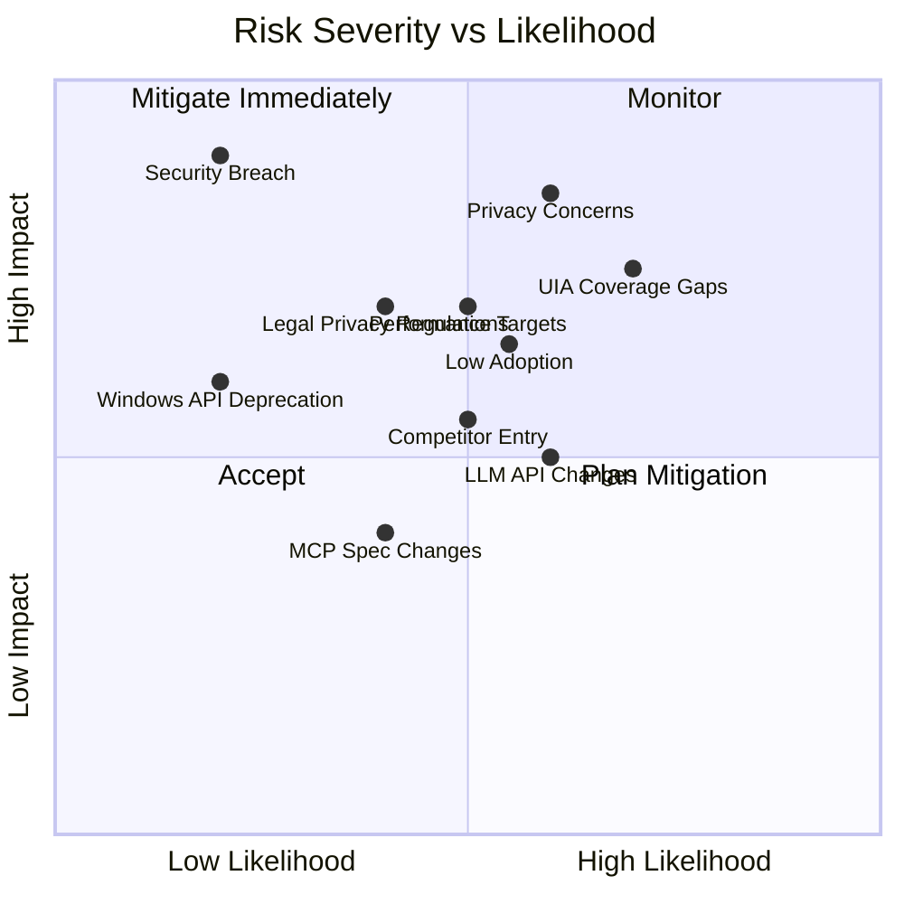

# Risk Analysis

**Project:** Contexa — AI Context Platform  
**Version:** 1.3  
**Status:** Reviewed  
**Last Updated:** 2026-07-07

---

## 1. Overview

This document identifies, assesses, and defines mitigation strategies for risks across technical, product, security, legal, and operational domains for the Contexa project.

---

## 2. Goals

1. Proactively identify risks before they impact development or launch
2. Assign severity and likelihood to prioritize mitigation efforts
3. Define concrete mitigation actions with owners and timelines
4. Establish risk monitoring cadence throughout the project lifecycle

---

## 3. Risk Assessment Matrix

### Severity Scale

| Level | Impact Description |
|-------|-------------------|
| **Critical** | Project failure or legal liability |
| **High** | Major feature degradation or user trust loss |
| **Medium** | Delayed milestone or reduced quality |
| **Low** | Minor inconvenience; workaround available |

### Likelihood Scale

| Level | Probability |
|-------|-------------|
| **High** | > 60% chance of occurring |
| **Medium** | 30-60% |
| **Low** | < 30% |

---

## 4. Technical Risks

### R-T01: UI Automation Coverage Gaps

| Attribute | Value |
|-----------|-------|
| **Severity** | High |
| **Likelihood** | High |
| **Category** | Technical |

**Description:** UI Automation (UIA) may not extract meaningful text from all applications, especially custom-rendered UIs (Electron apps, games, canvas-based tools, legacy software).

**Impact:** Context quality degrades for affected applications; user trust erodes if AI responses are irrelevant.

**Mitigation:**
1. Implement OCR fallback with region-level targeting (Vision Engine)
2. Build app-specific enrichers for top 20 applications (Plugin System)
3. Measure UIA confidence scores per application; publish compatibility list
4. Allow users to report incompatible apps; prioritize enricher development

**Owner:** Vision Engine team  
**Status:** Planned (Phase 1)

---

### R-T02: Performance Targets Not Met

| Attribute | Value |
|-----------|-------|
| **Severity** | High |
| **Likelihood** | Medium |
| **Category** | Technical |

**Description:** Background CPU/memory usage may exceed targets (< 5% CPU, < 300 MB RAM) on lower-end hardware or with many applications open.

**Impact:** Users disable or uninstall Contexa due to resource consumption.

**Mitigation:**
1. Adaptive scheduler reduces capture rate during idle
2. Frame differencing and region hashing skip unchanged content
3. OCR rate-limited to 2/second maximum
4. Dedicated performance optimization sprint in Phase 5
5. Continuous benchmarking in CI with regression alerts

**Owner:** Performance Engineer  
**Status:** Planned (Phase 5)

---

### R-T03: LLM Provider API Changes

| Attribute | Value |
|-----------|-------|
| **Severity** | Medium |
| **Likelihood** | Medium |
| **Category** | Technical |

**Description:** OpenAI, Anthropic, or other providers may change API formats, pricing, rate limits, or deprecate models.

**Impact:** LLM adapter breaks; users cannot get AI responses.

**Mitigation:**
1. Provider adapter pattern isolates API specifics
2. Support multiple providers with automatic fallback
3. Local LLM support (Ollama) as provider-independent fallback
4. Monitor provider changelogs; integration tests against live APIs weekly

**Owner:** AI Orchestrator team  
**Status:** Planned (Phase 2)

---

### R-T04: MCP Specification Changes

| Attribute | Value |
|-----------|-------|
| **Severity** | Medium |
| **Likelihood** | Low |
| **Category** | Technical |

**Description:** The Model Context Protocol is evolving; breaking changes could affect server/client compatibility.

**Impact:** External MCP clients fail to connect or use tools.

**Mitigation:**
1. Pin to stable MCP protocol version
2. Abstract MCP transport behind adapter layer
3. Participate in MCP community; track spec changes
4. Version MCP server endpoint

**Owner:** MCP Runtime team  
**Status:** Planned (Phase 4)

---

### R-T05: Windows API Deprecation

| Attribute | Value |
|-----------|-------|
| **Severity** | High |
| **Likelihood** | Low |
| **Category** | Technical |

**Description:** Microsoft may deprecate UI Automation or Graphics Capture APIs in future Windows versions.

**Impact:** Core capture pipeline requires rewrite.

**Mitigation:**
1. Abstract platform APIs behind `PlatformCapture` trait
2. Monitor Windows Insider builds for API changes
3. Maintain relationships with Microsoft developer community
4. Design for multi-platform abstraction from the start

**Owner:** Architect  
**Status:** Ongoing

---

### R-T06: SQLite Scalability Limits

| Attribute | Value |
|-----------|-------|
| **Severity** | Medium |
| **Likelihood** | Medium |
| **Category** | Technical |

**Description:** With 90-day retention and heavy usage, database may grow to 10+ GB; search performance may degrade.

**Impact:** Slow semantic search; high disk usage; user complaints.

**Mitigation:**
1. Configurable retention (default 90 days; user can reduce)
2. Database size monitoring with user warnings at 5 GB
3. Periodic VACUUM after purge operations
4. Chunk deduplication reduces storage growth
5. Default 384-dim embeddings (~1.5 KB/vector) vs 768-dim quality mode
6. **Plan B (if SP-04 fails):** migrate vector index to **[usearch](https://github.com/unum-cloud/usearch)** embedded index; keep SQLite for relational data only

**Owner:** Memory Engine team  
**Status:** Planned (Phase 1); Plan B documented

---

### R-T07: sqlite-vec Alpha Stability

| Attribute | Value |
|-----------|-------|
| **Severity** | Medium |
| **Likelihood** | Medium |
| **Category** | Technical |

**Description:** `sqlite-vec` is pre-1.0 (alpha). API or storage format changes could require migration or re-indexing.

**Impact:** Broken semantic search after upgrade; data migration effort.

**Mitigation:**
1. **SP-04 gate** — validate 50K vector performance before Phase 1
2. Pin extension version in `contexa-db`; test upgrades in CI
3. **Plan B:** usearch embedded index (see R-T06)
4. Abstract vector search behind `MemoryRepository::search_similar` trait

**Owner:** Database team  
**Status:** Planned (Phase 0.5 — SP-04)

---

## 5. Product Risks

### R-P01: Low User Adoption

| Attribute | Value |
|-----------|-------|
| **Severity** | High |
| **Likelihood** | Medium |
| **Category** | Product |

**Description:** Users may not see sufficient value over existing AI assistants (Copilot, ChatGPT desktop) to install and keep Contexa running.

**Impact:** Product fails to achieve product-market fit.

**Mitigation:**
1. Focus on unique value: timeline recall, cross-app context, MCP ecosystem
2. Early MCP integration to attract developer community
3. Beta program with 50-100 power users for feedback
4. Minimize onboarding friction (< 3 minutes to first value)
5. Demonstrate "killer feature" in onboarding: "What did I work on today?"

**Owner:** Product Manager  
**Status:** Ongoing

---

### R-P02: Competitor Entry

| Attribute | Value |
|-----------|-------|
| **Severity** | Medium |
| **Likelihood** | Medium |
| **Category** | Product |

**Description:** Microsoft Copilot, Apple Intelligence, or startups may ship similar context-aware features natively.

**Impact:** Reduced differentiation; harder user acquisition.

**Mitigation:**
1. Position as AI-agnostic infrastructure (not a competing assistant)
2. MCP-first strategy creates ecosystem lock-in
3. Superior privacy (local-first) as differentiator
4. Plugin system enables customization competitors lack
5. Move fast; ship MCP integration before competitors

**Owner:** Product Manager  
**Status:** Ongoing

---

### R-P03: Feature Creep

| Attribute | Value |
|-----------|-------|
| **Severity** | Medium |
| **Likelihood** | High |
| **Category** | Product |

**Description:** Pressure to add chatbot features, automation, or capabilities beyond the context platform scope.

**Impact:** Delayed launch; diluted product vision; increased complexity.

**Mitigation:**
1. Enforce "Contexa is NOT a chatbot" in all product decisions
2. ADR process for new feature proposals
3. Roadmap tied to SRS requirements; no scope additions without trade-off
4. Regular vision alignment reviews

**Owner:** Product Manager + Architect  
**Status:** Ongoing

---

## 6. Security & Privacy Risks

### R-S01: Privacy Concerns / User Trust

| Attribute | Value |
|-----------|-------|
| **Severity** | Critical |
| **Likelihood** | Medium |
| **Category** | Security |

**Description:** Users may perceive Contexa as spyware due to continuous desktop monitoring, regardless of actual privacy protections.

**Impact:** Negative press; user backlash; legal scrutiny.

**Mitigation:**
1. Privacy-by-design: local-first, no cloud by default
2. Transparent onboarding explaining exactly what is captured
3. Visible system tray indicator when capture is active
4. Easy exclusion list and pause/resume
5. One-click "Delete all data"
6. Open-source core components for auditability
7. Privacy policy and data handling documentation

**Owner:** Security Lead + Product Manager  
**Status:** Planned (Phase 3)

---

### R-S02: Sensitive Data Capture

| Attribute | Value |
|-----------|-------|
| **Severity** | Critical |
| **Likelihood** | Medium |
| **Category** | Security |

**Description:** Contexa may inadvertently capture passwords, financial data, health information, or confidential documents.

**Impact:** Data breach liability; regulatory violations; user harm.

**Mitigation:**
1. UIA `IsPassword` property detection and redaction
2. Default exclusion list for password managers, banking apps
3. User-configurable exclusion list
4. No screenshots stored to disk
5. Visible text truncated to 50K chars
6. Optional SQLCipher encryption (Phase 2)
7. Security audit before GA

**Owner:** Security Lead  
**Status:** Planned (Phase 1-3)

---

### R-S03: MCP Unauthorized Access

| Attribute | Value |
|-----------|-------|
| **Severity** | High |
| **Likelihood** | Low |
| **Category** | Security |

**Description:** Unauthorized MCP clients may access user context if token is leaked or server is misconfigured.

**Impact:** Desktop context exposed to malicious actors.

**Mitigation:**
1. Token-based auth with bcrypt hashing
2. MCP server binds to localhost only
3. Audit log for all tool invocations
4. Token revocation in settings UI
5. Rate limiting (60 calls/minute per token)

**Owner:** MCP Runtime team  
**Status:** Planned (Phase 4)

---

### R-S04: LLM Data Leakage

| Attribute | Value |
|-----------|-------|
| **Severity** | High |
| **Likelihood** | Medium |
| **Category** | Security |

**Description:** User context sent to cloud LLM providers may be stored, logged, or used for training by the provider.

**Impact:** Confidential work data exposed to third parties.

**Mitigation:**
1. Local LLM (Ollama) supported and promoted for sensitive work
2. Clear UI indicator when data is sent to cloud
3. User must explicitly configure cloud provider (not default)
4. Enterprise API agreements recommended for business users
5. Option to redact sensitive fields before LLM call

**Owner:** Security Lead + AI Orchestrator team  
**Status:** Planned (Phase 2-3)

---

## 7. Legal & Compliance Risks

### R-L01: Privacy Regulations (GDPR, CCPA)

| Attribute | Value |
|-----------|-------|
| **Severity** | High |
| **Likelihood** | Medium |
| **Category** | Legal |

**Description:** Continuous desktop monitoring may fall under data protection regulations requiring consent, data portability, and right to deletion.

**Impact:** Legal liability; inability to operate in regulated markets.

**Mitigation:**
1. Explicit consent during onboarding
2. Data export and deletion features (SRS requirement)
3. Local-first architecture minimizes regulatory scope
4. Privacy policy drafted before Beta
5. Legal review before GA launch in EU/US

**Owner:** Product Manager + Legal  
**Status:** Planned (Phase 5)

---

### R-L02: Software Licensing

| Attribute | Value |
|-----------|-------|
| **Severity** | Medium |
| **Likelihood** | Low |
| **Category** | Legal |

**Description:** Dependencies (Tauri, sqlite-vec, OCR libraries) may have license incompatibilities.

**Impact:** Forced removal of components; delayed launch.

**Mitigation:**
1. License audit of all dependencies during Phase 0
2. Prefer MIT/Apache-2.0 dependencies
3. Automated license checking in CI (cargo-deny)

**Owner:** Architect  
**Status:** Planned (Phase 0)

---

## 8. Operational Risks

### R-O01: Key Personnel Dependency

| Attribute | Value |
|-----------|-------|
| **Severity** | High |
| **Likelihood** | Medium |
| **Category** | Operational |

**Description:** Small team with concentrated Rust/Tauri expertise; departure of key engineer delays project.

**Mitigation:**
1. Comprehensive documentation (this docs/ folder)
2. ADR for all architectural decisions
3. Code review requirements; no single-person knowledge silos
4. Pair programming on critical engine implementations

**Owner:** Tech Lead  
**Status:** Ongoing

---

### R-O02: Insufficient Testing

| Attribute | Value |
|-----------|-------|
| **Severity** | High |
| **Likelihood** | Medium |
| **Category** | Operational |

**Description:** Complex multi-engine system with OS-level integrations may have bugs only reproducible on specific hardware/software combinations.

**Mitigation:**
1. Test plan with compatibility matrix (13_Test_Plan.md)
2. CI automated tests on every PR
3. Beta program with diverse hardware
4. Crash reporting (opt-in) for Beta users

**Owner:** QA Engineer  
**Status:** Planned (Phase 5)

---

## 9. Risk Register Summary

| ID | Risk | Severity | Likelihood | Priority | Status |
|----|------|----------|------------|----------|--------|
| R-T01 | UIA coverage gaps | High | High | P1 | Planned |
| R-T02 | Performance targets | High | Medium | P1 | Planned |
| R-T03 | LLM API changes | Medium | Medium | P2 | Planned |
| R-T04 | MCP spec changes | Medium | Low | P3 | Planned |
| R-T05 | Windows API deprecation | High | Low | P3 | Ongoing |
| R-T06 | SQLite scalability | Medium | Medium | P2 | Planned |
| R-P01 | Low adoption | High | Medium | P1 | Ongoing |
| R-P02 | Competitor entry | Medium | Medium | P2 | Ongoing |
| R-P03 | Feature creep | Medium | High | P2 | Ongoing |
| R-S01 | Privacy concerns | Critical | Medium | P1 | Planned |
| R-S02 | Sensitive data capture | Critical | Medium | P1 | Planned |
| R-S03 | MCP unauthorized access | High | Low | P2 | Planned |
| R-S04 | LLM data leakage | High | Medium | P1 | Planned |
| R-L01 | Privacy regulations | High | Medium | P2 | Planned |
| R-L02 | Software licensing | Medium | Low | P3 | Planned |
| R-O01 | Key personnel | High | Medium | P2 | Ongoing |
| R-O02 | Insufficient testing | High | Medium | P2 | Planned |

---

## 10. Monitoring Cadence

| Activity | Frequency | Participants |
|----------|-----------|--------------|
| Risk register review | Bi-weekly | Tech Lead, PM |
| Security assessment | Monthly | Security Lead |
| Performance regression check | Weekly (CI) | Performance Engineer |
| Privacy audit | Per milestone | Security Lead, Legal |
| Full risk reassessment | Per phase gate | All leads |

---

## 11. Future Expansion

- Quantitative risk modeling (FAIR framework)
- Automated dependency vulnerability scanning (Dependabot, cargo-audit)
- Bug bounty program post-GA
- Third-party security penetration test before GA

---

## 12. References

- [01_Software_Requirements_Specification.md](./01_Software_Requirements_Specification.md)
- [14_Development_Roadmap.md](./14_Development_Roadmap.md)
- [16_Security_Privacy.md](./16_Security_Privacy.md)
- [13_Test_Plan.md](./13_Test_Plan.md)
