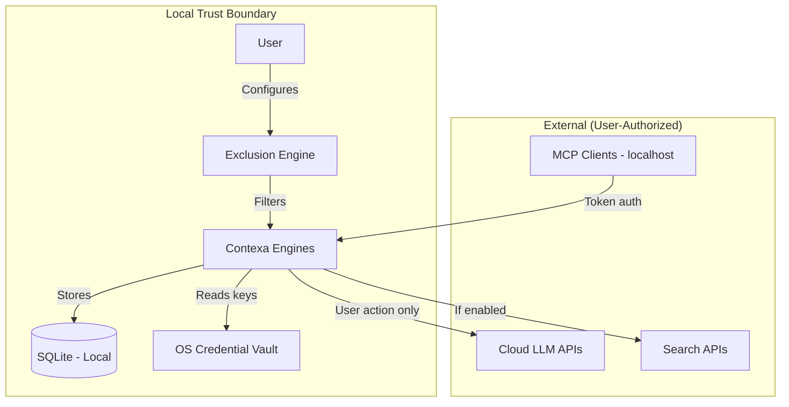
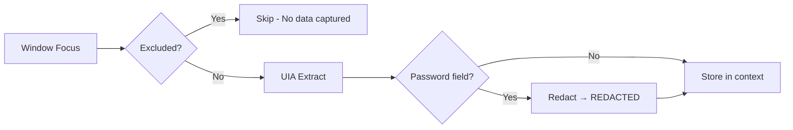
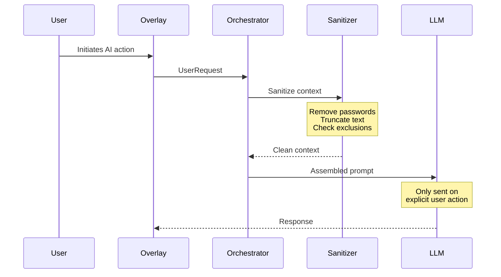
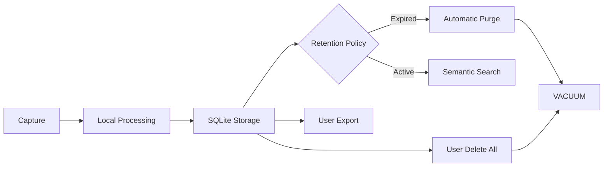

# Security & Privacy

**Project:** Contexa — AI Context Platform  
**Version:** 1.3  
**Status:** Reviewed  
**Last Updated:** 2026-07-07

---

## 1. Overview

Security and privacy are foundational design principles for Contexa. As a platform that continuously monitors desktop activity, Contexa must earn and maintain user trust through transparent data handling, local-first architecture, and robust access controls.

**Core principle:** Privacy by Design. Local First. User Control.

---

## 2. Goals

1. Store all user data locally by default; no cloud dependency
2. Give users complete control over what is captured, stored, and shared
3. Protect sensitive data (passwords, financial info) from capture and transmission
4. Secure all external interfaces (MCP, LLM APIs) with authentication
5. Comply with GDPR, CCPA, and applicable data protection regulations

---

## 3. Responsibilities

| Area | Owner |
|------|-------|
| Data classification | Security Lead |
| Capture exclusions | Vision Engine + Context Engine |
| Credential storage | Desktop Shell (OS keychain) |
| MCP authorization | MCP Runtime |
| LLM data handling | AI Orchestrator |
| Audit logging | Database Layer |
| Privacy policy | Product + Legal |

---

## 4. Architecture



---

## 5. Data Classification

| Classification | Examples | Storage | Retention | Encryption |
|----------------|----------|---------|-----------|------------|
| **Public** | App version, settings schema | SQLite | Permanent | None |
| **Internal** | Context snapshots, timeline | SQLite | 30-90 days | SQLCipher (Pro v1.1) |
| **Sensitive** | Visible text, selected text | SQLite + memory | Per policy | SQLCipher (Pro v1.1) |
| **Credential** | API keys, MCP tokens | OS keychain | Until deleted | OS-level |
| **Restricted** | Password field content | Never stored | Never | N/A |

---

## 6. Privacy Controls

### 6.1 User Controls

| Control | Location | Default |
|---------|----------|---------|
| Enable/disable capture | Settings → Capture | Enabled |
| Excluded applications | Settings → Capture | Password managers, banking |
| Excluded URLs | Settings → Capture | banking, healthcare domains |
| Excluded window titles | Settings → Capture | Empty |
| Pause/resume capture | System tray | Active |
| Memory retention period | Settings → Memory | 90 days |
| Enable/disable internet search | Settings → Search | Disabled |
| Cloud LLM provider | Settings → AI | Not configured |
| Delete all data | Settings → Privacy | N/A |
| Export data | Settings → Privacy | N/A |
| MCP token management | Settings → MCP | No tokens |

### 6.2 Default Exclusion List

```
Applications:
- 1password.exe, bitwarden.exe, lastpass.exe, keepass.exe
- mint.exe, quicken.exe (financial)
- teladoc.exe, mychart.exe (healthcare)

URL patterns:
- *banking*, *login*, *signin*, *password*
- *.gov*, *healthcare*, *medical*
```

---

## 7. Data Flow Security

### 7.1 Capture Pipeline



### 7.2 LLM Data Flow



**Rules:**
1. Context is NEVER sent to any external service without explicit user action
2. Background processing is 100% local
3. Cloud LLM requires user to configure provider and API key
4. UI indicator shows when data leaves the device

---

## 8. Credential Management

### 8.1 Storage

| Secret | Storage | Access |
|--------|---------|--------|
| LLM API keys | Windows Credential Manager | Orchestrator only |
| Search API keys | Windows Credential Manager | Search Engine only |
| MCP tokens | SQLite (bcrypt hash) | MCP Runtime only |
| MCP raw tokens | Shown once to user | Never stored |

### 8.2 Implementation

```rust
pub struct CredentialVault {
    service_name: &'static str, // "contexa"
}

impl CredentialVault {
    pub fn store(&self, key: &str, value: &str) -> Result<()> {
        // Windows: CredWrite via windows-credentials crate
        // Never store in SQLite, files, or environment variables
    }

    pub fn retrieve(&self, key: &str) -> Result<String> {
        // Retrieve at point of use; never cache in memory long-term
    }

    pub fn delete(&self, key: &str) -> Result<()> {
        // Called when user removes provider or deletes all data
    }
}
```

---

## 9. MCP Security

| Control | Implementation |
|---------|----------------|
| Authentication | Bearer token (bcrypt-hashed in DB) |
| Network binding | `127.0.0.1` only |
| Transport encryption | Not required (localhost) |
| Rate limiting | 60 requests/minute per token |
| Audit logging | All tool calls logged with timestamp, token ID, tool name |
| Token revocation | Immediate effect via settings UI |
| Token scope | All tools (no per-tool scoping in v1) |

---

## 10. Data Lifecycle



### 10.1 Data Deletion

**Delete all data** performs:
1. `DELETE FROM` all tables
2. Drop and recreate `embeddings` virtual table
3. Delete all credentials from OS keychain
4. Revoke all MCP tokens
5. Clear in-memory caches
6. `VACUUM` database file
7. Confirm with user via type-to-confirm dialog

---

## 11. Threat Model

### 11.1 STRIDE Analysis

| Threat | Category | Mitigation |
|--------|----------|------------|
| Desktop context stolen by malware | Information Disclosure | Localhost-only MCP; OS file permissions |
| API key extraction from memory | Information Disclosure | OS keychain; no long-term caching |
| Malicious MCP client | Spoofing | Token authentication; audit logging |
| Prompt injection via captured text | Tampering | Input sanitization; truncation |
| Unauthorized cloud data transmission | Information Disclosure | User must configure provider; UI indicator |
| Database file theft | Information Disclosure | OS file permissions; optional SQLCipher |
| Denial of service via MCP flood | Denial of Service | Rate limiting per token |

### 11.2 Attack Surface

| Surface | Exposure | Risk Level |
|---------|----------|------------|
| Tauri IPC | Local process only | Low |
| MCP HTTP server | localhost:9100 | Low (with auth) |
| MCP stdio | Local process pipe | Low |
| LLM API calls | Outbound HTTPS | Medium (user-authorized) |
| Search API calls | Outbound HTTPS | Low (disabled by default) |
| SQLite database | Local file | Low (OS permissions) |
| System tray | Local UI | Low |

---

## 12. Compliance

### 12.1 GDPR

| Requirement | Implementation |
|-------------|----------------|
| Lawful basis | Explicit consent during onboarding |
| Right to access | Export data feature |
| Right to erasure | Delete all data feature |
| Data minimization | Capture only active window; configurable retention |
| Purpose limitation | Data used only for context AI; not sold or shared |
| Storage limitation | Configurable retention (default 90 days) |

### 12.2 CCPA

| Requirement | Implementation |
|-------------|----------------|
| Right to know | Privacy policy; onboarding disclosure |
| Right to delete | Delete all data feature |
| Right to opt-out | Disable capture; no data sale (N/A) |
| Non-discrimination | All features available regardless of privacy choices |

---

## 13. Security Testing

See [13_Test_Plan.md](./13_Test_Plan.md) Section 10 for security test cases.

Additional pre-GA requirements:
- Internal security audit
- Dependency vulnerability scan (cargo-audit, npm audit)
- Penetration test of MCP server (optional, recommended)

---

## 14. Incident Response

| Step | Action | Owner |
|------|--------|-------|
| 1 | Detect via audit log, user report, or automated scan | On-call engineer |
| 2 | Assess severity and scope | Security Lead |
| 3 | Contain (revoke tokens, disable feature) | Engineering |
| 4 | Notify affected users within 72 hours | Product + Legal |
| 5 | Fix and deploy patch | Engineering |
| 6 | Post-incident review and ADR | All leads |

---

## 15. SQLCipher (v1.1 — Pro Tier)

Full specification: [04_Database_Design.md](./04_Database_Design.md) §16, [ADR/0009](../ADR/0009-sqlcipher-encryption.md).

| Control | Implementation |
|---------|----------------|
| Enable encryption | Settings → Privacy → Encrypt Database (Pro) |
| Key storage | Windows Credential Vault (`contexa-db-key`) |
| Lock on sleep | Optional passphrase re-entry |
| Disable encryption | Decrypt migration; user confirmation required |
| Lost passphrase | Data unrecoverable — disclosed at setup |

---

## 16. Future Expansion

- **Per-tool MCP token scoping**
- **Differential privacy** for analytics (opt-in)
- **Hardware security module** integration for enterprise
- **SOC 2 Type II** certification for enterprise tier
- **Bug bounty program** post-GA

---

## 17. Best Practices

- Never log context content in production
- Run `cargo-audit` and `npm audit` in CI
- Review all new external network calls in code review
- Default to most restrictive privacy setting
- Document all data flows in ADRs

---

## 18. References

- [01_Software_Requirements_Specification.md](./01_Software_Requirements_Specification.md)
- [15_Risk_Analysis.md](./15_Risk_Analysis.md)
- [OWASP Desktop App Security](https://owasp.org/www-project-desktop-app-security-top-10/)
- [GDPR Official Text](https://gdpr.eu/)
- [NIST Privacy Framework](https://www.nist.gov/privacy-framework)
