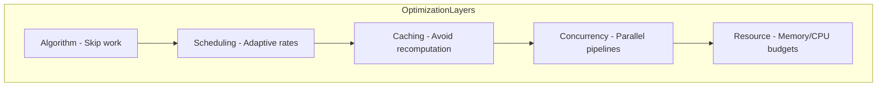
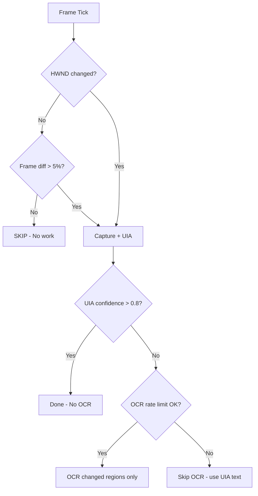
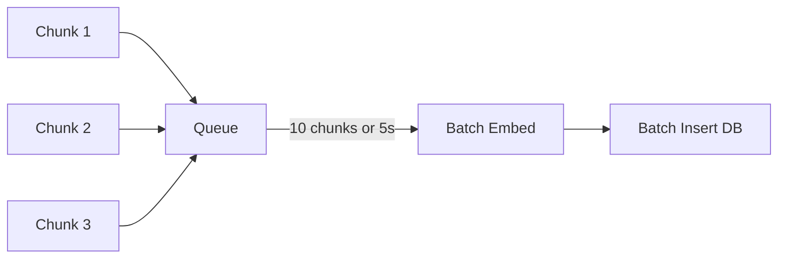
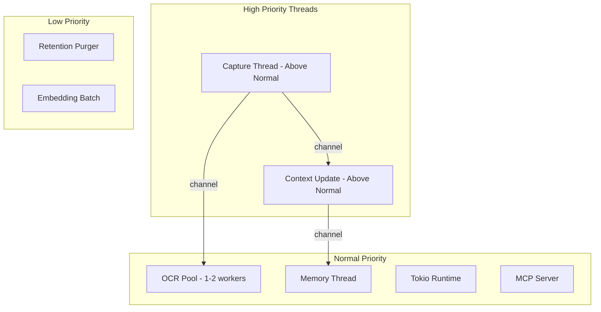

# Performance Optimization

**Project:** Contexa — AI Context Platform  
**Version:** 1.1  
**Status:** Reviewed  
**Last Updated:** 2026-07-06

---

## 1. Overview

Contexa runs continuously in the background while users work. Performance optimization is critical to user retention — an agent that consumes noticeable CPU or memory will be uninstalled. This document defines performance targets, optimization strategies, and profiling methodologies for each engine.

---

## 2. Goals

| Metric | Target |
|--------|--------|
| Background CPU (idle) | < 1% |
| Background CPU (active) | < 5% |
| Background memory (steady state) | < 300 MB |
| Overlay open latency | < 200 ms |
| Context update on app switch | < 500 ms |
| UIA text extraction | < 100 ms |
| OCR (single region) | < 500 ms |
| Semantic search (10K vectors) | < 200 ms |
| Prompt build | < 50 ms |
| Time to first AI token | < 1 s (after prompt ready) |

---

## 3. Responsibilities

| Engine | Primary Optimization |
|--------|---------------------|
| Vision Engine | Skip unnecessary captures; UIA over OCR |
| Context Engine | In-memory cache; debounced updates |
| Memory Engine | Batched embeddings; debounced writes |
| AI Orchestrator | Parallel lookups; streaming responses |
| Database | WAL mode; indexed queries; mmap |
| Overlay UI | Preloaded WebView; virtual scrolling |

---

## 4. Architecture



---

## 5. Vision Engine Optimization

### 5.1 Capture Avoidance (Highest Impact)



### 5.2 Strategies

| Strategy | Impact | Implementation |
|----------|--------|----------------|
| UI Automation first | Eliminates 90%+ of OCR | UIA tree walk before any OCR |
| Frame differencing | Skip 70%+ of frames | Perceptual hash comparison |
| Region hashing | Skip unchanged regions | 16×16 grid hash cache |
| Adaptive scheduler | Reduce idle CPU 80% | 1fps idle → 10fps interactive |
| Frame dropping | Prevent backlog | Bounded channel (capacity 16) |
| Downscale for hashing | 4× faster hash | Capture at 1/4 resolution for diff |
| OCR rate limit | Cap CPU spikes | Max 2 OCR/second |
| OCR result cache | Avoid repeat OCR | LRU cache by region hash |

### 5.3 Capture Rate Schedule

| State | FPS | CPU Budget | Detection |
|-------|-----|------------|-----------|
| Idle | 1 | < 0.5% | No focus change 30s |
| Active | 5 | < 3% | Focus change or input |
| Interactive | 10 | < 5% | Rapid changes or overlay open |

---

## 6. Context Engine Optimization

| Strategy | Impact | Implementation |
|----------|--------|----------------|
| In-memory cache | < 1ms reads | `Arc<RwLock<ContextSnapshot>>` |
| Change detection | Reduce events 60% | Only emit on meaningful changes |
| Enricher timeout | Prevent slow plugins | 20ms max per enricher |
| Text truncation | Bound memory | 50K char limit on visible_text |
| LRU recent cache | Fast history access | Last 100 snapshots in memory |

---

## 7. Memory Engine Optimization

| Strategy | Impact | Implementation |
|----------|--------|----------------|
| Batched embeddings | 10× fewer API calls | Queue 10 chunks; flush together |
| Debounced timeline writes | 90% fewer DB writes | 5-second debounce window |
| Content deduplication | Reduce storage 30% | SHA-256 hash check before insert |
| Chunking | Optimal embedding size | 512 tokens with 50 overlap |
| Background embedding | Non-blocking | Dedicated memory thread |
| Purge during idle | No user impact | Schedule at 3 AM or idle detection |

### 7.1 Embedding Batch Pipeline



---

## 8. Database Optimization

### 8.1 SQLite Configuration

```sql
PRAGMA journal_mode = WAL;          -- Concurrent reads during writes
PRAGMA synchronous = NORMAL;        -- Balance safety and speed
PRAGMA cache_size = -64000;         -- 64 MB page cache
PRAGMA temp_store = MEMORY;         -- Temp tables in RAM
PRAGMA mmap_size = 268435456;       -- 256 MB memory-mapped I/O
PRAGMA page_size = 4096;            -- Optimal for SSD
```

### 8.2 Query Optimization

| Query | Optimization |
|-------|-------------|
| Semantic search | sqlite-vec indexed cosine distance |
| Timeline range | Index on `timestamp` column |
| Recent context | Index on `timestamp` + `LIMIT` |
| Dedup check | Unique index on `content_hash` |
| Retention purge | Batch delete + periodic VACUUM |

### 8.3 Write Serialization

All writes go through a single channel to prevent SQLite lock contention:

```rust
pub struct WriteQueue {
    sender: Sender<WriteOp>,
}

// Dedicated write thread processes queue sequentially
// Readers use separate connections (WAL allows concurrent reads)
```

---

## 9. AI Pipeline Optimization

| Strategy | Impact | Implementation |
|----------|--------|----------------|
| Parallel context + memory | 50% faster gather | `tokio::join!` |
| Streaming responses | Perceived instant | SSE token stream to UI |
| Prompt token budgeting | Avoid API errors | Priority-based truncation |
| Provider fallback | Reduce failure latency | Secondary provider on timeout |
| Request timeout | Prevent hanging | 30s cloud / 60s local |
| Max 3 concurrent | Prevent resource exhaustion | Semaphore limit |

---

## 10. UI Optimization

| Strategy | Impact | Implementation |
|----------|--------|----------------|
| Preload WebView | < 200ms overlay open | Initialize on app startup |
| Virtual scrolling | 60fps timeline | react-window for 1000+ events |
| Debounced input | Reduce unnecessary calls | 300ms debounce on search |
| Lazy settings tabs | Faster settings open | Load tab content on click |
| CSS containment | Reduce layout thrashing | `contain: layout style` |

---

## 11. Threading & Concurrency



**Rules:**
1. Never block capture thread on I/O
2. Never block UI thread on Rust computation
3. OCR runs on separate pool; never on capture thread
4. LLM calls are async; never on any sync thread
5. Database writes serialized; reads concurrent

---

## 12. Profiling & Monitoring

### 12.1 Tracing

```rust
#[tracing::instrument(skip(self), fields(hwnd = %hwnd))]
pub fn extract_uia_text(&self, hwnd: isize) -> Result<UiaResult> {
    let start = Instant::now();
    let result = self.do_extract(hwnd)?;
    tracing::debug!(duration_ms = start.elapsed().as_millis(), "uia_extract");
    Ok(result)
}
```

**Key spans:**
- `vision.capture`, `vision.uia`, `vision.ocr`, `vision.diff`
- `context.assemble`, `context.enrich`, `context.detect_change`
- `memory.embed_batch`, `memory.search`, `memory.purge`
- `orchestrator.decide`, `orchestrator.pipeline`, `orchestrator.llm`
- `prompt.build`, `prompt.truncate`

### 12.2 Benchmarks (Criterion)

```rust
fn bench_uia_extraction(c: &mut Criterion) {
    c.bench_function("uia_extract_notepad", |b| {
        b.iter(|| engine.extract_uia_text(notepad_hwnd))
    });
}

fn bench_semantic_search_10k(c: &mut Criterion) {
    c.bench_function("search_10k_vectors", |b| {
        b.iter(|| search.search("test query", SearchOptions::default()))
    });
}
```

### 12.3 Runtime Metrics

| Metric | Collection | Alert Threshold |
|--------|------------|-----------------|
| CPU usage | Process monitor (5s interval) | > 10% sustained |
| Memory usage | Process monitor | > 500 MB |
| Capture latency | Tracing span | > 200 ms p95 |
| Context update latency | Tracing span | > 500 ms p95 |
| Search latency | Tracing span | > 500 ms p95 |
| Channel backlog | Channel len monitor | > 8 (of 16) |

---

## 13. Memory Budget

| Component | Budget | Notes |
|-----------|--------|-------|
| Frame buffer | 50 MB | 1 active + 1 previous frame |
| Context cache | 10 MB | 100 snapshots × ~100KB |
| Working memory | 20 MB | 200 snapshots |
| OCR cache | 10 MB | LRU region results |
| SQLite page cache | 64 MB | PRAGMA cache_size |
| SQLite mmap | 256 MB | Virtual; physical varies |
| WebView (overlay) | 80 MB | Preloaded |
| Rust runtime | 30 MB | Base overhead |
| **Total target** | **< 300 MB** | Steady state |

---

## 14. Performance Testing

See [13_Test_Plan.md](./13_Test_Plan.md) Section 9 for performance test cases.

### 14.1 Regression Prevention

- Criterion benchmarks run in CI (compile only; run on dedicated hardware weekly)
- Performance test suite runs on Beta releases
- Alert on > 10% regression from baseline

---

---

## 18. Benchmark Baseline Protocol

Performance targets are validated through the spike and benchmark program defined in [22_Technical_Spike_Plan.md](./22_Technical_Spike_Plan.md) and [13_Test_Plan.md](./13_Test_Plan.md).

### 18.1 Baseline Collection

1. Run on reference hardware (i5-12400, 16 GB, Windows 11, 1080p)
2. Warm up for 15 minutes before measurement
3. Record 3 runs; use median for baseline, p95 for SLA
4. Store results in `benchmarks/BASELINE.md` at each milestone

### 18.2 Regression Gates

| Milestone | Gate |
|-----------|------|
| Post-spike (M0.5) | Initial baselines recorded |
| Alpha (M5) | No metric > 15% worse than baseline |
| Beta | No metric > 10% worse than baseline |
| GA | All targets met; baselines published |

### 18.3 Continuous Monitoring (Post-GA)

- Opt-in telemetry: p95 overlay latency, CPU average, search latency
- Alert if p95 latency exceeds 2× baseline for 24 hours
- Monthly performance review with Criterion trend reports

---

## 19. Future Expansion

- **GPU-accelerated** frame differencing (DirectX compute)
- **SIMD** text processing for UIA result merging
- **Custom allocators** (mimalloc) for Rust runtime
- **Incremental embedding** — update vectors on minor text changes only
- **Tiered storage** — hot data in memory, warm in SQLite, cold compressed

---

## 20. Best Practices

- Profile before optimizing; measure impact of each change
- Prefer skipping work over making work faster
- Set CPU affinity for capture thread on multi-core systems
- Use `#[cold]` attribute on error paths and fallback code
- Release builds with LTO: `lto = true, codegen-units = 1`

---

## 21. References

- [05_Vision_Engine.md](./05_Vision_Engine.md)
- [13_Test_Plan.md](./13_Test_Plan.md)
- [criterion.rs](https://github.com/bheisler/criterion.rs)
- [tracing crate](https://github.com/tokio-rs/tracing)
- [SQLite Optimization](https://www.sqlite.org/optoverview.html)
