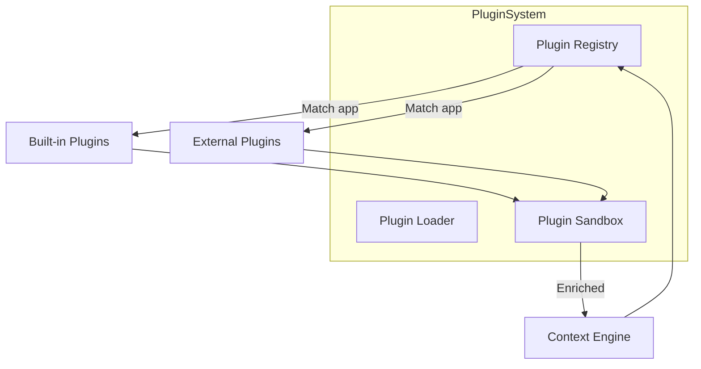
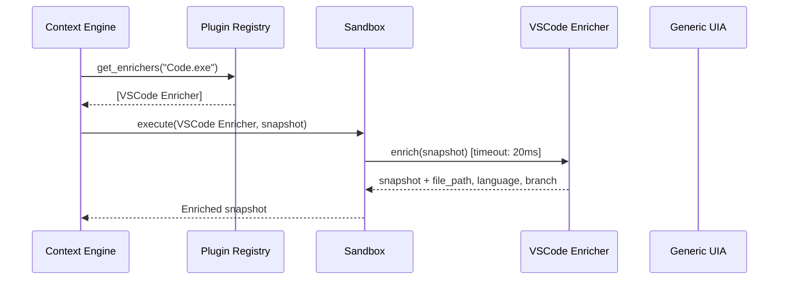

# Plugin System

**Project:** Contexa — AI Context Platform  
**Version:** 1.3  
**Status:** Reviewed  
**Last Updated:** 2026-07-07

---

## 1. Overview

The Contexa Plugin System enables third-party and built-in extensions to enrich desktop context with application-specific metadata. Plugins follow a trait-based architecture where **Context Enrichers** extract specialized data from known applications.

---

## 2. Goals

1. Support application-specific context extraction beyond generic UIA
2. Enable community-contributed enrichers without modifying core code
3. Maintain plugin isolation — failures must not crash the context pipeline
4. Provide clear APIs and documentation for plugin developers
5. Keep plugin execution under 20ms to avoid pipeline delays

---

## 3. Responsibilities

| Component | Responsibility |
|-----------|----------------|
| Plugin Registry | Discover, register, and match plugins to applications |
| ContextEnricher trait | Standard interface for all plugins |
| Built-in Plugins | First-party enrichers for top applications |
| Plugin Loader | Load external plugins from designated directory |
| Plugin Sandbox | Isolate plugin failures; enforce timeouts |

---

## 4. Architecture



---

## 5. Plugin Types

### 5.1 Context Enrichers (v1)

Extract application-specific metadata from the active window.

```rust
pub trait ContextEnricher: Send + Sync {
    /// Returns true if this enricher handles the given process
    fn matches(&self, process_name: &str) -> bool;

    /// Enrich the context snapshot with app-specific data
    fn enrich(&self, snapshot: &mut ContextSnapshot) -> Result<()>;

    /// Execution priority (higher = runs first)
    fn priority(&self) -> u32 { 0 }

    /// Plugin metadata
    fn info(&self) -> PluginInfo;
}

pub struct PluginInfo {
    pub id: String,
    pub name: String,
    pub version: String,
    pub author: String,
    pub description: String,
}
```

### 5.2 Future Plugin Types (v2+)

| Type | Purpose |
|------|---------|
| SearchAdapter | Custom search providers |
| LlmProvider | Custom LLM backends |
| CaptureSource | Alternative capture methods |
| ActionHandler | Custom overlay quick actions |
| MemoryEnricher | Post-process memory chunks |

---

## 6. Built-in Plugins

| Plugin ID | Process | Extracts | Priority |
|-----------|---------|----------|----------|
| `enricher.chrome` | `chrome.exe` | URL, page title, selected text | 100 |
| `enricher.edge` | `msedge.exe` | URL, page title, selected text | 100 |
| `enricher.firefox` | `firefox.exe` | URL, page title | 100 |
| `enricher.vscode` | `Code.exe` | File path, language, git branch, selection | 100 |
| `enricher.word` | `WINWORD.EXE` | Document path, selected text | 90 |
| `enricher.excel` | `EXCEL.EXE` | Workbook path, active sheet, selected cells | 90 |
| `enricher.explorer` | `explorer.exe` | Current directory, selected files | 80 |
| `enricher.terminal` | `WindowsTerminal.exe`, `pwsh.exe` | CWD, last command | 80 |
| `enricher.outlook` | `OUTLOOK.EXE` | Email subject, sender (not body) | 70 |
| `enricher.teams` | `ms-teams.exe` | Meeting title, participants | 70 |

---

## 7. Plugin Registry

```rust
pub struct PluginRegistry {
    enrichers: Vec<Box<dyn ContextEnricher>>,
}

impl PluginRegistry {
    pub fn register(&mut self, enricher: Box<dyn ContextEnricher>) {
        self.enrichers.push(enricher);
        self.enrichers.sort_by(|a, b| b.priority().cmp(&a.priority()));
    }

    pub fn get_enrichers(&self, process_name: &str) -> Vec<&dyn ContextEnricher> {
        self.enrichers
            .iter()
            .filter(|e| e.matches(process_name))
            .map(|e| e.as_ref())
            .collect()
    }

    pub fn list_all(&self) -> Vec<PluginInfo> {
        self.enrichers.iter().map(|e| e.info()).collect()
    }
}
```

---

## 8. Plugin Execution Flow



### 8.1 Sandbox Rules

| Rule | Implementation |
|------|----------------|
| Timeout | 20ms per enricher; kill on timeout |
| Error isolation | Enricher failure logged; pipeline continues |
| No network | Enrichers cannot make HTTP requests |
| No filesystem (except metadata) | Read-only access to process info |
| No nested calls | Enrichers cannot call other engines |

```rust
pub struct PluginSandbox {
    timeout: Duration, // 20ms
}

impl PluginSandbox {
    pub fn execute(
        &self,
        enricher: &dyn ContextEnricher,
        snapshot: &mut ContextSnapshot,
    ) -> Result<()> {
        let result = std::thread::scope(|s| {
            let handle = s.spawn(|| enricher.enrich(snapshot));
            match handle.join() {
                Ok(Ok(())) => Ok(()),
                Ok(Err(e)) => {
                    tracing::warn!(plugin = enricher.info().id, error = %e, "Plugin failed");
                    Ok(()) // Continue pipeline
                }
                Err(_) => {
                    tracing::warn!(plugin = enricher.info().id, "Plugin timed out");
                    Ok(())
                }
            }
        });
        result
    }
}
```

---

## 9. External Plugin Loading

### 9.1 Plugin Directory

```
%APPDATA%\Contexa\plugins\
├── my-plugin/
│   ├── plugin.toml
│   └── plugin.dll (or .so)
```

### 9.2 Plugin Manifest

```toml
[plugin]
id = "my-custom-enricher"
name = "My Custom Enricher"
version = "1.0.0"
author = "Developer Name"
description = "Extracts context from MyApp"
type = "context_enricher"

[plugin.match]
process_names = ["myapp.exe"]

[plugin.api]
min_contexa_version = "1.0.0"
```

### 9.3 Loading (Phase 2)

External plugins loaded via dynamic library interface:

```rust
// Phase 2: DLL-based plugins
pub trait PluginExports {
    fn create_enricher() -> Box<dyn ContextEnricher>;
}
```

**Phase 1:** Built-in plugins only (compiled into binary). External loading in Phase 2.

---

## 10. Plugin Development Guide

### 10.1 Creating a Built-in Plugin

```rust
pub struct MyAppEnricher;

impl ContextEnricher for MyAppEnricher {
    fn matches(&self, process_name: &str) -> bool {
        process_name.eq_ignore_ascii_case("myapp.exe")
    }

    fn enrich(&self, snapshot: &mut ContextSnapshot) -> Result<()> {
        let hwnd = snapshot.window.hwnd;
        
        // Extract app-specific data via UIA
        let custom_data = extract_myapp_context(hwnd)?;
        
        snapshot.metadata.insert("custom_field".into(), custom_data);
        Ok(())
    }

    fn info(&self) -> PluginInfo {
        PluginInfo {
            id: "enricher.myapp".into(),
            name: "MyApp Enricher".into(),
            version: "1.0.0".into(),
            author: "Contexa Team".into(),
            description: "Extracts context from MyApp".into(),
        }
    }
}
```

### 10.2 Registration

```rust
// In contexa-desktop/src/main.rs
let mut registry = PluginRegistry::new();
registry.register(Box::new(ChromeEnricher));
registry.register(Box::new(VSCodeEnricher));
registry.register(Box::new(MyAppEnricher));
// ...
```

---

## 11. Interfaces

```rust
pub trait PluginLoader: Send + Sync {
    fn load_builtin(&self) -> PluginRegistry;
    fn load_external(&self, dir: &Path) -> Result<Vec<Box<dyn ContextEnricher>>>;
    fn reload(&self) -> Result<()>;
}
```

---

## 12. Threading

- Plugins execute on the Context Update Thread
- Each plugin runs synchronously with timeout
- Multiple matching plugins run sequentially (priority order)
- Plugin loading happens at startup on main thread

---

## 13. Performance

| Metric | Target |
|--------|--------|
| Single enricher execution | < 20 ms |
| All enrichers for one snapshot | < 50 ms |
| Plugin registry lookup | < 1 ms |
| Plugin load at startup | < 100 ms |

---

## 14. Security

- External plugins (Phase 2) require user approval to install
- Plugins cannot access network or write to filesystem
- Plugin DLL signatures verified before loading (Phase 2)
- Malicious plugin cannot crash the context pipeline (sandbox)
- Plugin list visible in Settings → Plugins

---

## 15. Future Expansion

- **WASM plugins** — sandboxed, cross-platform, no DLL loading
- **Plugin marketplace** — curated directory of community plugins
- **Plugin SDK** — published crate for plugin developers
- **Hot reload** — reload plugins without restarting Contexa
- **Plugin telemetry** — opt-in performance metrics per plugin

---

## 16. Best Practices

- Keep enrichers focused on one application
- Use UIA for extraction; avoid screenshot-based approaches
- Handle UIA failures gracefully (return Ok, don't panic)
- Add tests with mock HWND data
- Document which UIA elements your enricher depends on

---

## 17. References

- [06_Context_Engine.md](./06_Context_Engine.md)
- [03_API_Interface_Specification.md](./03_API_Interface_Specification.md)
- [19_Coding_Standards.md](./19_Coding_Standards.md)
