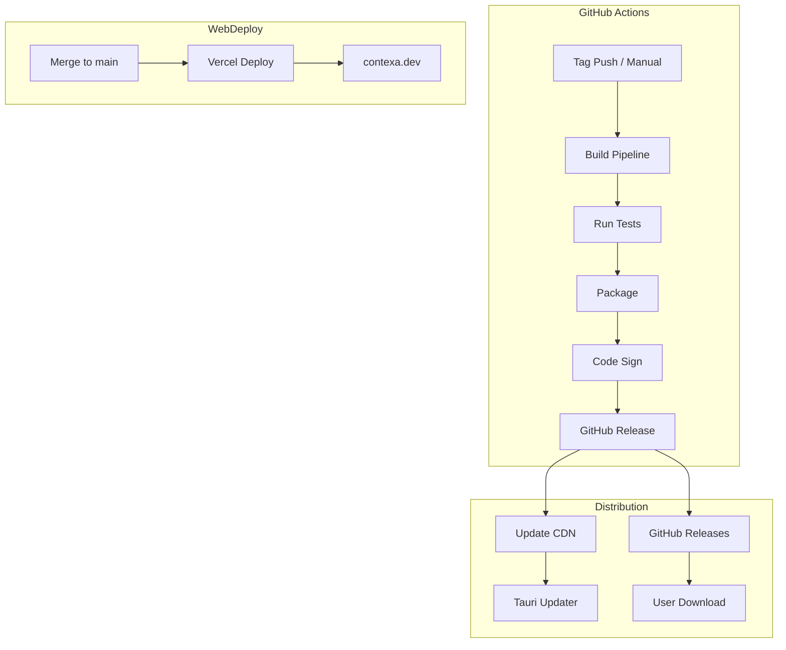
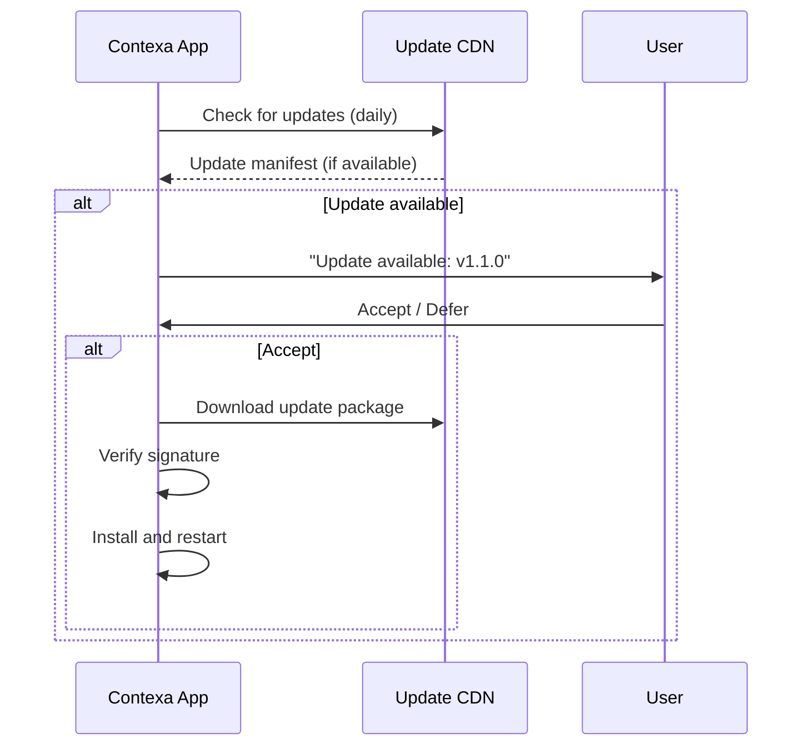

# Deployment

**Project:** Contexa — AI Context Platform  
**Version:** 1.3  
**Status:** Reviewed  
**Last Updated:** 2026-07-07

---

## 1. Overview

This document defines the build, packaging, distribution, and update strategy for Contexa desktop application and marketing website.

---

## 2. Goals

1. Deliver signed Windows installers via automated CI/CD
2. Support silent auto-updates with user consent
3. Deploy marketing website independently from desktop releases
4. Maintain separate release channels (stable, beta)
5. Enable rollback for critical issues

---

## 3. Responsibilities

| Component | Build | Deploy | Update |
|-----------|-------|--------|--------|
| Desktop App (Tauri) | GitHub Actions | GitHub Releases + CDN | Tauri Updater |
| Marketing Website (Next.js) | GitHub Actions | Vercel | Automatic on merge |
| Documentation | Markdown in repo | Bundled with app + web | Git-based |

---

## 4. Architecture



---

## 5. Desktop Application Build

### 5.1 Build Environment

| Requirement | Version |
|-------------|---------|
| OS | Windows Server 2022 (CI) |
| Rust | Stable (pinned in rust-toolchain.toml) |
| Node.js | 20 LTS |
| pnpm | 9.x |
| Tauri CLI | 2.x |
| WebView2 | Evergreen (bundled in installer) |

### 5.2 Build Commands

```bash
# Install dependencies
pnpm install
cargo fetch

# Build desktop app (release)
cd apps/desktop
pnpm tauri build

# Output
# apps/desktop/src-tauri/target/release/contexa.exe
# apps/desktop/src-tauri/target/release/bundle/msi/Contexa_1.0.0_x64_en-US.msi
# apps/desktop/src-tauri/target/release/bundle/nsis/Contexa_1.0.0_x64-setup.exe
```

### 5.3 Build Configuration

```json
// apps/desktop/src-tauri/tauri.conf.json
{
  "productName": "Contexa",
  "version": "1.0.0",
  "identifier": "dev.contexa.app",
  "build": {
    "frontendDist": "../dist",
    "devUrl": "http://localhost:1420"
  },
  "bundle": {
    "active": true,
    "targets": ["msi", "nsis"],
    "icon": ["icons/32x32.png", "icons/128x128.png", "icons/icon.ico"],
    "windows": {
      "webviewInstallMode": { "type": "embedBootstrapper" },
      "wix": { "language": "en-US" }
    }
  },
  "plugins": {
    "updater": {
      "active": true,
      "endpoints": [
        "https://releases.contexa.dev/{{target}}/{{arch}}/{{current_version}}"
      ],
      "pubkey": "<TAURI_UPDATER_PUBKEY>"
    }
  }
}
```

---

## 6. Code Signing

### 6.1 Requirements

| Item | Detail |
|------|--------|
| Certificate | EV Code Signing Certificate (Windows) |
| Provider | DigiCert, Sectigo, or equivalent |
| Timestamp | RFC 3161 timestamp server |
| Files signed | `.exe`, `.msi`, `.nsis` installer |

### 6.2 CI Signing

```yaml
# .github/workflows/release.yml
- name: Sign executable
  uses: sslcom/esigner-codesign@develop
  with:
    codeSigningCertificateName: ${{ secrets.CERT_NAME }}
    codeSigningCertificatePassword: ${{ secrets.CERT_PASSWORD }}
    filePath: apps/desktop/src-tauri/target/release/contexa.exe
```

### 6.3 SmartScreen

- EV certificate builds reputation over time
- Initial releases may trigger SmartScreen warning
- Provide clear installation instructions on website

---

## 7. Release Channels

| Channel | Audience | Update Frequency | Stability |
|---------|----------|------------------|-----------|
| **Stable** | General users | Bi-weekly / monthly | Fully tested |
| **Beta** | Early adopters | Weekly | Feature-complete, may have bugs |
| **Nightly** | Developers | Daily (auto) | Unstable; for testing only |

### 7.1 Channel Configuration

```json
// Stable updater endpoint
"https://releases.contexa.dev/stable/{{target}}/{{arch}}/{{current_version}}"

// Beta updater endpoint
"https://releases.contexa.dev/beta/{{target}}/{{arch}}/{{current_version}}"
```

Users select channel in Settings → About → Update Channel.

---

## 8. Auto-Update

### 8.1 Update Flow



### 8.2 Update Policy

- Check for updates once daily (configurable)
- Download in background; install on next restart
- User can defer updates for up to 7 days
- Critical security updates: prompt on next overlay open
- Rollback: keep previous version for 1 release

---

## 9. CI/CD Pipeline

### 9.1 Pull Request Pipeline

```yaml
name: PR Check
on: [pull_request]

jobs:
  rust:
    runs-on: windows-latest
    steps:
      - uses: actions/checkout@v4
      - uses: dtolnay/rust-toolchain@stable
      - run: cargo fmt --check
      - run: cargo clippy -- -D warnings
      - run: cargo test --workspace
      - run: cargo build --release

  frontend:
    runs-on: windows-latest
    steps:
      - uses: actions/checkout@v4
      - uses: pnpm/action-setup@v4
      - run: pnpm install
      - run: pnpm lint
      - run: pnpm typecheck
      - run: pnpm test
```

### 9.2 Release Pipeline

```yaml
name: Release
on:
  push:
    tags: ['v*']

jobs:
  build-and-release:
    runs-on: windows-latest
    steps:
      - uses: actions/checkout@v4
      - uses: dtolnay/rust-toolchain@stable
      - uses: pnpm/action-setup@v4
      - run: pnpm install
      - run: pnpm tauri build
      - name: Sign
        # ... signing steps
      - uses: softprops/action-gh-release@v2
        with:
          files: |
            apps/desktop/src-tauri/target/release/bundle/msi/*.msi
            apps/desktop/src-tauri/target/release/bundle/nsis/*.exe
      - name: Upload to CDN
        # ... upload to releases.contexa.dev
```

---

## 10. Website Deployment

### 10.1 Stack

| Component | Technology |
|-----------|------------|
| Framework | Next.js 14 (App Router) |
| Hosting | Vercel |
| Domain | contexa.dev |
| CDN | Vercel Edge Network |
| Analytics | Plausible (privacy-friendly) |

### 10.2 Deployment Flow

```
Merge to main → Vercel auto-deploy → contexa.dev (production)
PR opened → Vercel preview deploy → pr-123.contexa.dev
```

### 10.3 Website Pages

| Path | Purpose |
|------|---------|
| `/` | Landing page |
| `/features` | Feature overview |
| `/docs` | Documentation (links to GitHub) |
| `/download` | Download links (latest release) |
| `/privacy` | Privacy policy |
| `/terms` | Terms of service |
| `/changelog` | Release notes |

---

## 11. Installation

### 11.1 System Requirements

| Requirement | Minimum | Recommended |
|-------------|---------|-------------|
| OS | Windows 10 22H2 (build 19045) | Windows 11 23H2 |
| CPU | Dual-core 2.0 GHz | Quad-core 2.5 GHz |
| RAM | 8 GB | 16 GB |
| Disk | 500 MB | 2 GB (with 90-day memory) |
| Display | 1280×720 | 1920×1080 |
| WebView2 | Required (bundled) | Evergreen |

### 11.2 Installation Steps

1. Download installer from contexa.dev/download
2. Run MSI or NSIS installer
3. Follow onboarding wizard
4. Configure AI provider
5. Press `Alt + Space` to begin

### 11.3 Silent Install (Enterprise)

```powershell
# MSI silent install
msiexec /i Contexa_1.0.0_x64_en-US.msi /quiet /norestart

# NSIS silent install
Contexa_1.0.0_x64-setup.exe /S
```

---

## 12. Data Directory

| Path | Contents |
|------|----------|
| `%APPDATA%\Contexa\` | Application data root |
| `%APPDATA%\Contexa\contexa.db` | SQLite database |
| `%APPDATA%\Contexa\logs\` | Application logs |
| `%APPDATA%\Contexa\plugins\` | External plugins (Phase 2) |
| `%APPDATA%\Contexa\cache\` | Temporary cache files |

**Uninstall:** MSI/NSIS uninstaller offers to remove user data. "Delete all data" in Settings as alternative.

---

## 13. Monitoring & Observability

### 13.1 Application Logging

```rust
// tracing-subscriber configuration
tracing_subscriber::fmt()
    .with_env_filter("contexa=debug,warn")
    .with_writer(non_blocking_file_appender)
    .init();
```

| Log Level | Destination | Retention |
|-----------|-------------|-----------|
| Error | File + (opt-in) telemetry | 30 days |
| Warn | File | 14 days |
| Info | File | 7 days |
| Debug | File (dev only) | Session |

### 13.2 Crash Reporting (Opt-in)

- Sentry or equivalent for crash reports
- User must opt in during onboarding or settings
- No context content in crash reports
- Stack traces and system info only

### 13.3 Update Analytics

- Anonymous update check counts (no user identification)
- Version distribution metrics
- Download counts from GitHub Releases API

---

## 14. Rollback Strategy

| Scenario | Action |
|----------|--------|
| Critical bug in new release | Publish previous version to CDN; mark as latest |
| Security vulnerability | Emergency release; force-update prompt |
| User wants older version | Manual download from GitHub Releases |
| Database migration failure | Restore from `contexa.db.bak` (auto-created pre-migration) |

---

## 15. Security

- All release artifacts signed with EV certificate
- Update packages verified via Tauri updater signature (minisign)
- HTTPS only for all update endpoints
- No auto-execution of downloaded scripts
- Dependency vulnerability scanning in CI (cargo-audit, npm audit)

---

## 16. Future Expansion

- **macOS deployment** — DMG + App Store (Phase 2)
- **Linux deployment** — AppImage, Flatpak, .deb (Phase 3)
- **Enterprise MSI transforms** — pre-configured deployments
- **Group Policy support** — managed settings for enterprise
- **Docker** — headless Contexa for CI/CD context
- **Package manager** — `winget`, `chocolatey`, `scoop` distribution

---

## 17. Best Practices

- Never release on Fridays
- Always test installer on clean Windows VM before release
- Maintain changelog for every release
- Keep previous release artifacts available for rollback
- Monitor error rates for 48 hours post-release

---

## 18. References

- [14_Development_Roadmap.md](./14_Development_Roadmap.md)
- [13_Test_Plan.md](./13_Test_Plan.md)
- [Tauri Distribute](https://tauri.app/distribute/)
- [Tauri Updater](https://tauri.app/plugin/updater/)
- [16_Security_Privacy.md](./16_Security_Privacy.md)
