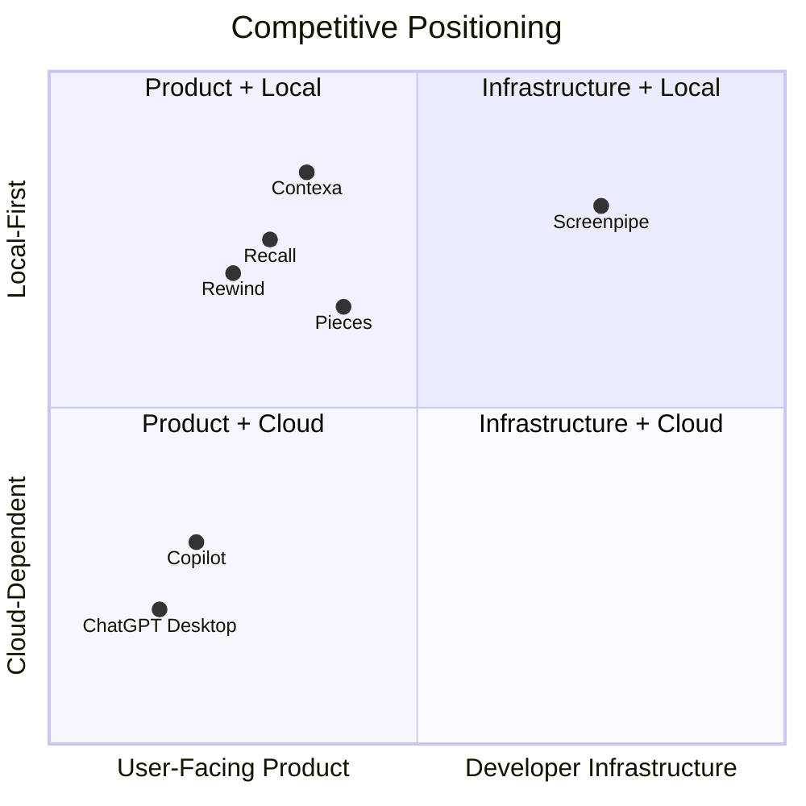

# Competitive Analysis

**Project:** Contexa — AI Context Platform  
**Version:** 1.1  
**Status:** Reviewed  
**Last Updated:** 2026-07-06

---

## 1. Overview

This document analyzes the competitive landscape for desktop AI context platforms. It defines Contexa's positioning, differentiation, and strategic moat relative to direct and adjacent competitors.

---

## 2. Market Category

Contexa operates in the intersection of three categories:

| Category | Description | Examples |
|----------|-------------|----------|
| **Desktop Context Capture** | Continuous activity recording and recall | Rewind, Microsoft Recall, Screenpipe |
| **AI Copilots** | AI assistants with limited context | Copilot, ChatGPT Desktop, Raycast AI |
| **AI Infrastructure / MCP** | Context and tool protocols for AI | MCP ecosystem, LangChain memory |

**Contexa's category:** AI Context Infrastructure — neither a copilot nor a recorder, but the **context layer** beneath any AI.

---

## 3. Competitive Matrix

| Product | Type | Local-First | MCP | Timeline | Semantic Search | AI Agnostic | Overlay | Open Source |
|---------|------|-------------|-----|----------|-----------------|-------------|---------|-------------|
| **Contexa** | Context Platform | ✅ | ✅ Native | ✅ | ✅ sqlite-vec | ✅ | ✅ Alt+Space | Planned (core) |
| Microsoft Recall | OS Feature | ✅ | ❌ | ✅ | ❌ | ❌ (Copilot only) | ❌ | ❌ |
| Rewind | Recorder + Search | ✅ | ❌ | ✅ | ✅ | ❌ | ❌ | ❌ |
| Screenpipe | Screen Capture API | ✅ | Partial | ✅ | ✅ | ✅ | ❌ | ✅ |
| ChatGPT Desktop | AI Copilot | ❌ | ❌ | ❌ | ❌ | ❌ | ❌ | ❌ |
| Microsoft Copilot | AI Copilot | Partial | ❌ | ❌ | ❌ | ❌ | ✅ Win+C | ❌ |
| Raycast AI | Launcher + AI | ❌ | ❌ | ❌ | ❌ | Partial | ✅ | ❌ |
| Pieces for Developers | Dev Context | ✅ | ❌ | ✅ | ✅ | Partial | ❌ | ❌ |
| Mem.ai | Cloud Memory | ❌ | ❌ | ✅ | ✅ | ❌ | ❌ | ❌ |

---

## 4. Competitor Deep Dives

### 4.1 Microsoft Recall

| Attribute | Detail |
|-----------|--------|
| **What it does** | Screenshots everything; semantic search over screen history; Copilot integration |
| **Strengths** | OS-level integration; massive distribution; NPU acceleration on Copilot+ PCs |
| **Weaknesses** | Privacy backlash (paused launch); Copilot-only AI; no MCP; Windows 11 only |
| **Contexa advantage** | AI-agnostic; MCP-native; user-controlled exclusions; no screenshot storage |
| **Threat level** | **High** — if Recall ships with broad AI API access |

### 4.2 Rewind

| Attribute | Detail |
|-----------|--------|
| **What it does** | Records screen + audio; compresses; searchable recall |
| **Strengths** | Polished UX; strong brand; meeting transcription |
| **Weaknesses** | macOS-first; closed ecosystem; high storage; no MCP; proprietary AI |
| **Contexa advantage** | Structured context (not raw video); MCP; Windows-native; lower storage |
| **Threat level** | **Medium** — different platform; may expand to Windows |

### 4.3 Screenpipe

| Attribute | Detail |
|-----------|--------|
| **What it does** | Open-source 24/7 screen/audio capture; developer API |
| **Strengths** | Open source; active community; MCP integration emerging; cross-platform |
| **Weaknesses** | Developer-focused; no end-user overlay; high resource usage; OCR-heavy |
| **Contexa advantage** | End-user product; UIA-first (lower CPU); overlay UX; plugin enrichers |
| **Threat level** | **Medium** — potential partner or competitor; watch MCP overlap |

### 4.4 ChatGPT Desktop / Copilot

| Attribute | Detail |
|-----------|--------|
| **What it does** | AI chat with basic screen awareness (Copilot Vision) |
| **Strengths** | Massive user base; best-in-class LLM; brand trust |
| **Weaknesses** | No persistent memory; no timeline; cloud-only; vendor lock-in |
| **Contexa advantage** | Persistent memory; timeline; local-first; works WITH any AI via MCP |
| **Threat level** | **Low-Medium** — complementary, not direct replacement |

### 4.5 Pieces for Developers

| Attribute | Detail |
|-----------|--------|
| **What it does** | Developer-focused context: clipboard, snippets, workflow memory |
| **Strengths** | Strong IDE integration; developer audience; local ML |
| **Weaknesses** | Developer-only; no general desktop context; no MCP |
| **Contexa advantage** | All applications; MCP ecosystem; broader use cases |
| **Threat level** | **Low** — niche overlap in dev workflows |

---

## 5. Positioning Map

---

## 6. Contexa Differentiation (Moat)

### 6.1 Primary Differentiators

| # | Differentiator | Why It Matters |
|---|----------------|----------------|
| 1 | **MCP-native context API** | Any AI client can consume context without custom integration |
| 2 | **UIA-first capture** | 10× lower CPU than screenshot+OCR approaches |
| 3 | **AI-agnostic** | User chooses LLM; Contexa is infrastructure, not assistant |
| 4 | **Structured context** | App metadata, URLs, file paths — not just flat text |
| 5 | **Privacy by design** | Local-first, exclusions, no screenshot storage, delete-all |

### 6.2 Positioning Statement

> For knowledge workers and developers who use multiple AI tools, **Contexa** is the **AI Context Platform** that provides real-time desktop context and persistent memory. Unlike AI copilots that trap context in a single product, Contexa is the **open context layer** that makes every AI smarter through MCP.

### 6.3 What We Do NOT Compete On

- Best LLM quality (user's choice of provider)
- Chat UX polish (we're infrastructure + lightweight overlay)
- Meeting transcription (not our focus)
- Screenshot/video recording (we capture structured context)

---

## 7. SWOT Analysis

| | |
|---|---|
| **Strengths** | MCP-first; UIA performance; modular Rust architecture; privacy design; AI-agnostic |
| **Weaknesses** | Pre-product; Windows-only v1; small team; no brand recognition |
| **Opportunities** | MCP ecosystem growth; Recall privacy backlash; developer tool convergence; enterprise context needs |
| **Threats** | Microsoft Recall with MCP; Screenpipe open-source momentum; OS-level context APIs; LLM providers adding native context |

---

## 8. Go-to-Market Implications

| Segment | Message | Channel |
|---------|---------|---------|
| Developers | "Give Cursor/Claude your desktop context via MCP" | GitHub, Hacker News, dev Twitter |
| Knowledge workers | "AI that knows what you're working on" | Product Hunt, productivity blogs |
| AI tool builders | "Context API for your AI product" | MCP community, API docs |
| Privacy-conscious | "Your context stays on your machine" | Privacy forums, Reddit |

---

## 9. Competitive Response Playbook

| If competitor does... | Contexa response |
|-----------------------|------------------|
| Microsoft ships Recall with MCP | Accelerate MCP tool depth; emphasize cross-AI value |
| Screenpipe gains traction | Partner on capture; differentiate on UX and UIA |
| OpenAI adds desktop memory | Position as AI-agnostic layer; "works with ChatGPT AND Claude" |
| New entrant with lower price | Open-source core; freemium model (see [24_Business_Model.md](./24_Business_Model.md)) |

---

## 10. Monitoring

Track quarterly:

- Competitor feature releases (Recall, Screenpipe, Rewind)
- MCP ecosystem growth (new clients, server count)
- Windows OS context API changes
- User sentiment on privacy-focused alternatives

---

## 11. References

- [00_Project_Vision.md](./00_Project_Vision.md)
- [24_Business_Model.md](./24_Business_Model.md)
- [ADR/0004-mcp-first-integration.md](../ADR/0004-mcp-first-integration.md)
