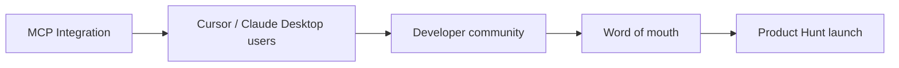

# Business Model & Go-to-Market

**Project:** Contexa — AI Context Platform  
**Version:** 1.1  
**Status:** Reviewed  
**Last Updated:** 2026-07-06

---

## 1. Overview

Contexa is **AI context infrastructure**, not a chatbot. The business model aligns with infrastructure positioning: free core for adoption, paid tiers for power users and teams, and API access for AI tool builders.

---

## 2. Value Proposition

| Stakeholder | Value |
|-------------|-------|
| **End users** | AI that understands what they're working on, across any tool |
| **AI tool builders** | Ready-made desktop context via MCP — no build-your-own capture |
| **Enterprises** | Controlled, local-first context layer for AI workflows |

---

## 3. Revenue Model

### 3.1 Tier Structure

| Tier | Price | Target | Key Features |
|------|-------|--------|--------------|
| **Free** | $0 | Individual users, developers | Full context capture, overlay, 1 LLM provider, MCP server (localhost), 30-day memory |
| **Pro** | $12/mo or $99/yr | Power users | Unlimited memory retention, all LLM providers, priority embed model, cloud sync (E2E encrypted, Phase 2), advanced timeline |
| **Team** | $8/user/mo (min 5) | Small teams | Shared context (opt-in), admin policies, audit logs, SSO (Phase 2) |
| **API** | Usage-based | AI tool builders | Remote MCP access, higher rate limits, SLA, webhook context events (Phase 2) |

### 3.2 Revenue Projections (Conservative)

| Milestone | Users | Paid Conversion | MRR |
|-----------|-------|-----------------|-----|
| Beta (M6) | 500 | 5% | $300 |
| GA (M9) | 5,000 | 8% | $4,800 |
| Year 1 | 25,000 | 10% | $30,000 |
| Year 2 | 100,000 | 12% | $144,000 |

---

## 4. Pricing Rationale

| Decision | Rationale |
|----------|-----------|
| Free tier is fully functional | Drive MCP adoption and word-of-mouth; compete with free OSS (Screenpipe) |
| $12/mo Pro | Below Raycast Pro ($8/mo) + AI value; above utility apps |
| No per-query LLM pricing | User brings own API key; Contexa doesn't resell LLM |
| Team tier deferred to Phase 2 | Focus on individual product-market fit first |

---

## 5. Go-to-Market Strategy

### 5.1 Phase 1: Developer-Led Growth (Months 1–6)

| Channel | Action | KPI |
|---------|--------|-----|
| GitHub | Open-source MCP server crate | 500 stars |
| Hacker News | "Show HN: Context layer for AI via MCP" | Front page |
| Cursor community | MCP setup guide, demo video | 100 MCP connections |
| Dev Twitter/X | Build-in-public updates | 1K followers |

### 5.2 Phase 2: Product-Led Growth (Months 7–12)

| Channel | Action | KPI |
|---------|--------|-----|
| Product Hunt | GA launch | #1 Product of the Day |
| YouTube | "What did I work on today?" demos | 10K views |
| Productivity blogs | Guest posts on AI workflow | 5 articles |
| Reddit | r/productivity, r/selfhosted | Organic mentions |

### 5.3 Phase 3: Enterprise (Year 2+)

| Channel | Action |
|---------|--------|
| Direct sales | Context API for enterprise AI deployments |
| Partnerships | Integrate with AI platforms (Databricks, etc.) |
| Compliance | SOC 2, GDPR certification for Team tier |

---

## 6. Key Metrics

| Metric | Definition | Target (GA) |
|--------|------------|-------------|
| DAU | Daily active users | 2,000 |
| DAU/MAU | Stickiness | > 40% |
| MCP connections | External clients using context API | 500 |
| Overlay queries/day | AI requests per active user | > 5 |
| Memory chunks/user | Engagement depth | > 100 |
| NPS | Net Promoter Score | > 50 |
| Free → Pro conversion | Paid upgrade rate | > 8% |
| Churn (Pro) | Monthly cancellation | < 5% |

---

## 7. Cost Structure

| Category | Monthly (at scale) | Notes |
|----------|-------------------|-------|
| Engineering (3 FTE) | $45,000 | Rust + React team |
| Infrastructure | $500 | Website, update CDN, CI |
| Code signing cert | $50 | EV certificate amortized |
| LLM costs | $0 | User-provided API keys |
| Embedding (local) | $0 | Ollama on user machine |
| **Total** | **~$45,500** | Break-even at ~3,800 Pro users |

---

## 8. Competitive Pricing

| Product | Price | Contexa Position |
|---------|-------|------------------|
| Rewind | $19/mo | Cheaper; AI-agnostic |
| Raycast Pro | $8/mo | Similar; but Contexa has memory + MCP |
| ChatGPT Plus | $20/mo | Complementary; different category |
| Screenpipe | Free (OSS) | Pro tier adds UX + support |
| Microsoft Copilot | $20/mo | Complementary; Contexa works with Copilot |

---

## 9. Open Source Strategy

| Component | License | Rationale |
|-----------|---------|-----------|
| MCP server crate | MIT | Drive ecosystem adoption |
| Core engines | Source-available (BSL) → MIT after 2 years | Prevent AWS-style hosting; eventual openness |
| Overlay UI | Proprietary | Product differentiation |
| Documentation | CC BY 4.0 | Community contribution |

---

## 10. Risks to Business Model

| Risk | Mitigation |
|------|------------|
| Users stay on free tier | Pro features compelling (retention, sync, all providers) |
| Microsoft ships free Recall + MCP | Move faster; deeper MCP integration; cross-AI value |
| Low MCP adoption | Overlay is standalone value; MCP is accelerator not dependency |
| Privacy regulation blocks capture | Local-first design; consent flows; exclusion controls |

---

## 11. References

- [00_Project_Vision.md](./00_Project_Vision.md)
- [21_Competitive_Analysis.md](./21_Competitive_Analysis.md)
- [14_Development_Roadmap.md](./14_Development_Roadmap.md)
