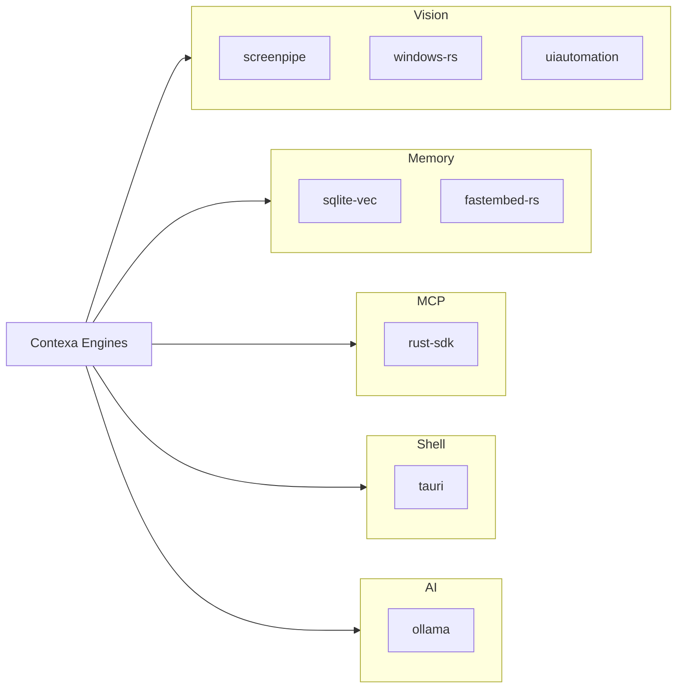

# Reference Repositories

**Project:** Contexa — AI Context Platform  
**Version:** 1.3  
**Status:** Reviewed  
**Last Updated:** 2026-07-08

---

## 1. Overview

This document maps **curated open-source repositories** to Contexa engines and ADRs. Use these as implementation references during spikes and Phase 1+ development — not as dependencies to fork wholesale.

**Local clones:** `reference-repos/` (Tier 1 at root, Tier 2/3 in subfolders). See [reference-repos/README.md](../reference-repos/README.md).

**Rule:** Study patterns; do not copy code without license review.

---

## 2. Tier 1 — Core References (always relevant)

| Repo | Stars | Maps To | What to Study |
|------|-------|---------|---------------|
| [screenpipe/screenpipe](https://github.com/screenpipe/screenpipe) | 10K+ | Vision Engine, Memory | Desktop capture loop, frame diff, OCR fallback, SQLite storage, low-CPU scheduling |
| [modelcontextprotocol/rust-sdk](https://github.com/modelcontextprotocol/rust-sdk) | 500+ | MCP Runtime | `rmcp` server/client, stdio transport, tool schema, Resources (v1.1) |
| [microsoft/windows-rs](https://github.com/microsoft/windows-rs) | 3K+ | Vision Engine | UIA, Graphics Capture, `Windows.Media.Ocr` bindings, COM patterns |
| [tauri-apps/tauri](https://github.com/tauri-apps/tauri) | 80K+ | Shell, UI | Tauri 2 overlay, global shortcuts, system tray, IPC commands |
| [asg017/sqlite-vec](https://github.com/asg017/sqlite-vec) | 4K+ | Memory Engine, DB | `vec0` virtual tables, cosine distance queries, load extension |
| [ollama/ollama](https://github.com/ollama/ollama) | 120K+ | AI Orchestrator | Local LLM API, embedding endpoint for quality mode (ADR-0006) |

---

## 3. Tier 2 — Read when implementing a module

| Local path | Repo | AI learns | Module |
|------------|------|-----------|--------|
| `tier2/uiautomation-rs/` | [leexgone/uiautomation-rs](https://github.com/leexgone/uiautomation-rs) | Walk UIA tree, get text/selection | Vision + Context |
| `tier2/sqlx/` | [launchbadge/sqlx](https://github.com/launchbadge/sqlx) | SQLite async, migrations *(reference only)* | Database layer |
| `tier2/ollama-rs/` | [pepperoni21/ollama-rs](https://github.com/pepperoni21/ollama-rs) | Call Ollama chat/embed from Rust | LLM adapter |
| `tier2/fastembed-rs/` | [Anush008/fastembed-rs](https://github.com/Anush008/fastembed-rs) | Local ONNX embedding (default) | Memory Engine |
| `tier2/plugins-workspace/` | [tauri-apps/plugins-workspace](https://github.com/tauri-apps/plugins-workspace) | Global shortcut, updater | Desktop shell |
| `tier2/shadcn-ui/` | [shadcn-ui/ui](https://github.com/shadcn-ui/ui) | UI components | Overlay UI |
| `tier2/vercel-ai/` | [vercel/ai](https://github.com/vercel/ai) | Streaming chat UI pattern | Overlay UI |
| `tier2/windows-capture/` | [NiiightmareXD/windows-capture](https://github.com/NiiightmareXD/windows-capture) | Windows Graphics Capture wrapper; frame-on-change (SP-02, Phase 1) | Vision Engine |
| `tier2/img_hash/` | [qarmin/img_hash](https://github.com/qarmin/img_hash) | Perceptual hash (aHash/dHash/pHash) for frame differencing | Vision Engine |
| `tier2/win-ocr-rs/` | [JichouP/win-ocr-rs](https://github.com/JichouP/win-ocr-rs) | Windows.Media.Ocr wrapper (SP-03) | Vision Engine |
| `tier2/oneocr-rs/` | [wangfu91/oneocr-rs](https://github.com/wangfu91/oneocr-rs) | Win11 Snipping Tool OCR engine binding — compare in SP-03 | Vision Engine |
| `tier2/ocrs/` | [robertknight/ocrs](https://github.com/robertknight/ocrs) | Pure-Rust ONNX OCR — custom OCR path (v1.2) | Vision Engine |
| `tier2/extism/` | [extism/extism](https://github.com/extism/extism) | WASM plugin framework, host functions (v2.0 plugin ADR) | Plugin System |

---

## 4. Tier 3 — Pattern reference when needed

| Local path | Repo | When to read |
|------------|------|--------------|
| `tier3/awesome-mcp-servers/` | [punkpeye/awesome-mcp-servers](https://github.com/punkpeye/awesome-mcp-servers) | Curated directory of 200+ MCP servers |
| `tier3/mcp-servers/` | [modelcontextprotocol/servers](https://github.com/modelcontextprotocol/servers) | MCP tool definitions, JSON schema |
| `tier3/mem0/` | [mem0ai/mem0](https://github.com/mem0ai/mem0) | Memory layer design, chunking |
| `tier3/async-openai/` | [64bit/async-openai](https://github.com/64bit/async-openai) | OpenAI adapter implementation |
| `tier3/skills/` | [anthropics/skills](https://github.com/anthropics/skills) | Official Claude skills — agent workflow reference |
| `tier3/superpowers/` | [obra/superpowers](https://github.com/obra/superpowers) | Plan/TDD/review workflow skills (installed in `.agents/skills/`) |
| `tier3/awesome-claude-code/` | [hesreallyhim/awesome-claude-code](https://github.com/hesreallyhim/awesome-claude-code) | Curated Claude Code skills/agents/tooling directory |

---

## 5. Other Secondary References (not cloned by default)

| Repo | Maps To | What to Study |
|------|---------|---------------|
| [hyprwm/keyring-rs](https://github.com/hyprwm/keyring-rs) | Security | Windows Credential Vault for API keys and SQLCipher DEK |
| [refinery/refinery](https://github.com/refinery/refinery) | Database | Migration runner paired with rusqlite |
| [rusqlite/rusqlite](https://github.com/rusqlite/rusqlite) | Database | Connection, WAL, `bundled-sqlcipher`, extension loading |

---

## 6. Engine → Repo Matrix

| Contexa Doc | Primary Repo | Secondary |
|-------------|--------------|-----------|
| [05_Vision_Engine.md](./05_Vision_Engine.md) | screenpipe, windows-rs | tier2/uiautomation-rs |
| [06_Context_Engine.md](./06_Context_Engine.md) | screenpipe | tier2/uiautomation-rs |
| [07_Memory_Engine.md](./07_Memory_Engine.md) | sqlite-vec, tier2/fastembed-rs | ollama, tier3/mem0 |
| [08_AI_Orchestrator.md](./08_AI_Orchestrator.md) | ollama, tier2/ollama-rs | tier3/async-openai |
| [11_MCP_Runtime.md](./11_MCP_Runtime.md) | rust-sdk | tier3/mcp-servers |
| [04_Database_Design.md](./04_Database_Design.md) | sqlite-vec, rusqlite | tier2/sqlx (patterns only) |
| [12_UI_UX.md](./12_UI_UX.md) | tauri, tier2/shadcn-ui | tier2/vercel-ai |
| [27_IDE_LSP_Integration.md](./27_IDE_LSP_Integration.md) | rust-sdk | tier3/mcp-servers |

---

## 7. Spike → Repo Mapping

| Spike | Study These Repos |
|-------|-------------------|
| SP-01 UIA coverage | screenpipe, windows-rs, **tier2/uiautomation-rs** |
| SP-02 Capture CPU | screenpipe (frame diff, adaptive fps) |
| SP-04 sqlite-vec scale | sqlite-vec, screenpipe (SQLite patterns) |
| SP-05 Embedding | **tier2/fastembed-rs**, ollama |
| SP-06 MCP + Cursor | rust-sdk, **tier3/mcp-servers** |
| SP-07 Tauri overlay | tauri, **tier2/plugins-workspace** |
| SP-09 SQLCipher + vec | rusqlite, sqlite-vec |

---

## 8. Patterns to Adopt vs Avoid

| Pattern | Source | Adopt? |
|---------|--------|--------|
| UIA-first, OCR fallback | screenpipe | ✅ Yes (ADR-0002) |
| Adaptive capture FPS | screenpipe | ✅ Yes |
| SQLite + vec in one file | screenpipe, sqlite-vec | ✅ Yes (ADR-0003) |
| MCP stdio server | rust-sdk | ✅ Yes (ADR-0004) |
| Full screenpipe fork | screenpipe | ❌ No — different product scope |
| Cloud sync by default | — | ❌ No — violates local-first |
| sqlx for SQLite | sqlx | ❌ No — use rusqlite (ADR-0010) |

---

## 9. License Notes

| Repo | License | Contexa Impact |
|------|---------|----------------|
| screenpipe | MIT | Compatible |
| rust-sdk | MIT | Compatible |
| windows-rs | MIT OR Apache-2.0 | Compatible |
| tauri | MIT OR Apache-2.0 | Compatible |
| sqlite-vec | MIT OR Apache-2.0 | Compatible |
| ollama | MIT | Compatible |
| fastembed-rs | Apache-2.0 | Compatible |

Verify licenses at implementation time; document in `NOTICE` file if required.

---

## 10. References

- [22_Technical_Spike_Plan.md](./22_Technical_Spike_Plan.md)
- [02_System_Architecture.md](./02_System_Architecture.md)
- [ADR/](../ADR/)
