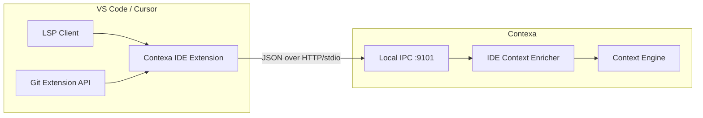

# IDE Deep Integration (LSP)

**Project:** Contexa — AI Context Platform  
**Version:** 1.1  
**Status:** Planned — v1.1 (Post-GA)  
**Priority:** P1  
**Last Updated:** 2026-07-07

---

## 1. Overview

IDE Deep Integration extends Contexa beyond surface-level UIA text by consuming **Language Server Protocol (LSP)** data from supported IDEs. This provides structured code context: symbols, diagnostics, references, git branch, and active file metadata.

**Principle:** Contexa does not run its own LSP server. A lightweight **IDE extension** publishes LSP-enriched context to the Contexa desktop agent via local IPC.

---

## 2. Goals

1. Provide AST-level code context for "Explain this code" and semantic search
2. Support VS Code and Cursor as first targets (shared extension API)
3. Enrich `ContextSnapshot` without blocking the capture pipeline
4. Expose IDE context via MCP tools and resources alongside desktop context

---

## 3. Architecture



| Component | Responsibility |
|-----------|----------------|
| **IDE Extension** | Subscribe to LSP events; collect symbols, diagnostics, selection |
| **IPC Bridge** | `127.0.0.1:9101` — extension → Contexa (token auth) |
| **IDE Enricher** | Merge LSP payload into `ContextSnapshot.metadata` |
| **MCP** | Expose `get_ide_context` tool + `contexa://ide/current` resource |

---

## 4. Data Collected

| Field | Source | Example |
|-------|--------|---------|
| `file_path` | LSP `textDocument/uri` | `src/auth/oauth.rs` |
| `language_id` | LSP | `rust` |
| `git_branch` | Git API | `feature/oauth-flow` |
| `git_repo` | Workspace root | `contexa` |
| `cursor_line` | LSP position | `42` |
| `symbol_at_cursor` | LSP `textDocument/documentSymbol` | `fn validate_token` |
| `selected_range` | Editor selection | L12–L28 |
| `diagnostics` | LSP publishDiagnostics | 2 warnings |
| `imports` | Document symbols (top-level) | `use serde::...` |
| `workspace_folders` | VS Code API | `["/projects/contexa"]` |

**Not collected:** Full file contents unless user has selection visible (respects existing truncation rules).

---

## 5. IPC Protocol

### 5.1 Endpoint

```
POST http://127.0.0.1:9101/v1/ide/context
Authorization: Bearer ctx_<extension_token>
```

### 5.2 Payload

```typescript
interface IdeContextPayload {
  timestamp: string;
  editor: {
    app: "vscode" | "cursor";
    version: string;
  };
  document: {
    uri: string;
    language_id: string;
    version: number;
  };
  position: { line: number; character: number };
  selection?: { start: Position; end: Position; text?: string };
  symbols?: DocumentSymbol[];
  diagnostics?: Diagnostic[];
  git?: {
    branch: string;
    repo_name: string;
    is_dirty: boolean;
  };
}
```

### 5.3 Push Model

Extension pushes on:
- Active editor change
- Selection change (debounced 300ms)
- Diagnostics update
- Git branch switch

---

## 6. Context Snapshot Integration

```rust
pub struct IdeContext {
    pub file_path: String,
    pub language_id: String,
    pub git_branch: Option<String>,
    pub symbol_at_cursor: Option<String>,
    pub diagnostics_count: u32,
    pub selected_code: Option<String>,
}

// Stored in ContextSnapshot.metadata:
// "ide.file_path", "ide.language", "ide.branch", "ide.symbol"
// document_path prefer IDE file_path over UIA when available
```

---

## 7. MCP Exposure

| API | Name | Description |
|-----|------|-------------|
| Tool | `get_ide_context` | Returns latest IDE context if extension connected |
| Resource | `contexa://ide/current` | Live IDE context JSON |
| Resource | `contexa://ide/symbols` | Document symbols for active file |

---

## 8. VS Code Extension Scope

```
contexa-vscode/
├── package.json
├── src/
│   ├── extension.ts       # Activation, IPC client
│   ├── lspCollector.ts    # Symbol + diagnostic collection
│   ├── gitCollector.ts    # Branch + dirty state
│   └── ipcClient.ts       # Push to Contexa agent
└── README.md
```

**Distribution:** Open VSX + Visual Studio Marketplace (separate from desktop installer).

---

## 9. Security

- Extension token generated in Contexa Settings → IDE Integration
- IPC binds `127.0.0.1` only
- User can disable IDE integration globally
- Excluded workspaces configurable (e.g. `**/secrets/**`)
- No file content transmitted except selection (user-controlled)

---

## 10. Performance

| Metric | Target |
|--------|--------|
| Extension → Contexa push | < 20 ms |
| Enricher merge | < 5 ms |
| LSP symbol request | < 100 ms (async in extension) |
| Extension memory | < 30 MB |

---

## 11. Rollout Plan

| Version | Deliverable |
|---------|-------------|
| v1.0 GA | VSCode enricher (UIA only — file path from title) |
| **v1.1** | Contexa VS Code extension + IPC + `get_ide_context` |
| v1.2 | Cursor marketplace listing; JetBrains plugin spike |

---

## 12. References

- [06_Context_Engine.md](./06_Context_Engine.md)
- [11_MCP_Runtime.md](./11_MCP_Runtime.md)
- [14_Development_Roadmap.md](./14_Development_Roadmap.md)
- [Language Server Protocol](https://microsoft.github.io/language-server-protocol/)
