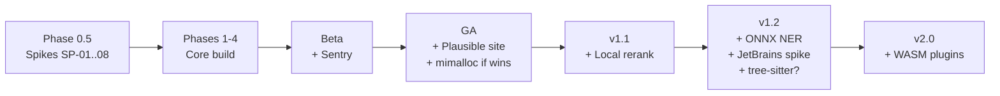

# Tech Expansion Plan (Post-Docs Evaluation)

**Project:** Contexa — AI Context Platform  
**Version:** 1.0  
**Status:** Proposed  
**Last Updated:** 2026-07-14

---

## 1. Overview

This document takes the flat "future technology" list (GPU compute, mimalloc, SIMD, WASM plugins, tree-sitter, JetBrains/Kotlin, reranking, ONNX, Sentry, Plausible) and assigns each item a **phase, a gate, and a disposition** consistent with the locked roadmap ([14_Development_Roadmap.md](./14_Development_Roadmap.md)) and the project's design principles.

**Rule of thumb applied throughout:** *Profile before optimizing* ([17_Performance_Optimization.md](./17_Performance_Optimization.md) §20) and YAGNI (`ponytail.mdc`). No expansion item may start before its gate condition is met.

---

## 2. Disposition Summary

| Item | Disposition | Phase | Gate |
|------|-------------|-------|------|
| Sentry (opt-in crash reporting) | **Adopt** | Beta (Phase 5) | Beta entry; required for crash-free-session metric |
| Plausible Analytics | **Adopt** | GA (Phase 5) | Marketing website deliverable |
| mimalloc global allocator | **Adopt (benchmarked)** | Phase 5 optimization sprint | Criterion before/after on Alpha baseline |
| Local reranking model | **Adopt (local only)** | v1.1 | [ADR-0012](../ADR/0012-local-reranking.md); GA search baseline recorded |
| ONNX Runtime (NER, custom OCR) | **Already in stack** | v1.2 | Per [07_Memory_Engine.md](./07_Memory_Engine.md) §15; fastembed already runs on ONNX |
| JetBrains plugin (Kotlin) | **Adopt (spike first)** | v1.2 (Q2 post-GA) | v1.1 VS Code extension shipped + adoption signal |
| Tree-sitter fallback parsing | **Evaluate** | v1.2+ | [ADR-0013](../ADR/0013-tree-sitter-fallback-parsing.md) accepted |
| WASM plugin runtime | **Adopt (design later)** | v2.0 | Host-function design ADR; v1 enricher API stable |
| DirectX compute shaders (frame diff) | **Conditional** | Only if gate fails | CPU baseline > 5% active *after* capture-avoidance tuning |
| SIMD text merging | **Conditional** | Only if gate fails | Profiling shows UIA/OCR merge is a top-3 hotspot |

---

## 3. Timeline Mapping

**Nothing in this plan runs during Phase 0.5–4.** The current priority is the four remaining gate spikes: SP-01 (UIA coverage), SP-02 (capture CPU), SP-05 (embedding selection), SP-08 (COM threading).

---

## 4. Item Details

### 4.1 Observability — Sentry & Plausible (Beta / GA)

Both already specified in [20_Deployment.md](./20_Deployment.md). This plan only pins timing:

- **Sentry** must be integrated **before Beta starts** — the Beta success metric "crash-free sessions ≥ 95%" ([14_Development_Roadmap.md](./14_Development_Roadmap.md) §14) is unmeasurable without it. Strictly opt-in, scrub payloads of captured text (crash reports must never contain `visible_text` or memory chunks).
- **Plausible** ships with the marketing website (GA deliverable). Website only — never embedded in the desktop app.

### 4.2 mimalloc (Phase 5 optimization sprint)

One-line adoption (`#[global_allocator]`), low risk, plausible win for a long-running background process (fragmentation). Adopt **only with evidence**:

1. Record Alpha baseline (M5) per §18 protocol in [17_Performance_Optimization.md](./17_Performance_Optimization.md).
2. Toggle mimalloc behind a cargo feature; run Criterion suite + 24h soak (RSS trend).
3. Keep if steady-state memory or p95 latency improves ≥ 5%; otherwise drop the feature.

### 4.3 Local Reranking (v1.1)

Highest-value item in the list — it directly improves context quality, the product's core value. **Cloud rerankers (Cohere) are rejected**: reranking inputs are memory chunks (user screen content); sending them to a third-party API violates Privacy by Design. Use a local ONNX cross-encoder via the existing fastembed stack. Full decision in [ADR-0012](../ADR/0012-local-reranking.md).

### 4.4 ONNX Runtime (v1.2, already present)

fastembed (default embeddings, ADR-0006) already runs on ONNX Runtime — this is not a new dependency. The v1.2 items that build on it are already documented: local NER model ([07_Memory_Engine.md](./07_Memory_Engine.md) §15) and custom OCR models ([05_Vision_Engine.md](./05_Vision_Engine.md) §Future). No action before v1.2.

### 4.5 JetBrains Plugin — Kotlin (v1.2)

Matches the existing roadmap (Q2 post-GA is a **spike**, not a build — [14_Development_Roadmap.md](./14_Development_Roadmap.md) §10.4). Preconditions: the v1.1 VS Code extension has shipped and the IPC contract in [27_IDE_LSP_Integration.md](./27_IDE_LSP_Integration.md) §5 has proven stable. The JetBrains plugin reuses the same `POST /v1/ide/context` payload; Kotlin is the implementation language, not an architecture change.

### 4.6 Tree-sitter Fallback Parsing (v1.2+, needs ADR)

The only item **not** already in the docs, and the only one that changes architecture: the core would parse source files from disk instead of receiving symbols pushed by an IDE extension. That touches the privacy model (core reads file contents) and binary size (bundled grammars). Do not implement without accepting [ADR-0013](../ADR/0013-tree-sitter-fallback-parsing.md).

### 4.7 WASM Plugin Runtime (v2.0)

Direction already locked in [18_Plugin_System.md](./18_Plugin_System.md) §15 and [02_System_Architecture.md](./02_System_Architecture.md). WASM's sandbox maps cleanly onto the existing sandbox rules (no network, no filesystem, timeout). Two open problems to solve in a future ADR before any code:

1. **Host functions** — enrichers need UIA access; the host API surface (and its audit story) is the hard part.
2. **Latency budget** — 20ms/enricher is tight across a WASM boundary; budget may need per-plugin-type tiers.

Precondition: the v1 `ContextEnricher` trait API is stable in production (post-GA), so the WASM ABI wraps a proven interface.

### 4.8 Conditional Items — GPU Frame Diff & SIMD

Both are **fallback tools, not roadmap items**. The Vision Engine's primary strategy is *skipping work* (capture avoidance, [17_Performance_Optimization.md](./17_Performance_Optimization.md) §5), not doing work faster.

| Item | Trigger to open a spike | Why not now |
|------|------------------------|-------------|
| DirectX compute shaders | Active-state CPU > 5% at Beta *after* adaptive scheduling + region hashing are tuned | Frame diff runs on ¼-resolution perceptual hashes — cheap on CPU; GPU readback overhead may exceed the win |
| SIMD text merge | Profiling (tracing spans `vision.uia`, `context.assemble`) shows merge in top-3 hotspots | Merge cost is dominated by allocation and COM calls, not byte processing |

If a trigger fires, open a time-boxed spike (2 days) with a measurable exit criterion before any production code.

---

## 5. Explicit Non-Goals

- No cloud reranking or any path that sends memory chunks to third-party APIs.
- No performance work of any kind before Alpha baselines exist in `benchmarks/BASELINE.md`.
- No plugin ABI (DLL or WASM) before the built-in enricher set has shipped and stabilized.
- No analytics in the desktop app; Plausible is website-only.

---

## 6. References

- [14_Development_Roadmap.md](./14_Development_Roadmap.md)
- [17_Performance_Optimization.md](./17_Performance_Optimization.md)
- [18_Plugin_System.md](./18_Plugin_System.md)
- [20_Deployment.md](./20_Deployment.md)
- [27_IDE_LSP_Integration.md](./27_IDE_LSP_Integration.md)
- [ADR-0012](../ADR/0012-local-reranking.md), [ADR-0013](../ADR/0013-tree-sitter-fallback-parsing.md)
